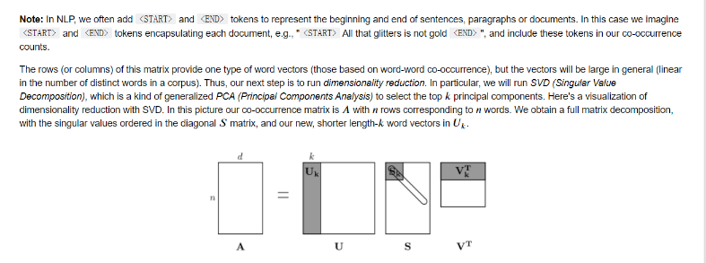

Welcome to CS224N!

We'll be using Python throughout the course. If you've got a good Python setup already, great! But make sure that it is at least Python version 3.8. If not, the easiest thing to do is to make sure you have at least 3GB free on your computer and then to head over to (https://www.anaconda.com/download/) and install the Python 3 version of Anaconda. It will work on any operating system.

After you have installed conda, close any open terminals you might have. Then open a new terminal and run the following command:

# 1. Create an environment with dependencies specified in env.yml:
    conda env create -f env.yml

# 2. Activate the new environment:
    conda activate cs224n

# 3. Inside the new environment, install IPython kernel so we can use this environment in jupyter notebook: 

    python -m ipykernel install --user --name cs224n

# 4. Homework 1 (only) is a Jupyter Notebook. With the above done you should be able to get underway by typing:

    jupyter notebook exploring_word_vectors.ipynb

# 5. To make sure we are using the right environment, go to the toolbar of exploring_word_vectors.ipynb, click on Kernel -> Change kernel, you should see and select cs224n in the drop-down menu.

# To deactivate an active environment, use
    conda deactivate

# svd

奇异值分解（SVD）是一种强大的矩阵分解技术，它在许多领域都有重要的应用。SVD 的主要目的包括：

1. **数据压缩**：通过保留最大的几个奇异值及其对应的奇异向量，可以实现对数据的有效压缩。这在图像压缩、信号处理等领域非常有用。

2. **降维**：SVD 可以用于降低数据的维度，同时尽量保留数据的重要特征。这在主成分分析（PCA）、潜在语义分析（LSA）等技术中被广泛应用。

3. **数据去噪**：在处理带有噪声的数据时，可以通过舍弃较小的奇异值来去除噪声，从而得到更干净的数据。

4. **特征提取**：SVD 可以用于提取数据的重要特征，这在机器学习和模式识别等领域非常重要。

5. **矩阵近似**：SVD 提供了一种最佳的方式来近似一个矩阵，这在矩阵的低秩近似、数据填充等问题中非常有用。

6. **求解线性方程组**：对于不可逆或病态的线性方程组，SVD 可以用于找到最佳的近似解。

7. **矩阵分解**：在数值线性代数中，SVD 是一种重要的矩阵分解方法，它可以将任意矩阵分解成三个特定的矩阵乘积，这对理解矩阵的性质和结构非常有帮助。

总的来说，SVD 是一种非常通用和强大的工具，它在数据分析、机器学习、计算机视觉等多个领域都有着广泛的应用。

这幅图展示的是单词共现矩阵降维的过程，用的是奇异值分解（Singular Value Decomposition，简称SVD）方法。这个过程通常用于自然语言处理（NLP）中，特别是在处理词嵌入（word embeddings）和语义分析时。

1. **矩阵 A**：
   - 矩阵 A 代表共现矩阵，其中行代表独特的单词，列也代表独特的单词。矩阵 A 中的每个元素 \( A_{ij} \) 代表单词 i 和单词 j 共同出现在窗口内的次数。这个矩阵是对称的，因为共现是无向的（单词 A 与单词 B 共现等同于单词 B 与单词 A 共现）。

2. **SVD 分解**：
   - SVD 分解是一种因子分解方法，它将矩阵 A 分解为三个矩阵 U、S 和 V^T 的乘积。
   - **U 矩阵**：左奇异向量，它的每一列可以被看作是原始单词向量空间中的一个轴。
   - **S 矩阵**：对角矩阵，其对角线上的元素是奇异值，这些值按从大到小的顺序排列。奇异值表示原始矩阵数据中的重要性，越大的奇异值对应的方向越重要。
   - **V^T 矩阵**：右奇异向量的转置，和 U 矩阵类似，也表示原始空间中的轴。

3. **降维**：
   - 在 NLP 中，通常不需要所有的奇异值和对应的向量。相反，只选择前 k 个最大的奇异值及其对应的向量来降低矩阵的维度。这就是所谓的截断奇异值分解（Truncated SVD）。
   - 通过选择前 k 个奇异值和左奇异向量，可以得到一个新的矩阵 \( U_k \)，其维度为原始单词数量乘以 k。这个矩阵 \( U_k \) 乘以对角矩阵 S 中的前 k 个奇异值，就得到了降维后的单词嵌入矩阵。

这个降维过程有助于捕捉和表示单词之间的语义关系，并且减少了计算复杂性和存储需求。在降维后的空间中，每个单词由一个 k 维向量表示，这个向量捕捉了单词的主要语义特征。

SVD（奇异值分解）本质上是一种矩阵分解技术，它将任意的矩阵分解为三个特定的矩阵的乘积。SVD 在很多领域都有应用，包括信号处理、统计学、计算机视觉等。

在自然语言处理领域，SVD 被用作一种构建词嵌入的方法。具体来说，通过对词的共现矩阵进行 SVD 分解，可以得到词的低维表示，即词嵌入。这种方法的一个经典例子是 LSA（Latent Semantic Analysis，潜在语义分析）。

因此，可以说 SVD 是一种矩阵分解技术，而在自然语言处理中，它被用作一种词嵌入方法。两者的关系是，SVD 提供了一种数学工具，可以通过矩阵分解来发现和表示词之间的潜在语义关系，从而构建词嵌入。
