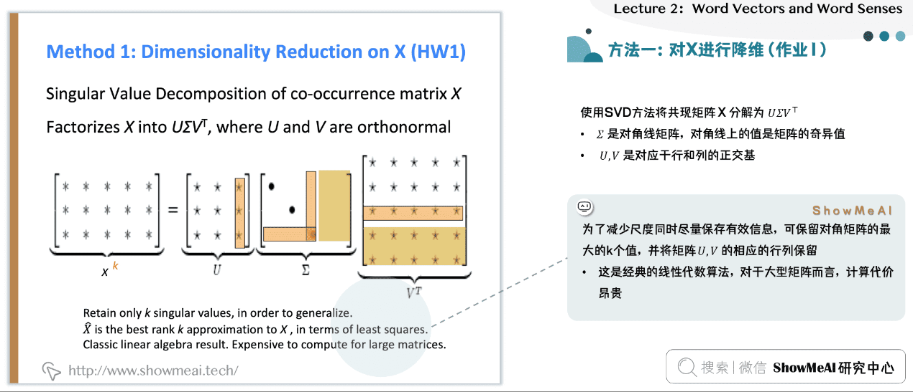
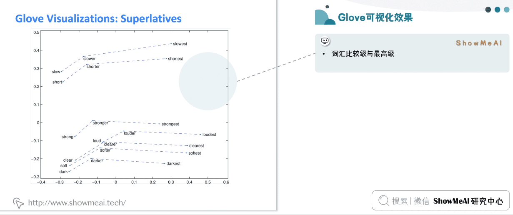

# some concepts

## machine learning and deep learning 

[机器学习和深度学习区别的简要概述 - 知乎 (zhihu.com)](https://zhuanlan.zhihu.com/p/69776750)

深度学习 基于神经网络

## 神经网络 

首先把人类眼中的特征转换成计算机的向量

把特征进行变化，特征：x身高+y体重等

神经网络生成很多特征，最终进行测算

特征的系数由神经网络学习得到

综上所述，深度学习是一种机器学习方法，神经网络是其基础模型，而大模型则是指具有大规模参数和复杂结构的神经网络模型。深度学习利用神经网络来学习数据的表示，而大模型则是神经网络的一种特例，具有更大的规模和复杂性。

# NLP

pytorch

# LECTURE 1

## basic acknowledge

### representing words as discrete symbols

#### one-hot向量

one-hot向量将类别变量转换为机器学习算法易于利用的一种形式的过程，这个向量的表示为一项属性的特征向量，也就是同一时间只有一个激活点（不为0），这个向量只有一个特征是不为0的，其他都是0，特别稀疏。

### problem with words as discrete symbols

虽然单词可以被表达为向量，但是在数学逻辑中，这两个向量是正交的，没有任何的自然联系

### representing words by their context

为了解决离散的词组无法被计算机认知的问题

人们提出分布式语义让计算机去了解单词

其中最成功的idea就是NLP

分布式语义：代表的是一个词的含义其实是由和伴随这个词经常出现的上下文给出的

#### word can be sorted refer to token and type

1. **Token**：Token指的是文本中的最小单位，通常是指由空格或标点符号分隔开的单词或符号。在某些情况下，token也可以是一个更大的单位，比如一个词组或短语。在NLP任务中，文本通常会被分解成一系列token，每个token代表文本中的一个基本单位。
2. **Type**：Type指的是不同的token种类或类型。换句话说，type是指所有不同token的集合。例如，在句子"I love love love NLP."中，有6个token（I, love, love, love, NLP, .），但是只有4个不同的type（I, love, NLP, .）。

文中第一行的banking是这段话的token

这三句话banking都是一种类型，所以在这三句话中，我们用banking代表一种类型

### word vectors

我们想使用vector去表示每个单词，让它不仅能够表达含义，还可以预测上下文

## Word2vec:overview

### overview

Word2Vec是一种广泛使用的自然语言处理（NLP）技术，用于学习词语的向量表示。它是由Google的研究团队在2013年提出的。Word2Vec的核心思想是将词语映射到一个高维空间中的向量，使得语义相近的词语在这个空间中的向量也相近。这种向量表示可以捕捉词语之间的语义关系，如同义、反义、上下位等。

首先我么要有一个巨大的语料库

然后把每个单词用vector去表示 

在一段文本中选择一个中心词，和上下文单词o

用c和o的向量去计算给中心词c 出现o的概率

不断调整单词的向量 让他的可能性最大

为了提高出现上下文的概率

我们不断改变中心测 然后预测

### objective function

1. **Likelihood**：在Word2Vec的上下文中，似然（likelihood）通常指的是给定一个词和其上下文时，模型正确预测这个上下文出现的概率。例如，在Skip-gram模型中，给定一个中心词，似然就是模型正确预测其周围上下文词的概率。似然越高，表示模型对训练数据的拟合程度越好。
2. **Objective Function**：目标函数（objective function）是在训练过程中需要优化的函数。在Word2Vec中，通常使用对数似然函数（log-likelihood function）作为目标函数。对于Skip-gram模型，目标函数是最大化所有词及其上下文的对数似然之和。对于CBOW模型，目标函数则是最大化给定上下文词预测中心词的对数似然之和。

目标函数的用途是指导模型的训练过程。通过调整模型参数（即词向量）来最大化目标函数，Word2Vec模型能够学习到能够反映词之间语义关系的词向量。

### prediction function

用于预测上下文

我们通过dot product代表两个向量，这里是中心词和上下文向量的相似度

softmax函数被用来计算给定中心词的上下文词的概率分布

其中，p*(*c*∣*w*)表示给定中心词w*时，上下文词*c*出现的概率。

***总而言之，首先通过向量表示文字，表示要与上下文紧密联系，使得具有相似上下文的单词向量相近，在大量学习之后，我们可以通过似然函数推理出上下文单词出现概率，从而预测上下文***

### to train the model:optimize value if parameters to minimize loss

在生成词向量的过程，如何减少word->vec的损失

*这张图片展示了一个参数向量θ，它包含了一系列的词向量。在这里，"R" 表示实数集，"2dV" 表示参数向量的维数，其中 \( V \) 是词汇表的大小，\( d \) 是每个词向量的维数。因此，\( \mathbb{R}^{2dV} \) 表示参数向量θ属于一个维数为 \( 2dV \) 的实数空间，这意味着每个词有两个向量表示：一个用作中心词（通常用 \( v \) 表示），另一个用作上下文词（通常用 \( u \) 表示），每个向量都有 \( d \) 维。所以，如果你有一个词汇表大小为 \( V \) 的语料库，并且选择了一个 \( d \) 维的向量空间来表示每个词，那么整个模型的参数空间的维数将是 \( 2dV \)，包括所有词的中心词向量和上下文词向量。*

在Word2Vec模型中提到的计算向量梯度是指在训练过程中，为了最大化似然函数，我们需要计算目标函数（通常是对数似然函数）相对于每个词向量参数的导数，即梯度。

梯度计算公式的细节取决于所用的目标函数，但基本过程如下：

1. **正向传播**：给定一个中心词，模型使用当前的词向量计算上下文词出现的概率。
2. **计算损失**：使用目标函数计算预测概率和真实概率之间的差异。
3. **反向传播**：计算损失函数关于每个词向量的梯度。这涉及到对目标函数求导，并将这些导数（梯度）反向传播回网络，以便更新词向量。
4. **更新词向量**：使用梯度和学习率来更新词向量，这个过程称为梯度下降（或在最大化问题中的梯度上升）

### whole process

#### 1. 初始化：

- **选择模型**：确定使用CBOW（Continuous Bag of Words）模型还是Skip-gram模型。
- **准备数据**：从文本语料库中收集训练数据，通常是单词及其上下文。
- **参数初始化**：随机初始化词向量。每个词有两个向量表示：作为中心词的向量和作为上下文词的向量。

#### 2. 训练：

- **滑动窗口**：在语料库中滑动窗口，选取中心词和上下文词。
- **生成训练样本**：在Skip-gram模型中，训练样本是中心词与其周围上下文词的配对。在CBOW模型中，是上下文词的集合和目标中心词的配对。
- **计算概率**：使用softmax函数或其近似（比如负采样或层次softmax）来计算给定中心词下上下文词出现的概率。
- **计算损失**：通过比较预测的概率分布和实际的分布，计算损失函数。
- **计算梯度**：通过反向传播算法计算损失函数相对于每个词向量的偏导数，即梯度。
- **更新词向量**：使用计算出的梯度和学习率来更新每个词的向量。

#### 3. 重复训练过程：

- **迭代优化**：重复上述训练过程多次，直到损失函数的值趋于稳定或达到预设的迭代次数。

#### 4. 预测（使用模型）：

- **获取词向量**：一旦训练完成，每个词的向量表示可以从模型中提取出来。
- **词语相似度**：通过计算词向量之间的余弦相似度，可以找到语义上相似的词。
- **类比推理**：可以使用向量运算（如王后 - 女性 + 男性 = 国王）来进行词语间的类比推理。
- **新词预测**：虽然Word2Vec不是一个传统意义上的预测模型，但可以通过向量的加减运算预测和某个词语语义相近的词。

#### 5. 结果使用：

- **NLP任务**：训练得到的词嵌入可以作为特征输入到各种自然语言处理任务中，如文本分类、情感分析、机器翻译等。

1. **实际概率**： 实际概率（也称为观测概率或真实概率）是指在训练数据中，一个词的上下文词实际出现的概率分布。这是从训练集中直接得到的统计信息。例如，在一个大的文本语料库中，单词“bank”后面跟着“river”和“money”的频率可以决定“river”和“money”作为“bank”上下文的实际概率。
2. **预测概率**： 预测概率是模型基于当前参数（词向量）计算得到的，给定一个词时其上下文词出现的概率。在Word2Vec模型中，这是通过softmax函数或其近似算法（如负采样或层次softmax）计算得到的。

在Word2Vec的训练过程中，我们希望模型预测的概率分布尽可能接近实际的概率分布。这就需要一个衡量标准，通常是损失函数，比如交叉熵损失函数，它可以衡量两个概率分布之间的差异。

关于偏导数和梯度的问题：

1. **偏导数**： 在多变量函数中，偏导数是指函数对单一变量的导数，而保持其他变量恒定。在Word2Vec中，每个词都由一个向量表示，这些向量的每个元素都是多变量损失函数的变量。

2. **梯度**： 梯度是由一个函数的所有偏导数组成的向量。在最优化问题中，梯度指向函数在给定点上增长最快的方向。因此，在Word2Vec中，我们计算损失函数相对于每个词向量的偏导数，所有这些偏导数组合起来形成了损失函数的梯度。

   在梯度下降优化算法中，梯度的负方向指示了减少损失函数值的方向，我们通过在梯度的负方向上更新词向量来训练模型，这样做可以使预测概率分布更接近实际概率分布。

# lecture2 

### Gradient Descent

梯度下降算法，这里我们需要用梯度下降算法最小化目标函数J通过改边delta

方法就是朝梯度相反方向做出改变，直到达到最小值

这张图片展示的是机器学习中常用的两个数学更新方程，特别是在梯度下降这样的优化算法中。

梯度并不是越大越好，在梯度下降算法中，如果梯度为0，说明达到最大值

### Stochastic  Gradient Descent

随机的梯度下降，用于解决梯度下降在问题中成本太过昂贵的问题，它只需要采样一小部分的中心词进行梯度计算估计就可以了

在实际应用中，**由于计算完整softmax代价很大**（需要对整个词汇表的单词进行计算），通常使用一些近似方法，**如负采样（Negative Sampling）**或层次softmax（Hierarchical Softmax），以提高训练的效率。这些方法减少了需要更新的权重数量，从而加快了训练过程。**负采样通过随机选择一小部分“负样本”（即上下文中没有出现的单词）**，而层次softmax通过构建一个二叉树来减少计算量，每个单词都是树的一个叶节点。这样，在更新权重时，只需要沿着从根节点到目标单词的叶节点的路径进行计算，而不是对整个词汇表进行计算。

## The skip-gram model with negative sampling (hw2)

对于softmax方法计算概率并进行采样，我们需要遍历每个单词，所以这个过程消耗很大

所以在skipgram model中

- 我们将在作业2中实现使用 negative sampling/负例采样方法的 skip-gram 模型。
- 使用一个 true pair (中心词及其上下文窗口中的词)与几个 noise pair (中心词与随机词搭配) 形成的样本，训练二元逻辑回归。

在Word2Vec模型的负采样中，J表示特定于负采样策略的损失函数。这个损失函数衡量的是模型当前参数下，生成观察到的正样本（正确的单词上下文对）的概率，以及同时抑制模型生成一组随机选择的负样本（错误的单词上下文对）的概率。

我们想让损失函数J越小，我们需要第一项中的点积最大，接近1，这就导致第一项越小，也代表了上下文本相关性概率最大。我们和需要第二项我们希望正确地预测负样本与当前词不相关时（即负样本的向量与上下文向量的点积应该是负数），代表着模型能识别不属于上下文的单词，所以点积是负数，加符号变成正数接近1，加对数变成接近0我们需要最大化目标函数

- 左侧为sigmoid函数(大家会在后续的内容里经常见到它)
- 我们要最大化2个词共现的概率

这个公式是在word2vec中使用负采样（Negative Sampling）时，用来选择负样本的概率分布。**这里的\( P(w) \) 表示选择一个单词\( w \)作为负样本的概率**。其中，\( U(w) \)是单词\( w \)在训练语料中的不平衡（unnormalized）频率，即该单词出现的次数。**Z是规范化常数（normalization constant），确保所有单词的\( P(w) \)加起来等于1。**

**指数4/3是一个经验值**，它的作用是重新调整每个单词被选为负样本的概率，使得频率非常高的单词（如停用词）不会被过度采样，同时保证低频词有足够的机会被选中。**这个调整能够改善训练的效果**，因为它减少了常见词汇对负样本选择的影响，使得模型学习到的向量表示更加丰富和平衡。

## co-occurrence matrix

我们能最简单想到的方法去联系中心词和上下文词就是，实现一个co-occurrence matrix矩阵，以此来计数，每个单词在上下文出现的概率，而不是通过算法去将word->vector

这个就是窗口大小为1，也就是我们只统计前后1个单词，出现的概率，并形成所有单词作为行列的对称矩阵

## co-occurrence vectors

### svd中如何从matrix中提取vector

那么对于这种co-occurrence vectors来说有一下问题

所以人们想到利用降维的方法。这样做可以去除噪声（去掉一些我无关紧要的数据）并减少维度。

## Classic Method: Dimensionality Reduction on X

**降维并不是二维到一维，而是分割行或者列**

可以使用SVD方法将共现矩阵  分解为  ，其中：

-  是对角线矩阵，对角线上的值是矩阵的奇异值（奇异值就是AAT的特征值开平方)
-  ,  是对应于行和列的正交基

为了减少尺度同时尽量保存有效信息，可保留对角矩阵的最大的  个值，并将矩阵  ,  的相应的行列保留

## Hacks to X

running an svd on raw counts doesn't work well

按比例调整 counts 会很有效

- 对高频词进行缩放(语法有太多的影响) like:a the an 
  - 使用log进行缩放
  - t应该是单词出现频次的阈值
  - 忽略function words
- 在基于window的计数中，提高更加接近的单词的计数
- 使用Person相关系数

## Interesting semantic patterns emerge in the scaled vectors

verv to the person who does the verbe ，这些向量大致平行

就好像drive to driver 就类似于 swin to swimmer

## Count based vs. direct prediction

基于基数和基于预测的两种获得词向量的模型

**基于计数**：使用整个矩阵的全局统计数据来直接估计

- **优点**：训练快速；统计数据高效利用
- **缺点**：主要用于捕捉单词相似性；对大量数据给予比例失调的重视

**基于预估模型**：定义概率分布并试图预测单词

- **优点**：提高其他任务的性能；能捕获除了单词相似性以外的复杂的模式
- **缺点**：随语料库增大会增大规模；统计数据的低效使用（采样是对统计数据的低效使用）

## Encoding meaning conponennts in vector difference

meaning componets 可以被代表为co-occurrence概率的比值

重点不是单一的概率大小，**重点是他们之间的比值**，其中蕴含着重要的信息成分。

- 例如我们想区分热力学上两种不同状态ice冰与蒸汽steam，它们之间的关系可通过与不同的单词  的共现概率的比值来描述
- 例如对于solid固态，虽然  与  本身很小，不能透露有效的信息，但是它们的比值  却较大，因为solid更常用来描述ice的状态而不是steam的状态，所以在ice的上下文中出现几率较大
- 对于gas则恰恰相反，而对于water这种描述ice与steam均可或者fashion这种与两者都没什么联系的单词，则比值接近于  。所以相较于单纯的共现概率，实际上共现概率的相对比值更有意义

## Glove combining the best of both worlds

logxij代表着单词两个单词出现的次数的比值（这里不是单词对的比值，这是两个单词的比值，应该和之前单词对差不多，只是消掉了分母）

## How to evaluate word vectors

## Intrinsic word vector evaluation 

## Glove Visualizations

## Analogy evaluation and hyperparameters

- **Sem.**: 表示在语义测试中的表现。这通常涉及到词义的相似性测试，如比较单词对是否在语义上接近。
- **Syn.**: 表示在语法测试中的表现。这涉及到词语的语法属性，比如词性标注或句法依赖关系。
- **Tot.**: 表示总体表现，可能是语义（Sem.）和语法（Syn.）分数的平均或加权总和

## 问题

### 这个随机的矩阵 是谁规定的  每个词对应一个向量？

在训练神经网络，特别是进行词嵌入训练时，随机初始化嵌入矩阵是一个常见的做法。这个过程并不是由某个人规定的，而是一种标准的机器学习技术，通常在模型的实现代码中自动完成。

随机初始化的目的是为了打破对称性，确保模型训练时可以正常学习。如果所有的向量初始化为同样的值，那么模型在训练过程中可能无法学习到有用的特征，因为每个单词的表示将会以同样的方式更新，从而无法分辨它们。

在训练开始时，每个单词被随机分配一个向量，这个向量的维度是提前设定的。例如，我们可能选择使用100维或300维的向量来表示每个单词。向量的具体数值是随机生成的，但通常会遵循一定的统计分布（如均匀分布或正态分布），且数值通常很小。

随着训练的进行，这些向量会根据模型的学习目标（如预测上下文单词）逐渐调整，以至于最终反映出单词的语义和语法特性。这样，模型最终得到的词向量就不再是随机的了，而是有意义的，能捕捉到单词之间的关系，如它们的相似度和共现频率等。

### skip-gram 和glove的区别

Skip-gram 和 GloVe 都是用于学习词嵌入的模型，但它们在原理和实现上有一些关键的区别：

1. **模型原理**：
   - **Skip-gram（Word2Vec 的一种架构）**：基于局部上下文信息。给定一个中心词，模型的目标是预测它在文本中周围的词语。Skip-gram 通过优化这种局部上下文预测来学习词嵌入。
   - **GloVe**：基于全局统计信息。GloVe 使用整个语料库中的词共现（co-occurrence）统计信息来学习词嵌入。它构建一个全局共现矩阵，并通过矩阵分解来得到词嵌入。
2. **优化目标**：
   - **Skip-gram**：优化的是局部上下文预测的对数似然函数。
   - **GloVe**：优化的是词对之间的共现概率的对数与词嵌入内积之间的差异的平方和。
3. **处理大规模数据**：
   - **Skip-gram**：通常需要对大量的局部上下文窗口进行采样和训练，可能在处理非常大的语料库时效率较低。
   - **GloVe**：由于是基于全局统计信息，可以在构建共现矩阵时一次性处理整个语料库，可能在处理大规模数据时更加高效。
4. **捕捉语义关系**：
   - **Skip-gram**：能够捕捉词语之间的相似性和语义关系，特别擅长捕捉罕见词的表示。
   - **GloVe**：通过全局共现统计，能够捕捉更丰富的语义关系，特别是能够较好地保持词与词之间的线性关系（如“king” - “man” + “woman” ≈ “queen”）。

**GloVe 用于什么时候**： GloVe 适用于需要从全局统计信息中学习词嵌入的场景，特别是当你希望捕捉词与词之间的共现关系并保持词嵌入中的线性语义关系时。GloVe 在处理大规模语料库时也可能更高效，因为它避免了对大量局部上下文的重复采样和训练。

总的来说，Skip-gram 和 GloVe 都是强大的词嵌入学习模型，选择使用哪个模型取决于具体的任务需求和语料库特点。在实践中，尝试不同的模型并比较它们在特定任务上的表现是一个常见的做法。

### Skip-gram的整体过程

Word2Vec 的 Skip-gram 模型整体过程包括以下步骤：

1. **初始化**：
   - 随机初始化词向量，为每个单词生成两个向量：中心词向量和外部词（上下文）向量。
2. **训练循环**：
   - 对于语料库中的每个单词，将其作为中心词，然后根据窗口大小选取周围的上下文词。
   - 对于每个中心词和上下文词对，执行以下步骤：
3. **前向传播**：
   - 通过计算中心词向量和每个上下文词向量的点积得到一个分数。
   - 应用 softmax 函数将分数转换成概率分布。
4. **计算损失**：
   - 使用交叉熵损失函数来计算当前的预测概率分布与实际的一热编码分布之间的差异。
5. **反向传播（梯度计算）**：
   - 通过损失函数相对于词向量的梯度来更新中心词向量和上下文词向量。
6. **参数更新**：
   - 使用梯度下降（或其他优化算法）更新词向量。这通常包括计算学习率和梯度的乘积，并从当前向量中减去该乘积。
7. **重复步骤**：
   - 重复步骤2到6，直到达到一定的迭代次数，或者模型损失不再显著减少。
8. **后处理**（可选）：
   - 训练完成后，可能会对词向量进行归一化处理。
   - 有时还会使用技巧如词向量维数的降维（例如使用 PCA）以提高其实用性。

# lecture3 Backprop and Neural Networks（向后传播和神经网络）

## 1.named entity recognition（NER）命名实体识别

给文字添加标签，例如per人，loc位置

- 可能的用途
  - 跟踪文档中提到的特定实体(组织、个人、地点、歌曲名、电影名等)
  - 对于问题回答，答案通常是命名实体
  - 许多需要的信息实际上是命名实体之间的关联
  - 同样的技术可以扩展到其他 slot-filling 槽填充分类

- 通常后面是命名实体链接/规范化到知识库

1. **基本思想**：
   - 为每个单词分类，根据其邻近词（上下文窗口）来确定该单词是否属于某个特定类别。
2. **训练分类器**：
   - 在手标注数据上训练逻辑回归分类器，以确定中心词是否属于某个类别（是或否）。虽然通常会使用多类 softmax 分类器，但为了简化，这里使用了二元分类器。
3. **举例**：
   - 分类“Paris”（巴黎）这个单词，判断它在句子中是否是一个位置（地点名称）。这里使用的窗口长度是 2，即考虑中心词前后各两个词作为上下文。
   - 给出的例子句子是“The museums in Paris are amazing to see.”（博物馆在巴黎是惊人的看点）。在这个句子中，“Paris”前后各有两个词，形成了一个上下文窗口。
4. **特征向量构建**：
   - 构建**特征向量** `x_window` 通过拼接（concatenation）中心词“Paris”和它的上下文词“museums”，“in”，“are”，“amazing”的词向量。这里 `x_museums`、`x_in`、`x_Paris`、`x_are`、`x_amazing` 分别是这些词的词向量。
   - 拼接后的结果向量 `x_window` 属于 �5�*R*5*d* 空间，是一个列向量，其中 d 是单个词向量的维度。
5. **分类操作**：
   - 为了对整个句子中的每个单词进行分类，针对每个单词中心的向量运行分类器，判断其所属类别。

我们现在有了输入的特征向量X，其中由五个词向量组成

- 隐藏层计算方式：通过特征矩阵W和偏置项（*偏置项允许模型输出在没有输入（即输入为零）时不等于零，从而更灵活地拟合数据。例如，在二维空间中，偏置项允许直线不必经过原点。这提供了额外的自由度，让模型能够更好地适应数据。*）b和非线性激活函数得到h
- 得分计算公式:u是权重向量，h是隐藏层表示（文中叫Neural Networks，虽然这是机器学习，但是他利用的是神经网络提取特征值的方法进行计算）
- costfunction，将得分s映射到（0，1）内表示概率

## SGD

### grandients 梯度概念

**梯度是一个向量**，包含了f对每个xi的偏导数▽f

梯度向量中的每个分量是衡量函数f在相应变量xi方向上的变化率

所以表示为下面这个式子

雅可比矩阵（Jacobian matrix）

这里是n个input n个output的函数

那么对这个函数求偏导，只有i=j才对函数有影响

所以这个函数的jacobian矩阵只有在对角线上有元素，可以类比ninput m ouput的jacobian矩阵去理解

这个矩阵就被表示成diag(f'(z)) ，表示一个对角线上有 *f*′ 导数，其他元素为 0 的对角矩阵。

形如u.T,也是向量，所以最终形式也要进行转置

### Back to our Nerual Net

虽然我们对cost function J感兴趣，但是这里为了简化，我们就求score 对b的偏导数

之前我们求wx+b对b偏导，矩阵是单位矩阵，因为b和x相对独立。但是这里并不独立，所以需要通过链式法则来求解。

进一步分解链式法则

这个小圆点（∘）表示的是**哈达玛积**（Hadamard product），也称作逐元素乘法。这是一个二元操作，它接受**两个尺寸相同**的矩阵，并产生另一个同样尺寸的矩阵，其各个元素是原两个矩阵对应元素的乘积。

我们发现s对W偏导的时候，前两项是完全相同的，所以我们有必要使用一种减少重复运算的算法

我们把前两项替换为δ（局部误差信号）

- 参数形状和jacobian矩阵形状不同，w有nxm个输入，1个输出，所以jacobian矩阵式一个1xnxm的形状（*由于这是二元分类问题所以output只有一个值 0/1*）
- 梯度形状的重要性：**我们通常希望梯度的形状与参数矩阵 *W* 的形状相匹配。**这样做可以使更新参数更加直观和容易实现，尤其是在编写代码来更新神经网络参数时。
- 遵循**形状约定**（shape convention）：在数学上，尽管可以计算出不同形状的梯度（例如，标量对矩阵的雅可比矩阵），但在实践中，我们遵循一个“形状约定”，即梯度的形状应该与参数的形状相同。这意味着如果 *W* 是一个 n*×*m 矩阵，那么s对w的偏导也是一个nxm的矩阵。
- jacobian矩阵梯度元素：Wij是W矩阵中第i行第j列的元素，这种表示方法展示了如何计算每个权重对输出s的影响

Transposes 转置

然而，按照形状惯例，因为 b 是一个列向量，我们的梯度应该也是一个列向量。这样的形状惯例可以让数学表达式在形式上保持一致性，特别是在编写代码实现算法时，这能使得矩阵运算更加直观和一致。

在机器学习和线性代数中，**通常将变量（特别是在优化问题中的参数）表示为列向量**。这是因为在矩阵乘法中，一个矩阵 A 乘以一个列向量 b，结果是另一个列向量，计算过程遵循了线性映射的规则。这个习惯使得表达式和计算在形式上保持一致。

1. 尽可能使用雅各比形式（Jacobian form），但在计算的最后阶段，根据形状约定进行转换：这意味着在计算过程中可以使用行向量，但在最终结果时，需要将导数 ∂s/∂b 转置成列向量，得到 δ^T。
2. 始终遵循形状约定：这建议在进行导数计算时始终保持形状一致性。在操作中需要查看维度，以确定何时需要转置或重新排序项，确保每个计算步骤的输出与期望的形状一致。

幻灯片还指出，错误信息 δ，即反向传播中到达隐藏层的误差梯度，应该与该隐藏层的维度一致。这是为了确保在神经网络中反向传播算法可以正确执行，因为每一层的权重更新依赖于与该层输出相同维度的梯度。

## Backpropagation 反向传播

反向传播（Backpropagation）是神经网络训练中的一种算法，用于根据损失函数（表示网络预测错误程度的函数）来调整网络中的权重和偏置。**其核心目标是最小化损失函数的值，即减少神经网络输出与实际值之间的差异。**

1. **前向传播（Forward Propagation）**：
   - 输入数据在网络中前向传播，通过层间的权重和偏置，以及非线性激活函数，直到得到输出。
   - 网络的输出与真实的标签值比较，计算损失函数的值。
2. **计算梯度（Gradient Calculation）**：
   - 损失函数相对于网络最后一层输出的梯度首先被计算出来。
   - 这个梯度反映了损失函数对网络输出的敏感度。
3. **反向传播（Backpropagation）**：
   - 通过链式法则，损失函数的梯度被反向传播回网络中，计算中间层输出和最终损失之间的关系。
   - 在每一层，计算损失函数对该层每个权重的偏导数，这些偏导数构成了梯度。
   - 这一步是反向传播算法的核心，它允许我们理解如何通过调整每个权重来减少最终的损失。
4. **权重更新（Weight Update）**：
   - 一旦计算出损失函数对所有权重的梯度，就可以使用这些梯度来更新权重。
   - 更新通常是通过梯度下降或其变种进行，权重按照其对损失的贡献程度进行调整，以期望在下一次前向传播时降低损失。

**优化技巧**：幻灯片上的“other trick”提到了一个重要的优化技巧——在计算时重复利用上层计算出的导数来计算下层的导数，以减少计算量。**这意味着在神经网络的某一层计算出的导数可以在计算之前的层时重复使用，这样可以避免重复的计算工作，使得算法更加高效。**

用计算图来代表神经网络中如何进行向前传播

向后传播更新权重

**局部梯度**就是这个节点输出对输入的偏导数

**上游梯度**就是损失函数对当前节点输出的偏导数

**下游梯度**就是损失函数对于当前节点输入的偏导数，是局部梯度和上有梯度的乘积

***这三个概念都是相对于节点而言，这里为了简化只有一个节点***

**我们所谓的梯度是针对整个神经网络**

在反向传播中，下游梯度的计算对于更新网络中的权重和偏置至关重要。每个节点的下游梯度都是基于其上游梯度和当前节点操作的局部梯度。通过这种方式，梯度信息可以从输出层回传到输入层，允许我们对每个参数的影响进行量化并相应地更新它们以减少损失。

单节点但是多个输入的情况

最后输入对应的下游梯度就是改变他们对应的权重，比如改变x那么输出结果就会变成两倍的x值

多个输出的时候只需要相加

## question

1. **前向传播（Fprop）**：
   - 按照拓扑排序访问节点，即从输入层开始，按顺序向后访问，直到输出层。
   - 对于每个节点，基于其前驱节点的值计算该节点的值。
2. **反向传播（Bprop）**：
   - 初始化输出的梯度为 1，因为这是损失函数相对于自身的导数。
   - 逆序访问节点，即从输出层开始，向前逐节点进行，直到输入层。
   - 对每个节点，利用该节点对其后继节点的梯度来计算相对于该节点的梯度。

- **反向传播（Backpropagation）**：这是一种递归（因而高效）的方式沿着计算图应用链式法则。它的基本原则是“下游梯度 = 上游梯度 × 局部梯度”，这意味着梯度是如何通过网络反向传递的。
- **前向传播（Forward pass）**：这一步计算操作的结果，并保存中间值。在神经网络中，这通常涉及对输入数据应用权重，加上偏置，并通过激活函数，最终获得输出。
- **后向传播（Backward pass）**：在这一步，我们应用链式法则计算梯度。从输出开始，我们逆向工作，使用保存的中间值（从前向传播）和链式法则来计算每个参数相对于损失函数的梯度

反向传播是完整的循环算法，包含了前向传播和后向传播

*反向传播（Backpropagation）和后向传播（Backward pass）这两个术语经常在深度学习的文献和讨论中互换使用，但它们可以从不同的角度描述同一过程：*

1. ***反向传播（Backpropagation）**:*
   - *这个术语通常用来描述整个用于训练神经网络的算法过程，它包括了前向传播（在网络中计算输出），计算损失，以及后向传播（计算梯度并传递回输入层的过程）。*
   - *反向传播强调的是算法的完整循环，包括了前向计算和后向梯度传播的整个序列。*
2. ***后向传播（Backward pass）**:*
   - *这个术语更具体地指反向传播过程中的一部分，即从输出层到输入层传递梯度的过程。*
   - *它仅指梯度计算和反向流动的部分，而不包括前向传播或梯度下降步骤（实际更新权重）。*
