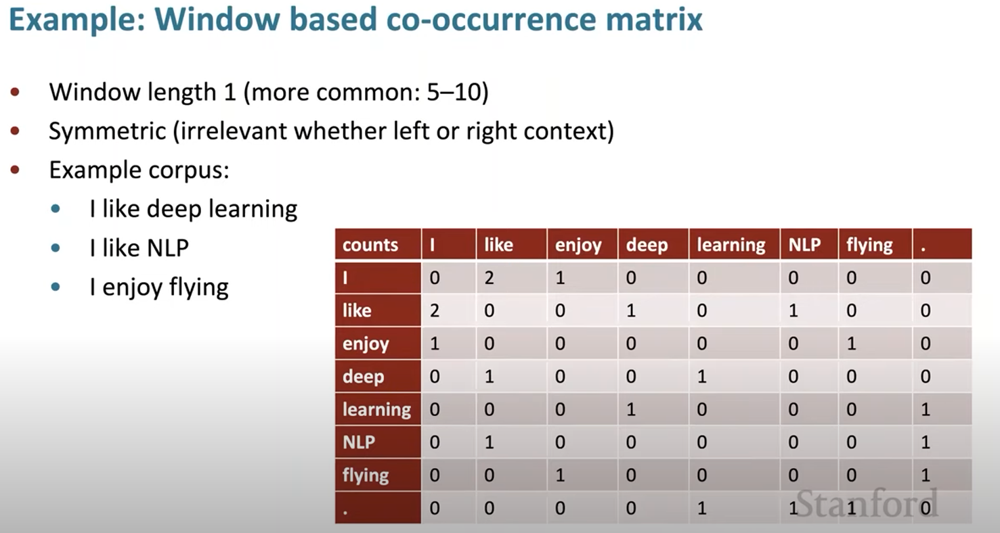
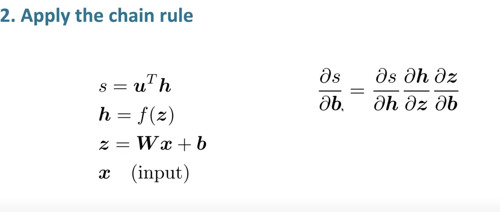
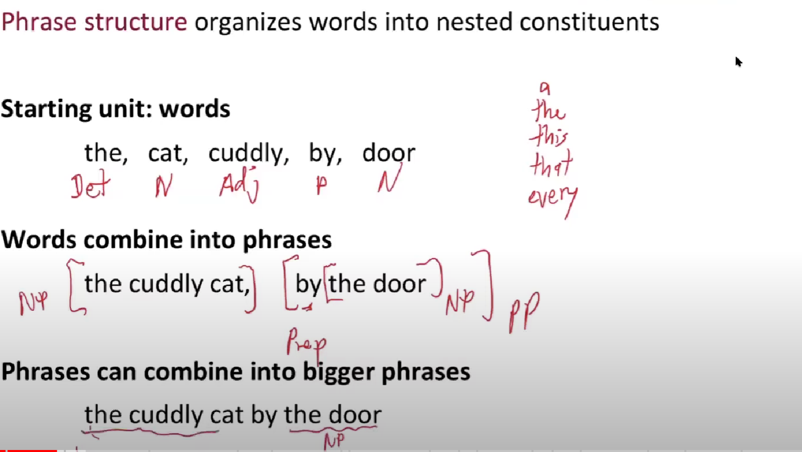
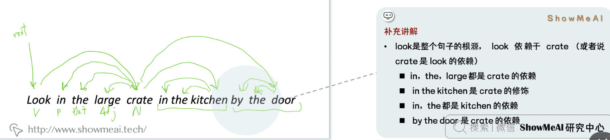
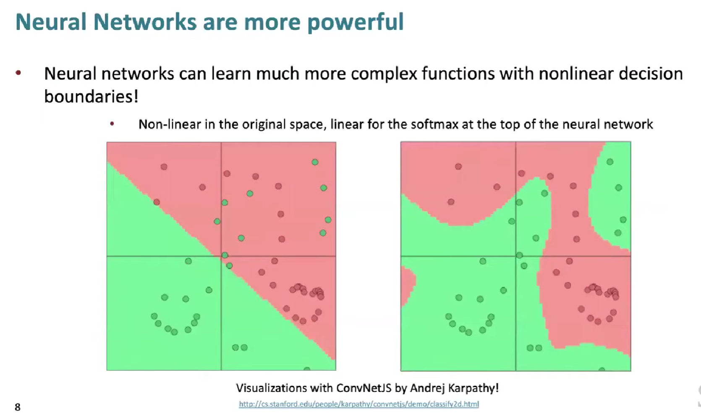
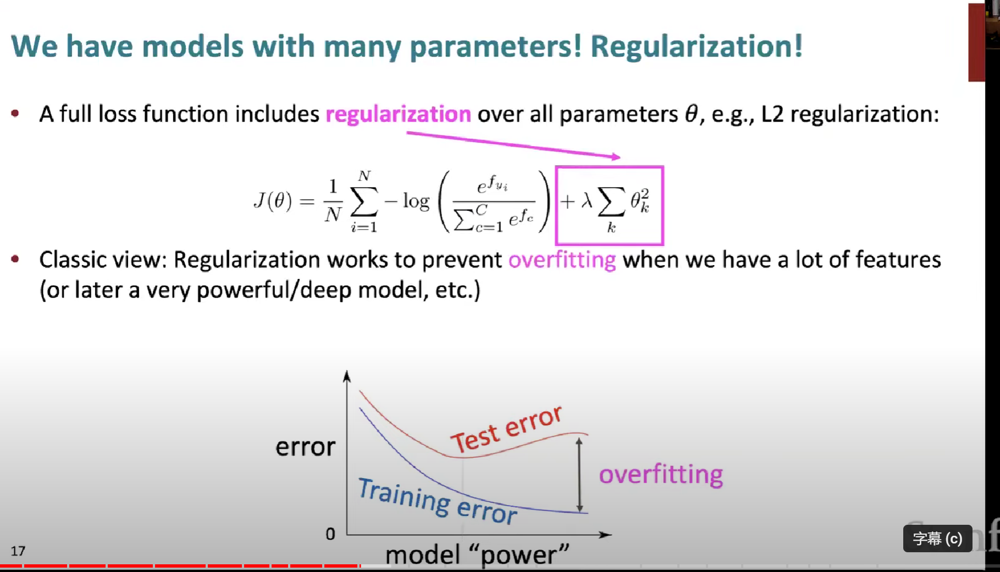
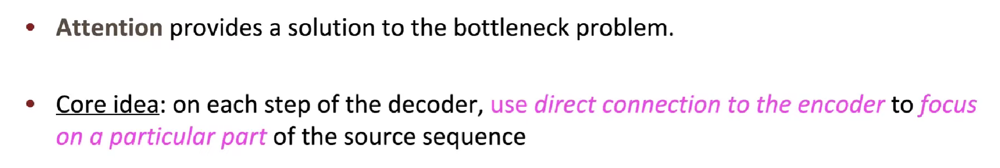

# some concepts

## machine learning and deep learning 

[机器学习和深度学习区别的简要概述 - 知乎 (zhihu.com)](https://zhuanlan.zhihu.com/p/69776750)

深度学习 基于神经网络

## 神经网络 

首先把人类眼中的特征转换成计算机的向量

把特征进行变化，特征：x身高+y体重等

神经网络生成很多特征，最终进行测算

特征的系数由神经网络学习得到

综上所述，深度学习是一种机器学习方法，神经网络是其基础模型，而大模型则是指具有大规模参数和复杂结构的神经网络模型。深度学习利用神经网络来学习数据的表示，而大模型则是神经网络的一种特例，具有更大的规模和复杂性。

# NLP

pytorch

# LECTURE 1

## basic acknowledge

### representing words as discrete symbols

#### one-hot向量

one-hot向量将类别变量转换为机器学习算法易于利用的一种形式的过程，这个向量的表示为一项属性的特征向量，也就是同一时间只有一个激活点（不为0），这个向量只有一个特征是不为0的，其他都是0，特别稀疏。

### problem with words as discrete symbols

虽然单词可以被表达为向量，但是在数学逻辑中，这两个向量是正交的，没有任何的自然联系

### representing words by their context

为了解决离散的词组无法被计算机认知的问题

人们提出分布式语义让计算机去了解单词

其中最成功的idea就是NLP

分布式语义：代表的是一个词的含义其实是由和伴随这个词经常出现的上下文给出的

#### word can be sorted refer to token and type

1. **Token**：Token指的是文本中的最小单位，通常是指由空格或标点符号分隔开的单词或符号。在某些情况下，token也可以是一个更大的单位，比如一个词组或短语。在NLP任务中，文本通常会被分解成一系列token，每个token代表文本中的一个基本单位。
2. **Type**：Type指的是不同的token种类或类型。换句话说，type是指所有不同token的集合。例如，在句子"I love love love NLP."中，有6个token（I, love, love, love, NLP, .），但是只有4个不同的type（I, love, NLP, .）。

文中第一行的banking是这段话的token

这三句话banking都是一种类型，所以在这三句话中，我们用banking代表一种类型

### word vectors

我们想使用vector去表示每个单词，让它不仅能够表达含义，还可以预测上下文

## Word2vec:overview

### overview

Word2Vec是一种广泛使用的**自然语言处理（NLP）技术**，用于学习词语的向量表示。它是由Google的研究团队在2013年提出的。Word2Vec的核心思想是将词语映射到一个高维空间中的向量，使得语义相近的词语在这个空间中的向量也相近。**这种向量表示可以捕捉词语之间的语义关系**，如同义、反义、上下位等。

首先我么要有一个巨大的语料库

然后把每个单词用vector去表示 

在一段文本中选择一个中心词，和上下文单词o

用c和o的向量去计算给中心词c 出现o的概率

不断调整单词的向量 让他的可能性最大

为了提高出现上下文的概率

我们不断改变中心测 然后预测

### objective function

1. **Likelihood**：在Word2Vec的上下文中，似然（likelihood）通常指的是给定一个词和其上下文时，模型正确预测这个上下文出现的概率。例如，在Skip-gram模型中，给定一个中心词，似然就是模型正确预测其周围上下文词的概率。似然越高，表示模型对训练数据的拟合程度越好。
2. **Objective Function**：目标函数（objective function）是在训练过程中需要优化的函数。在Word2Vec中，通常使用对数似然函数（log-likelihood function）作为目标函数。对于Skip-gram模型，目标函数是最大化所有词及其上下文的对数似然之和。对于CBOW模型，目标函数则是最大化给定上下文词预测中心词的对数似然之和。

目标函数的用途是指导模型的训练过程。通过调整模型参数（即词向量）来最大化目标函数，Word2Vec模型能够学习到能够反映词之间语义关系的词向量。

### prediction function

用于预测上下文

我们通过dot product代表两个向量，这里是中心词和上下文向量的相似度

softmax函数被用来计算给定中心词的上下文词的概率分布

其中，p*(*c*∣*w*)表示给定中心词w*时，上下文词*c*出现的概率。

***总而言之，首先通过向量表示文字，表示要与上下文紧密联系，使得具有相似上下文的单词向量相近，在大量学习之后，我们可以通过似然函数推理出上下文单词出现概率，从而预测上下文***

### to train the model:optimize value if parameters to minimize loss

在生成词向量的过程，如何减少word->vec的损失

*这张图片展示了一个参数向量θ，它包含了一系列的词向量。在这里，"R" 表示实数集，"2dV" 表示参数向量的维数，其中 \( V \) 是词汇表的大小，\( d \) 是每个词向量的维数。因此，\( \mathbb{R}^{2dV} \) 表示参数向量θ属于一个维数为 \( 2dV \) 的实数空间，这意味着每个词有两个向量表示：一个用作中心词（通常用 \( v \) 表示），另一个用作上下文词（通常用 \( u \) 表示），每个向量都有 \( d \) 维。所以，如果你有一个词汇表大小为 \( V \) 的语料库，并且选择了一个 \( d \) 维的向量空间来表示每个词，那么整个模型的参数空间的维数将是 \( 2dV \)，包括所有词的中心词向量和上下文词向量。*

在Word2Vec模型中提到的计算向量梯度是指在训练过程中，为了最大化似然函数，我们需要计算目标函数（通常是对数似然函数）相对于每个词向量参数的导数，即梯度。

梯度计算公式的细节取决于所用的目标函数，但基本过程如下：

1. **正向传播**：给定一个中心词，模型使用当前的词向量计算上下文词出现的概率。
2. **计算损失**：使用目标函数计算预测概率和真实概率之间的差异。
3. **反向传播**：计算损失函数关于每个词向量的梯度。这涉及到对目标函数求导，并将这些导数（梯度）反向传播回网络，以便更新词向量。
4. **更新词向量**：使用梯度和学习率来更新词向量，这个过程称为梯度下降（或在最大化问题中的梯度上升）

### whole process

#### 1. 初始化：

- **选择模型**：确定使用CBOW（Continuous Bag of Words）模型还是Skip-gram模型。
- **准备数据**：从文本语料库中收集训练数据，通常是单词及其上下文。
- **参数初始化**：随机初始化词向量。每个词有两个向量表示：作为中心词的向量和作为上下文词的向量。

#### 2. 训练：

- **滑动窗口**：在语料库中滑动窗口，选取中心词和上下文词。
- **生成训练样本**：在Skip-gram模型中，训练样本是中心词与其周围上下文词的配对。在CBOW模型中，是上下文词的集合和目标中心词的配对。
- **计算概率**：使用softmax函数或其近似（比如负采样或层次softmax）来计算给定中心词下上下文词出现的概率。
- **计算损失**：通过比较预测的概率分布和实际的分布，计算损失函数。
- **计算梯度**：通过反向传播算法计算损失函数相对于每个词向量的偏导数，即梯度。
- **更新词向量**：使用计算出的梯度和学习率来更新每个词的向量。

#### 3. 重复训练过程：

- **迭代优化**：重复上述训练过程多次，直到损失函数的值趋于稳定或达到预设的迭代次数。

#### 4. 预测（使用模型）：

- **获取词向量**：一旦训练完成，每个词的向量表示可以从模型中提取出来。
- **词语相似度**：通过计算词向量之间的余弦相似度，可以找到语义上相似的词。
- **类比推理**：可以使用向量运算（如王后 - 女性 + 男性 = 国王）来进行词语间的类比推理。
- **新词预测**：虽然Word2Vec不是一个传统意义上的预测模型，但可以通过向量的加减运算预测和某个词语语义相近的词。

#### 5. 结果使用：

- **NLP任务**：训练得到的词嵌入可以作为特征输入到各种自然语言处理任务中，如文本分类、情感分析、机器翻译等。

1. **实际概率**： 实际概率（也称为观测概率或真实概率）是指在训练数据中，一个词的上下文词实际出现的概率分布。这是从训练集中直接得到的统计信息。例如，在一个大的文本语料库中，单词“bank”后面跟着“river”和“money”的频率可以决定“river”和“money”作为“bank”上下文的实际概率。
2. **预测概率**： 预测概率是模型基于当前参数（词向量）计算得到的，给定一个词时其上下文词出现的概率。在Word2Vec模型中，这是通过softmax函数或其近似算法（如负采样或层次softmax）计算得到的。

在Word2Vec的训练过程中，我们希望模型预测的概率分布尽可能接近实际的概率分布。这就需要一个衡量标准，通常是损失函数，比如交叉熵损失函数，它可以衡量两个概率分布之间的差异。

关于偏导数和梯度的问题：

1. **偏导数**： 在多变量函数中，偏导数是指函数对单一变量的导数，而保持其他变量恒定。在Word2Vec中，每个词都由一个向量表示，这些向量的每个元素都是多变量损失函数的变量。

2. **梯度**： 梯度是由一个函数的所有偏导数组成的向量。在最优化问题中，梯度指向函数在给定点上增长最快的方向。因此，在Word2Vec中，我们计算损失函数相对于每个词向量的偏导数，所有这些偏导数组合起来形成了损失函数的梯度。

   在梯度下降优化算法中，梯度的负方向指示了减少损失函数值的方向，我们通过在梯度的负方向上更新词向量来训练模型，这样做可以使预测概率分布更接近实际概率分布。

## question

word2vect中通过反向传播算法计算损失函数相对于每个词向量的偏导数  为什么这里是相对于每个词向量 词向量难道不是输出吗 我们一般计算梯度不是都是对特征值进行求偏导吗？

在Word2Vec模型中，词向量既是模型的输入也是模型的参数。模型的目标是调整这些词向量以最大化它们对观察到的词序列的预测准确性。这里的"词向量"实际上指的是模型中每个词的表示，它们是模型学习过程中需要优化的参数。

在训练过程中，通过反向传播算法计算损失函数相对于每个词向量的偏导数，意味着我们在调整这些词的嵌入向量以减少模型的预测误差。每个词的向量会根据它们对损失函数的贡献进行调整，目的是使得模型能更好地捕捉和重现训练数据中词和它们上下文之间的关系。

所以，在这种情况下，“特征值”实际上是指词嵌入本身，这与传统的机器学习中输入特征不同，传统机器学习中通常是指模型的外部输入。在Word2Vec中，我们通过优化这些词向量，从而使得模型能够学到有用的词语表示。

# lecture2 

### Gradient Descent

梯度下降算法，这里我们需要用梯度下降算法最小化目标函数J通过改边delta

方法就是朝梯度相反方向做出改变，直到达到最小值

这张图片展示的是机器学习中常用的两个数学更新方程，特别是在梯度下降这样的优化算法中。

梯度并不是越大越好，在梯度下降算法中，如果梯度为0，说明达到最大值

### Stochastic  Gradient Descent

随机的梯度下降，用于解决梯度下降在问题中成本太过昂贵的问题，它只需要采样一小部分的中心词进行梯度计算估计就可以了

在实际应用中，**由于计算完整softmax代价很大**（需要对整个词汇表的单词进行计算），通常使用一些近似方法，**如负采样（Negative Sampling）**或层次softmax（Hierarchical Softmax），以提高训练的效率。这些方法减少了需要更新的权重数量，从而加快了训练过程。**负采样通过随机选择一小部分“负样本”（即上下文中没有出现的单词）**，而层次softmax通过构建一个二叉树来减少计算量，每个单词都是树的一个叶节点。这样，在更新权重时，只需要沿着从根节点到目标单词的叶节点的路径进行计算，而不是对整个词汇表进行计算。

## The skip-gram model with negative sampling (hw2)

对于softmax方法计算概率并进行采样，我们需要遍历每个单词，所以这个过程消耗很大

所以在skipgram model中

- 我们将在作业2中实现使用 negative sampling/负例采样方法的 skip-gram 模型。
- 使用一个 true pair (中心词及其上下文窗口中的词)与几个 noise pair (中心词与随机词搭配) 形成的样本，训练二元逻辑回归。

在Word2Vec模型的负采样中，J表示特定于负采样策略的损失函数。**这个损失函数衡量的是模型当前参数下，生成观察到的正样本（正确的单词上下文对）的概率，以及同时抑制模型生成一组随机选择的负样本（错误的单词上下文对）的概率。**

我们想让损失函数J越小，我们需要第一项中的点积最大，接近1，这就导致第一项越小，也代表了上下文本相关性概率最大。我们和需要第二项我们希望正确地预测负样本与当前词不相关时（即负样本的向量与上下文向量的点积应该是负数），代表着模型能识别不属于上下文的单词，所以点积是负数，加符号变成正数接近1，加对数变成接近0我们需要最大化目标函数

- 左侧为sigmoid函数(大家会在后续的内容里经常见到它)
- 我们要最大化2个词共现的概率

这个公式是在word2vec中使用负采样（Negative Sampling）时，用来选择负样本的概率分布。**这里的\( P(w) \) 表示选择一个单词\( w \)作为负样本的概率**。其中，\( U(w) \)是单词\( w \)在训练语料中的不平衡（unnormalized）频率，即该单词出现的次数。**Z是规范化常数（normalization constant），确保所有单词的\( P(w) \)加起来等于1。**

**指数4/3是一个经验值**，它的作用是重新调整每个单词被选为负样本的概率，使得频率非常高的单词（如停用词）不会被过度采样，同时保证低频词有足够的机会被选中。**这个调整能够改善训练的效果**，因为它减少了常见词汇对负样本选择的影响，使得模型学习到的向量表示更加丰富和平衡。

## co-occurrence matrix

我们能最简单想到的方法去联系中心词和上下文词就是，实现一个co-occurrence matrix矩阵，以此来计数，每个单词在上下文出现的概率，而不是通过算法去将word->vector

这个就是窗口大小为1，也就是我们只统计前后1个单词，出现的概率，并形成所有单词作为行列的对称矩阵

## co-occurrence vectors

### svd中如何从matrix中提取vector

那么对于这种co-occurrence vectors来说有一下问题

所以人们想到利用降维的方法。这样做可以去除噪声（去掉一些我无关紧要的数据）并减少维度。

## Classic Method: Dimensionality Reduction on X

**降维并不是二维到一维，而是分割行或者列**

可以使用SVD方法将共现矩阵  分解为  ，其中：

-  是对角线矩阵，对角线上的值是矩阵的奇异值（奇异值就是AAT的特征值开平方)
-  ,  是对应于行和列的正交基

为了减少尺度同时尽量保存有效信息，可保留对角矩阵的最大的  个值，并将矩阵  ,  的相应的行列保留

## Hacks to X

running an svd on raw counts doesn't work well

按比例调整 counts 会很有效

- 对高频词进行缩放(语法有太多的影响) like:a the an 
  - 使用log进行缩放
  - t应该是单词出现频次的阈值
  - 忽略function words
- 在基于window的计数中，提高更加接近的单词的计数
- 使用Person相关系数

## Interesting semantic patterns emerge in the scaled vectors

verv to the person who does the verbe ，这些向量大致平行

就好像drive to driver 就类似于 swin to swimmer

## Count based vs. direct prediction

基于基数和基于预测的两种获得词向量的模型

**基于计数**：使用整个矩阵的全局统计数据来直接估计

- **优点**：训练快速；统计数据高效利用
- **缺点**：主要用于捕捉单词相似性；对大量数据给予比例失调的重视

**基于预估模型**：定义概率分布并试图预测单词

- **优点**：提高其他任务的性能；能捕获除了单词相似性以外的复杂的模式
- **缺点**：随语料库增大会增大规模；统计数据的低效使用（采样是对统计数据的低效使用）

## Encoding meaning conponennts in vector difference

meaning componets 可以被代表为co-occurrence概率的比值

重点不是单一的概率大小，**重点是他们之间的比值**，其中蕴含着重要的信息成分。

- 例如我们想区分热力学上两种不同状态ice冰与蒸汽steam，它们之间的关系可通过与不同的单词  的共现概率的比值来描述
- 例如对于solid固态，虽然  与  本身很小，不能透露有效的信息，但是它们的比值  却较大，因为solid更常用来描述ice的状态而不是steam的状态，所以在ice的上下文中出现几率较大
- 对于gas则恰恰相反，而对于water这种描述ice与steam均可或者fashion这种与两者都没什么联系的单词，则比值接近于  。所以相较于单纯的共现概率，实际上共现概率的相对比值更有意义

## Glove combining the best of both worlds

logxij代表着单词两个单词出现的次数的比值（这里不是单词对的比值，这是两个单词的比值，应该和之前单词对差不多，只是消掉了分母）

## How to evaluate word vectors

## Intrinsic word vector evaluation 

## Glove Visualizations

## Analogy evaluation and hyperparameters

- **Sem.**: 表示在语义测试中的表现。这通常涉及到词义的相似性测试，如比较单词对是否在语义上接近。
- **Syn.**: 表示在语法测试中的表现。这涉及到词语的语法属性，比如词性标注或句法依赖关系。
- **Tot.**: 表示总体表现，可能是语义（Sem.）和语法（Syn.）分数的平均或加权总和

## 问题

### 这个随机的矩阵 是谁规定的  每个词对应一个向量？

在训练神经网络，特别是进行词嵌入训练时，随机初始化嵌入矩阵是一个常见的做法。这个过程并不是由某个人规定的，而是一种标准的机器学习技术，通常在模型的实现代码中自动完成。

随机初始化的目的是为了打破对称性，确保模型训练时可以正常学习。如果所有的向量初始化为同样的值，那么模型在训练过程中可能无法学习到有用的特征，因为每个单词的表示将会以同样的方式更新，从而无法分辨它们。

在训练开始时，每个单词被随机分配一个向量，这个向量的维度是提前设定的。例如，我们可能选择使用100维或300维的向量来表示每个单词。向量的具体数值是随机生成的，但通常会遵循一定的统计分布（如均匀分布或正态分布），且数值通常很小。

随着训练的进行，这些向量会根据模型的学习目标（如预测上下文单词）逐渐调整，以至于最终反映出单词的语义和语法特性。这样，模型最终得到的词向量就不再是随机的了，而是有意义的，能捕捉到单词之间的关系，如它们的相似度和共现频率等。

### skip-gram 和glove的区别

Skip-gram 和 GloVe 都是用于学习词嵌入的模型，但它们在原理和实现上有一些关键的区别：

1. **模型原理**：
   - **Skip-gram（Word2Vec 的一种架构）**：基于局部上下文信息。给定一个中心词，模型的目标是预测它在文本中周围的词语。Skip-gram 通过优化这种局部上下文预测来学习词嵌入。
   - **GloVe**：基于全局统计信息。GloVe 使用整个语料库中的词共现（co-occurrence）统计信息来学习词嵌入。它构建一个全局共现矩阵，并通过矩阵分解来得到词嵌入。
2. **优化目标**：
   - **Skip-gram**：优化的是局部上下文预测的对数似然函数。
   - **GloVe**：**优化的是词对之间的共现概率的对数与词嵌入内积之间的差异的平方和**。
3. **处理大规模数据**：
   - **Skip-gram**：通常需要对大量的局部上下文窗口进行采样和训练，可能在处理非常大的语料库时效率较低。
   - **GloVe**：由于是基于全局统计信息，可以在构建共现矩阵时一次性处理整个语料库，可能在处理大规模数据时更加高效。
4. **捕捉语义关系**：
   - **Skip-gram**：能够捕捉词语之间的相似性和语义关系，特别擅长捕捉罕见词的表示。
   - **GloVe**：通过全局共现统计，**能够捕捉更丰富的语义关系**，特别是能够较好地保持词与词之间的线性关系（如“king” - “man” + “woman” ≈ “queen”）。

**GloVe 用于什么时候**： GloVe 适用于需要从全局统计信息中学习词嵌入的场景，特别是当你希望捕捉词与词之间的共现关系并保持词嵌入中的线性语义关系时。GloVe 在处理大规模语料库时也可能更高效，因为它避免了对大量局部上下文的重复采样和训练。

总的来说，Skip-gram 和 GloVe 都是强大的词嵌入学习模型，选择使用哪个模型取决于具体的任务需求和语料库特点。在实践中，尝试不同的模型并比较它们在特定任务上的表现是一个常见的做法。

### Skip-gram的整体过程

Word2Vec 的 Skip-gram 模型整体过程包括以下步骤：

1. **初始化**：
   - 随机初始化词向量，为每个单词生成两个向量：中心词向量和外部词（上下文）向量。
2. **训练循环**：
   - 对于语料库中的每个单词，将其作为中心词，然后根据窗口大小选取周围的上下文词。
   - 对于每个中心词和上下文词对，执行以下步骤：
3. **前向传播**：
   - 通过计算中心词向量和每个上下文词向量的点积得到一个分数。
   - 应用 softmax 函数将分数转换成概率分布。
4. **计算损失**：
   - 使用交叉熵损失函数来计算当前的预测概率分布与实际的一热编码分布之间的差异。
5. **反向传播（梯度计算）**：
   - 通过损失函数相对于词向量的梯度来更新中心词向量和上下文词向量。
6. **参数更新**：
   - 使用梯度下降（或其他优化算法）更新词向量。这通常包括计算学习率和梯度的乘积，并从当前向量中减去该乘积。
7. **重复步骤**：
   - 重复步骤2到6，直到达到一定的迭代次数，或者模型损失不再显著减少。
8. **后处理**（可选）：
   - 训练完成后，可能会对词向量进行归一化处理。
   - 有时还会使用技巧如词向量维数的降维（例如使用 PCA）以提高其实用性。

# lecture3 Backprop and Neural Networks（向后传播和神经网络）

## 1.named entity recognition（NER）命名实体识别

给文字添加标签，例如per人，loc位置

- 可能的用途
  - 跟踪文档中提到的特定实体(组织、个人、地点、歌曲名、电影名等)
  - 对于问题回答，答案通常是命名实体
  - 许多需要的信息实际上是命名实体之间的关联
  - 同样的技术可以扩展到其他 slot-filling 槽填充分类

- 通常后面是命名实体链接/规范化到知识库

1. **基本思想**：
   - 为每个单词分类，根据其邻近词（上下文窗口）来确定该单词是否属于某个特定类别。
2. **训练分类器**：
   - 在手标注数据上训练逻辑回归分类器，以确定中心词是否属于某个类别（是或否）。虽然通常会使用多类 softmax 分类器，但为了简化，这里使用了二元分类器。
3. **举例**：
   - 分类“Paris”（巴黎）这个单词，判断它在句子中是否是一个位置（地点名称）。这里使用的窗口长度是 2，即考虑中心词前后各两个词作为上下文。
   - 给出的例子句子是“The museums in Paris are amazing to see.”（博物馆在巴黎是惊人的看点）。在这个句子中，“Paris”前后各有两个词，形成了一个上下文窗口。
4. **特征向量构建**：
   - 构建**特征向量** `x_window` 通过拼接（concatenation）中心词“Paris”和它的上下文词“museums”，“in”，“are”，“amazing”的词向量。这里 `x_museums`、`x_in`、`x_Paris`、`x_are`、`x_amazing` 分别是这些词的词向量。
   - 拼接后的结果向量 `x_window` 属于 5*R*5*d* 空间，是一个列向量，其中 d 是单个词向量的维度。
5. **分类操作**：
   - 为了对整个句子中的每个单词进行分类，针对每个单词中心的向量运行分类器，判断其所属类别。

我们现在有了输入的特征向量X，其中由五个词向量组成

- 隐藏层计算方式：通过特征矩阵W和偏置项（*偏置项允许模型输出在没有输入（即输入为零）时不等于零，从而更灵活地拟合数据。例如，在二维空间中，偏置项允许直线不必经过原点。这提供了额外的自由度，让模型能够更好地适应数据。*）b和非线性激活函数得到h
- 得分计算公式:u是权重向量，h是隐藏层表示（文中叫Neural Networks，虽然这是机器学习，但是他利用的是神经网络提取特征值的方法进行计算）
- costfunction，将得分s映射到（0，1）内表示概率

## SGD

### grandients 梯度概念

**梯度是一个向量**，包含了f对每个xi的偏导数▽f

梯度向量中的每个分量是衡量函数f在相应变量xi方向上的变化率

所以表示为下面这个式子

雅可比矩阵（Jacobian matrix）

这里是n个input n个output的函数

那么对这个函数求偏导，只有i=j才对函数有影响

所以这个函数的jacobian矩阵只有在对角线上有元素，可以类比ninput m ouput的jacobian矩阵去理解

这个矩阵就被表示成diag(f'(z)) ，表示一个对角线上有 *f*′ 导数，其他元素为 0 的对角矩阵。

形如u.T,也是向量，所以最终形式也要进行转置

### Back to our Nerual Net

虽然我们对cost function J感兴趣，但是这里为了简化，我们就求score 对b的偏导数

之前我们求wx+b对b偏导，矩阵是单位矩阵，因为b和x相对独立。但是这里并不独立，所以需要通过链式法则来求解。

进一步分解链式法则

这个小圆点（∘）表示的是**哈达玛积**（Hadamard product），也称作逐元素乘法。这是一个二元操作，它接受**两个尺寸相同**的矩阵，并产生另一个同样尺寸的矩阵，其各个元素是原两个矩阵对应元素的乘积。

我们发现s对W偏导的时候，前两项是完全相同的，所以我们有必要使用一种减少重复运算的算法

我们把前两项替换为δ（局部误差信号）

- 参数形状和jacobian矩阵形状不同，w有nxm个输入，1个输出，所以jacobian矩阵式一个1xnxm的形状（*由于这是二元分类问题所以output只有一个值 0/1*）
- 梯度形状的重要性：**我们通常希望梯度的形状与参数矩阵 *W* 的形状相匹配。**这样做可以使更新参数更加直观和容易实现，尤其是在编写代码来更新神经网络参数时。
- 遵循**形状约定**（shape convention）：在数学上，尽管可以计算出不同形状的梯度（例如，标量对矩阵的雅可比矩阵），但在实践中，我们遵循一个“形状约定”，即梯度的形状应该与参数的形状相同。这意味着如果 *W* 是一个 n*×*m 矩阵，那么s对w的偏导也是一个nxm的矩阵。
- jacobian矩阵梯度元素：Wij是W矩阵中第i行第j列的元素，这种表示方法展示了如何计算每个权重对输出s的影响

Transposes 转置

然而，按照形状惯例，因为 b 是一个列向量，我们的梯度应该也是一个列向量。这样的形状惯例可以让数学表达式在形式上保持一致性，特别是在编写代码实现算法时，这能使得矩阵运算更加直观和一致。

在机器学习和线性代数中，**通常将变量（特别是在优化问题中的参数）表示为列向量**。这是因为在矩阵乘法中，一个矩阵 A 乘以一个列向量 b，结果是另一个列向量，计算过程遵循了线性映射的规则。这个习惯使得表达式和计算在形式上保持一致。

1. 尽可能使用雅各比形式（Jacobian form），但在计算的最后阶段，根据形状约定进行转换：这意味着在计算过程中可以使用行向量，但在最终结果时，需要将导数 ∂s/∂b 转置成列向量，得到 δ^T。
2. 始终遵循形状约定：这建议在进行导数计算时始终保持形状一致性。在操作中需要查看维度，以确定何时需要转置或重新排序项，确保每个计算步骤的输出与期望的形状一致。

幻灯片还指出，错误信息 δ，即反向传播中到达隐藏层的误差梯度，应该与该隐藏层的维度一致。这是为了确保在神经网络中反向传播算法可以正确执行，因为每一层的权重更新依赖于与该层输出相同维度的梯度。

## Backpropagation 反向传播

反向传播（Backpropagation）是神经网络训练中的一种算法，用于根据损失函数（表示网络预测错误程度的函数）来调整网络中的权重和偏置。**其核心目标是最小化损失函数的值，即减少神经网络输出与实际值之间的差异。**

1. **前向传播（Forward Propagation）**：
   - 输入数据在网络中前向传播，通过层间的权重和偏置，以及非线性激活函数，直到得到输出。
   - 网络的输出与真实的标签值比较，计算损失函数的值。
2. **计算梯度（Gradient Calculation）**：
   - 损失函数相对于网络最后一层输出的梯度首先被计算出来。
   - 这个梯度反映了损失函数对网络输出的敏感度。
3. **反向传播（Backpropagation）**：
   - 通过链式法则，损失函数的梯度被反向传播回网络中，计算中间层输出和最终损失之间的关系。
   - 在每一层，**计算损失函数对该层每个权重的偏导数**，这些偏导数构成了梯度。
   - 这一步是反向传播算法的核心，它允许我们理解如何通过调整每个权重来减少最终的损失。
4. **权重更新（Weight Update）**：
   - 一旦计算出损失函数对所有权重的梯度，就可以使用这些梯度来更新权重。
   - 更新通常是通过梯度下降或其变种进行，权重按照其对损失的贡献程度进行调整，以期望在下一次前向传播时降低损失。

**优化技巧**：幻灯片上的“other trick”提到了一个重要的优化技巧——在计算时重复利用上层计算出的导数来计算下层的导数，以减少计算量。**这意味着在神经网络的某一层计算出的导数可以在计算之前的层时重复使用，这样可以避免重复的计算工作，使得算法更加高效。**

用计算图来代表神经网络中如何进行向前传播

向后传播更新权重

**局部梯度**就是这个节点输出对输入的偏导数

**上游梯度**就是损失函数对当前节点输出的偏导数

**下游梯度**就是损失函数对于当前节点输入的偏导数，是局部梯度和上有梯度的乘积

***这三个概念都是相对于节点而言，这里为了简化只有一个节点***

**我们所谓的梯度是针对整个神经网络**

在反向传播中，下游梯度的计算对于更新网络中的权重和偏置至关重要。每个节点的下游梯度都是基于其上游梯度和当前节点操作的局部梯度。通过这种方式，梯度信息可以从输出层回传到输入层，允许我们对每个参数的影响进行量化并相应地更新它们以减少损失。

单节点但是多个输入的情况

最后输入对应的下游梯度就是改变他们对应的权重，比如改变x那么输出结果就会变成两倍的x值

多个输出的时候只需要相加

## question

1. **前向传播（Fprop）**：
   - 按照拓扑排序访问节点，即从输入层开始，按顺序向后访问，直到输出层。
   - 对于每个节点，基于其前驱节点的值计算该节点的值。
2. **反向传播（Bprop）**：
   - 初始化输出的梯度为 1，因为这是损失函数相对于自身的导数。
   - 逆序访问节点，即从输出层开始，向前逐节点进行，直到输入层。
   - 对每个节点，利用该节点对其后继节点的梯度来计算相对于该节点的梯度。

- **反向传播（Backpropagation）**：这是一种递归（因而高效）的方式沿着计算图应用链式法则。它的基本原则是“下游梯度 = 上游梯度 × 局部梯度”，这意味着梯度是如何通过网络反向传递的。
- **前向传播（Forward pass）**：这一步计算操作的结果，并保存中间值。在神经网络中，这通常涉及对输入数据应用权重，加上偏置，并通过激活函数，最终获得输出。
- **后向传播（Backward pass）**：在这一步，我们应用链式法则计算梯度。从输出开始，我们逆向工作，使用保存的中间值（从前向传播）和链式法则来计算每个参数相对于损失函数的梯度

反向传播是完整的循环算法，包含了前向传播和后向传播

*反向传播（Backpropagation）和后向传播（Backward pass）这两个术语经常在深度学习的文献和讨论中互换使用，但它们可以从不同的角度描述同一过程：*

1. ***反向传播（Backpropagation）**:*
   - *这个术语通常用来描述整个用于训练神经网络的算法过程，它包括了前向传播（在网络中计算输出），计算损失，以及后向传播（计算梯度并传递回输入层的过程）。*
   - *反向传播强调的是算法的完整循环，包括了前向计算和后向梯度传播的整个序列。*
2. ***后向传播（Backward pass）**:*
   - *这个术语更具体地指反向传播过程中的一部分，即从输出层到输入层传递梯度的过程。*
   - *它仅指梯度计算和反向流动的部分，而不包括前向传播或梯度下降步骤（实际更新权重）。*

# Lecture4 Syntactic Structure and Dependency Parsing**句法结构和依赖关系解析**

在语言学和自然语言处理（NLP）中，句法结构分析是理解句子是如何构建的一个关键部分，它包括研究词语如何组合成短语和子句，以及这些短语和子句如何进一步组合成完整的句子。

“一致性”通常指的是句子成分在语法功能和形式上的一致匹配，如主谓一致，确保主语和谓语在人称和数上的一致。

“依赖性”通常描述的是句子中各个词语之间的依赖关系，即一个词（依赖词）在句法功能上依赖于另一个词（主导词）。依赖关系可以用来描绘句子的句法结构，是很多句法分析和句法解析算法的基础。

## two views of linguistic structure

### Constituency=phrase structure grammar = context-free gammars(CFGs) 无上下文语法

在自然语言处理中，CFGs 可以用来定义如何将句子分解为其组成部分，例如短语或单词。举个简单的例子，一个简单的CFG可能包含以下规则：

1. 句子 -> 名词短语 动词短语
2. 名词短语 -> 冠词 名词
3. 动词短语 -> 动词 名词短语
4. 冠词 -> 'the' | 'a'
5. 名词 -> 'cat' | 'dog'
6. 动词 -> 'chases' | 'sees'

这个CFG定义了如何生成简单句子，比如 "the cat chases the dog"。CFG中的每条规则描述了一个结构组件如何被分解或组合。

这是介绍句法结构的基础，显示了从单词到短语，再到更大短语的结构层次。

### Dependency structure 依赖结构

这张幻灯片讨论的是语言结构的另一种观点：依存结构（Dependency Structure）。依存结构揭示了词语之间的依赖关系，显示出哪些词语依赖于（修饰、附加到或作为参数的）其他词语。

在自然语言处理（NLP）中，依存结构是一种表现句子内部各个词之间关系的模型。依赖性分析是NLP中的一个任务，它识别出词之间的依存关系，通常是通过依存句法分析来完成的。

举例来说，在句子 "The cat sat on the mat" 中：

- "sat" 是主要动词，是句子的中心。
- "The cat" 是 "sat" 的主语，因此 "cat" 依赖于 "sat"。
- "on the mat" 是 "sat" 的状语，显示出位置，其中 "on" 依赖于 "sat"，"the mat" 依赖于 "on"。

依存结构通常通过一棵树来表示，树中的节点代表词语，而边代表词语之间的依存关系。这种结构对于许多NLP应用至关重要，例如句法分析、信息提取、问答系统和机器翻译，因为它有助于理解词语在句子中如何相互作用。

### why do we need senten ce structure为什么我们需要句子结构

- 为了能够正确地解释语言，我们需要理解句子结构
- 人类通过将单词组合成更大的单元来传达复杂的意思，从而交流复杂的思想
- 我们需要知道什么与什么相关联
  - 除非我们知道哪些词是其他词的参数或修饰词，否则我们无法弄清楚句子是什么意思

### prepositional phrase attachment ambiguity 介词短语增加了歧义

人类大脑可能很好理解这句话，但是对于计算机来说可能会有两个含义，这就引起了歧义

歧义成倍增加

### Coordination scope ambiguity 协调范围模糊

### Adjectival/Adverbial Modifier Ambiguity形容词修饰模糊

### Verb Phrase attachment ambiguity动词短语(VP)依存歧义

## Dependency paths 依赖语法与树库

### Dependency grammar and dependency structure 依赖语法和依赖结构

###  

### The rise of annotated data & Universal Dpendencies treebanks带注释数据的兴起：通用依存句法树库

**Treebank** 是一个语料库，其中的每个句子都经过了句法分析，并以树状结构表示出来，展示了句子中各个词语之间的语法关系。这些树状结构可以是依存关系树，也可以是短语结构树。

### the rise of annotated data

### dependency conditioning preferences 依赖条件首选项

1. **双词亲和性 (Bilexical affinities)**：指的是某些词对自然倾向于形成依存关系。例如，“discussion”和“issues”这两个词之间形成依存关系是合理的。
2. **依存距离 (Dependency distance)**：依赖关系通常存在于相邻的词之间，距离较近的词更可能形成依存。
3. **介入材料 (Intervening material)**：依存关系很少跨越介入的动词或标点。
4. **核心词的价 (Valency of heads)**：核心词（head word）通常与特定数量的依赖项（dependents）相关联，这个信息可以帮助解析器确定哪些词作为核心词是常见的。

### Dependency parsing

### 基本的基于转换的依存关系解析器

如何选择下一步的行为：

- 我们需要解释如何选择下一步行动
  - Answer：机器学习

- 每个动作都由一个有区别分类器(例如softmax classifier)对每个合法的移动进行预测
- 最多三种无类型的选择，当带有类型时，最多  种
- Features：栈顶单词，POS；buffer中的第一个单词，POS；等等

- 在最简单的形式中是没有搜索的
  - 但是，如果你愿意，你可以有效地执行一个 Beam search 束搜索(虽然速度较慢，但效果更好)：你可以在每个时间步骤中保留K个好的解析前缀

- 该模型的精度略低于依赖解析的最高水平，但它提供了非常快的线性时间解析，性能非常好

### 

### 传统特征表示

这张幻灯片介绍了在依存句法分析中使用的常规特征表示方法。分析器如何选择它的下一步行动是通过机器学习的方法来实现的，其中使用了特征向量来代表解析器的当前状态。

这张幻灯片介绍了在依存句法分析中使用的常规特征表示方法。分析器如何选择它的下一步行动是通过机器学习的方法来实现的，其中使用了特征向量来代表解析器的当前状态。

幻灯片上展示了一个**特征向量**，它通常是高维的、稀疏的（这意味着大部分值为零），维度通常在 \(10^6\) 到 \(10^7\) 之间。这个向量包含了从解析配置中提取的不同特征，这些特征有助于机器学习模型预测下一步最佳的行动（SHIFT, LEFT-ARC, 或 RIGHT-ARC）。

特征模板通常是配置中1到3个元素的组合。例如，幻灯片中展示的**特征模板**（*在机器学习中，尤其是在自然语言处理任务中，特征模板用于从原始数据中提取出有助于学习和预测的信息。在依存句法分析中，特征模板定义了哪些属性和它们的组合会被用作输入，以便训练分类器来预测解析动作（比如 SHIFT, LEFT-ARC, 或 RIGHT-ARC）*。）包括：

- 单个词的属性，如它的词性（Part-of-Speech，POS）。
- 两个词之间的依存关系，如它们的词性和它们之间的特定关系。
- “指示器特征”（Indicator features），它们是二进制的（0或1），指示某个特定的属性或属性组合是否存在。

在上面的幻灯片例子中，指示器特征表示了栈顶的词（如 "has"）、栈顶词的POS标签、缓冲区中的第一个词以及这些词的POS标签。这些特征将用于预测在给定的解析状态下执行哪个转移操作是最合适的。

这个过程是自然语言处理和机器学习中句法分析的关键组成部分，**因为它允许计算模型学习**如何识别和构建正确的语言结构，这是理解和处理自然语言的基础。

###  依赖分析的评估：(标记)依赖准确性

- **UAS (Unlabeled Attachment Score)**: 这个得分计算了在解析过程中正确识别依赖关系的百分比，不考虑依赖关系的类型标签。在这个例子中，“4/5”意味着在5个依赖关系中有4个被正确识别了，所以UAS是80%。
- **LAS (Labeled Attachment Score)**: 这个得分计算了在解析过程中正确识别依赖关系及其正确类型标签的百分比。在这个例子中，“2/5”意味着在5个依赖关系中只有2个的关系和类型标签都被正确识别了，所以LAS是40%。

# Lecture4 循环神经网络 RNNs

## neutral dependency parser  神经依赖解析器

### first win：分布式表示单词  Distributed representations

- **单词的分布式表示**：这里提到了将每个单词表示为一个维度为 *d* 的密集向量，也就是单词嵌入（word embedding）。这种表示方法的优势在于，相似的单词在向量空间中会有接近的向量，这允许计算机能够捕捉到单词之间的语义相似性。
- **词性标注和依赖标签的表示**：幻灯片还提到词性标注（POS）和依赖标签也用维度为 *d* 的向量来表示。这表示除了单词本身，单词的语法功能（比如名词、动词等）和它们在句子中的依赖关系（如主谓宾结构）也通过密集向量来编码。这样的表示方式有助于捕捉语法标签之间的语义相似性。

幻灯片下方的例子阐明了**相似的词性标签和依赖标签在向量空间中应该是相近的**。比如，复数名词（NNS）的向量应该和单数名词（NN）的向量相近；数值修饰词（nummod）应该和形容词修饰词（amod）相近。

***“nsubj”表示名词主语（nominal subject），这是一个常见的依赖关系，指的是一个名词或名词性短语在句子中作为动词的主语***
将所有这些信息的向量表示拼接（concatenate）起来，就可以得到当前配置的神经表示。**这意味着，解析器会将单词、词性标签和依存标签的向量合并成一个长向量**，这个长向量将作为神经网络模型输入的一部分，用来预测下一步解析动作。

### second win：deep learning classifiers are non-linear classifiers 深度学习分类器不是线性的分类器

- **Softmax分类器**：在这里提到的softmax分类器是一种用于多类分类问题的分类器。它可以根据给定输入 x 属于实数空间 R*d* 计算出一个类别 *y* 的概率 p*(*y*∣*x)，这个概率通过一个指数函数来计算，使得所有类别概率之和为1。权重矩阵 W 中的每一行都对应于一个类别的权重向量。
- **交叉熵损失**：训练时，softmax分类器的目标是最小化负对数似然损失，也称为交叉熵损失。这是一个常见的损失函数，用于衡量模型预测概率分布与真实标签之间的差异。
- **传统ML分类器的限制**：幻灯片提到传统的机器学习分类器（如朴素贝叶斯、支持向量机（SVMs）、逻辑回归等）通常只能创建线性决策边界，这在处理复杂问题时可能是一个限制。**例如，在下方的图示中，如果数据不是线性可分的，那么传统的线性分类器就很难正确分类。**
- **深度学习的优势**：与此相对，**深度学习分类器能够学习非线性决策边界**，因此它们能够处理更复杂的问题。这是通过在网络中添加非线性变换（例如，使用激活函数如ReLU或Sigmoid）实现的。

### 简单的前馈神经网络多类分类器的结构

- **输入层 x**: 输入层接收原始数据。在这个上下文中，输入数据可能是词嵌入，也就是在NLP任务中将词表示为向量的形式。在此之前会将one-hot向量经过特征矩阵处理变成一个密集的向量
- **隐藏层 h**: 这是网络中的中间层，它通过将输入层的数据（x）与权重矩阵（W）相乘然后加上偏置项（b₁）得到，之后通过激活函数，**这里是ReLU（Rectified Linear Unit）**，来增加非线性（***不是y=kx+b都是非线性***）。ReLU函数的特点是它会将所有负值转换为0，而保留所有正值。隐藏层的目的是对输入数据进行重新表示，使其可以更容易地被输出层的线性softmax分类器处理。
- **输出层 y**: 这是网络的最后一层，用于进行最终的分类决策。它采用隐藏层的输出（h），将其乘以另一个权重矩阵（U）并加上偏置项（b₂），然后通过softmax函数。softmax函数会将这些值转换为概率分布，表示每个类别的概率。这个层的输出（y）就是模型对每个类别的预测概率。
- **损失函数**: 网络通过损失函数来学习，这里使用的是对数损失函数（又称交叉熵损失）。损失函数衡量预测概率分布和真实标签之间的差异，并通过反向传播算法更新网络的权重，以减小这种差异。
- **反向传播**: 交叉熵误差将通过网络反向传播回去，确保隐藏层和输入层的权重（以及偏置）得到更新。这样，网络能够在迭代过程中逐渐学习并改进其预测性能。

#### feed-forward定义

**“前馈”（feed-forward）**体现在神经网络的架构和数据流动方式中。在这种网络中，信息从输入层开始，经过隐藏层（可能有多个），最终到达输出层，并且在这个过程中，信息流动是单向的，即从输入端到输出端，不会回流。**每一层的输出都是基于当前层的输入、权重、偏差和激活函数计算得到，然后这个输出成为下一层的输入。**

### Neural dependency parser model architecture

转化的第一步可能包括以下子步骤：

1. **词汇查找（Lookup）**：模型会对栈和缓冲区中的每个单词执行查找操作，将单词转换为词嵌入向量。
2. **拼接（Concatenate）**：然后，这些向量会按照它们在栈和缓冲区中的顺序被拼接起来。例如，如果栈顶的两个词是 "has" 和 "good"，模型会首先查找这两个单词对应的向量，然后将这些向量端到端连接起来形成一个长的向量。
3. **输入层**：拼接后的向量组成了神经网络的输入层 *x*，这个层将会传递给隐藏层进行进一步的处理。

这个输入层的数据随后会被送入一个或多个隐藏层，最后通过输出层的softmax函数得到每个可能的解析动作（如Shift, Left-Arc, Right-Arc）的概率。这些概率用于决定模型应该执行哪个动作来分析或解析给定的句子。

## 训练过程

### we have models with many parameters！regularization

#### 正则化 regularization

**正则化是一种用于减少模型过拟合的技术**，在机器学习和统计建模中经常使用。过拟合是一个问题，它发生在模型过于复杂，以至于它开始记住而不是从训练数据中泛化特征，导致在新的、未见过的数据上表现不佳。

当我们训练模型时，我们希望模型在新的数据上也能表现良好，即具有良好的泛化能力。为了做到这一点，我们不希望模型变得过于复杂并且完全适应训练数据中的每个细节。正则化通过为模型增加一个额外的惩罚项来限制模型的复杂度，这个惩罚项会惩罚过大的权重值。

举个例子，没有正则化的线性回归模型会尽可能地减少预测值和实际值之间的差异，而不考虑权重的大小。但是，如果我们增加一个正则化项，如 L2 正则化，**它会惩罚权重值的平方和**，这迫使模型不仅要减少误差，还要保持权重较小。

这张幻灯片讨论了机器学习模型中的正则化技术，**特别是 L2 正则化，也称为岭回归（Ridge Regression）或权重衰减。**这里解释了正则化在防止过拟合方面的重要性，尤其是在模型参数很多时。

正则化是通过在损失函数中添加一个额外的项来实现的，这个额外的项惩罚了模型权重的大小。具体来说：

- **损失函数 J(θ)**：这个函数是模型在所有训练样本上的平均损失。在这里，它由两部分组成：第一部分是对数损失（也称为交叉熵损失），用于衡量模型预测和真实数据标签之间的差异；第二部分是正则化项，λ 是正则化强度参数，Σθ²_k 是所有模型参数的平方和。

- **L2正则化项**：这个项是 θ 参数的平方和，**乘以正则化强度 λ**。L2 正则化倾向于将权重推向较小的值，这有助于防止模型对训练数据过度拟合，从而提高模型在新数据上的泛化能力。

- **模型"力量"和过拟合**：幻灯片底部的图显示了随着模型"力量"（或复杂性）的增加，**训练误差通常会降低，但测试误差在达到某一点后会开始增加**。这种现象被称为**过拟合**，即模型学习了训练数据中的噪声和细节，而这些特性并不适用于更广泛的数据集。

正则化通过在模型复杂性和模型在未见数据上的表现之间取得平衡，帮助我们找到误差曲线上的一个佳点，以优化模型的泛化能力。通过选择合适的 λ 值，我们可以控制正则化的程度，防止过拟合同时保留模型足够的灵活性以学习数据中的规律。

当我们构建大型神经网络的时候l2正则化起到的作用不多，所以我们需要了解dropout实现正则化

### Drop out

这张幻灯片介绍了 Dropout，这是一种在训练神经网络时常用的正则化技术，以防止过拟合。

**Dropout的基本概念：**

- **在训练时**：对于每次训练实例，在前向传播的过程中，每个**神经元**（包括输入层和隐藏层的神经元）都有一定概率（例如，50%）被随机临时“丢弃”，即它们的输出被置为零。**这意味着网络的每一次迭代训练实际上都是在不同的网络架构上进行的，因为一些神经元暂时被移除了。**

- **在测试时**：所有神经元都参与预测，**但是它们的输出权重会根据丢弃概率进行缩放**，比如如果训练时的丢弃概率是50%，那么在测试时，每个神经元的输出权重都会乘以0.5，以平衡活跃神经元的数量。

**为什么使用 Dropout：**

- **防止特征共适应**（Co-adaptation）：**网络中的神经元可能会依赖于其他神经元的存在**，这可能导致过拟合。通过丢弃，神经元不能依赖于特定的其他神经元，因为它们可能不会在下一个训练实例中激活，这迫使每个神经元独立学习有用的特征。

- **中间态正则化**：Dropout可以被视为介于全独立特征的朴素贝叶斯和全依赖特征的逻辑回归之间的中间方法。

- **模型集成的形式**：Dropout训练可以视为在指数级数量的不同网络上进行训练，然后在测试时进行平均，这与集成方法类似，集成方法中多个模型被训练以得到更好的泛化性能。

**为什么有时候不使用 Dropout：**

尽管 Dropout 是一种强有力的正则化手段，但并不是所有情况下都适用或必要：

- **数据充足时**：如果有大量的训练数据，模型可能自然而然地就具有很好的泛化能力，因此不需要额外的正则化。

- **对小型网络**：对于较小的网络，过拟合的风险较小，可能不需要 Dropout。

- **计算资源有限**：Dropout可能会增加训练时间，因为网络需要在多种"丢弃"配置上训练。

- **其他正则化手段**：如果已经在模型中使用了其他正则化技术，如权重衰减（L2正则化）、数据增强等，再使用 Dropout 可能就显得过剩了。

- **某些类型的网络结构**：比如循环神经网络（RNNs），在这些网络中，由于时间序列数据的特殊性质，Dropout 可能不是最合适的正则化方法。虽然 Dropout 也可以被应用到 RNNs，但需要更为谨慎地处理，例如通过使用变体如区域性 Dropout。

总之，Dropout 是一种常见且有效的正则化策略，但是否使用以及如何使用需要根据具体任务的数据、网络复杂度和训练目标来确定。

### non-linearities

dl中非线性处理很重要

在dl中我们首先默认使用的非线性函数就是relu，右侧还有一些relu的变体

### Parameter initialization

这张幻灯片讨论了神经网络中的参数初始化问题，并介绍了Xavier初始化方法，其目的是在训练开始时正确地设置权重。

**参数初始化的重要性：**
- 正确的初始化可以防止学习过程中的对称性问题，**如果所有权重都初始化为相同的值，神经元可能会学到相同的特征。**
- 初始权重太大或太小都可能导致问题：权重太大可能导致梯度爆炸，太小可能导致梯度消失。

**Xavier初始化：**
- Xavier初始化是一种特别为深度神经网络设计的初始化方法。
- 初始化的权重值取自均匀分布 ( U(-r, r) )，其中 \( r \) 是根据输入和输出单元数量的函数来选择的，以确保网络中每一层的权重有适当的方差。
- 这种方法保持每一层输入的方差在传递过程中大致相同，帮助避免在训练过程中梯度消失或爆炸。
- 

幻灯片的最后一点提到**，随着层标准化（layer normalization）**等技术的出现，对初始权重的需要可能减少了。**层标准化是一种训练时在每一层内部标准化激活值的技术**，可以降低模型对权重初始值的敏感度。

层标准化（Layer Normalization）是一种在训练神经网络时使用的技术，旨在通过对每一层的激活值进行标准化，改善训练过程的稳定性和速度。这种方法与批量标准化（Batch Normalization）类似，但它是在每个样本的单个层上独立进行的，而不是在一个批次的样本上。

在神经网络中，**层标准化**通常如下进行：

1. **计算均值和方差**：对于网络中的每个样本，计算特定层每个激活值（*激活值在神经网络中是指通过激活函数处理网络中某一层的加权输入后得到的值。这些激活值是传递到网络下一层或作为输出的数值，它们是网络内部表示的一部分，可以视为网络对于给定输入在特定层的响应。*）的均值和方差。
2. **标准化激活值**：使用上一步计算出的均值和方差，对每个激活值进行标准化，使得输出的均值为 0，方差为 1。具体来说，对于给定层的每个神经元，它的激活值会减去均值并除以其标准差。
3. **重新缩放和偏移**：然后，这些标准化的激活值会被重新缩放和偏移，这一步使用两个可学习的参数（通常表示为 γ（gamma）和 β（beta）），以便网络可以学习层应有的最佳标准化方式。

### optimizers 优化训练

- **SGD**：SGD代表随机梯度下降，**是最基本的优化算法**。它可以工作得很好，但通常需要仔细调整学习率。
- **手动调整学习率**：虽然简单的SGD在很多情况下都足够好，但为了获得更好的结果，通常需要手动调整学习率，这是一个挑战且容易出错的过程。
- **复杂网络和情境**：对于更复杂的网络或者其他需要更细致调优的情况，通常会采用更先进的、所谓的“自适应”优化器。
- **自适应优化器**：**这些优化器会根据每个参数累积的梯度历史自动调整学习率**，使得某些参数可以有较大的更新，而另一些则较小。这些优化器包括：
  - **Adagrad**：调整学习率，允许频繁更新的参数有较小的更新，而不常更新的参数有较大的更新。
  - **RMSprop**：修改Adagrad以解决其学习率随时间急剧下降的问题。
  - **Adam**：结合了Adagrad和RMSprop的优点，计算每个参数的自适应学习率。
  - **SparseAdam**：是Adam的变体，专为稀疏数据（即大部分梯度为零的数据）设计。

#### learning rate

这张幻灯片聚焦于学习率（learning rate）的选择，这是神经网络训练中的一个关键超参数。以下是幻灯片的内容解释：

**学习率的重要性：**
- 学习率决定了在每次迭代中参数更新的幅度。如果它太大，模型可能会发散或者无法收敛；如果它太小，模型训练可能会非常缓慢，甚至在可接受的时间内无法收敛到一个好的解。

**如何选择学习率：**
- 通常可以从一个大致的值开始尝试，例如0.001，并根据模型在验证集上的表现进行调整。通过试验不同数量级的学习率（如10的幂次），可以找到一个合适的起始值。

**如何调整学习率：**
- **手动调整**：在训练过程中，**可能需要手动调整学习率**，例如每过`k`个时代减半，以响应模型的表现。
- **使用公式**：也可以使用一个数学公式，例如指数衰减，\( lr = lr_0 e^{-kt} \)，其中`lr`是当前学习率，`lr_0`是初始学习率，`k`是衰减率，`t`是当前的时代（epoch）数（完整进行以此训练的次数）。

**进阶优化器和学习率调整：**
- 尽管存在更复杂的方法来调整学习率，如循环学习率，但许多现代优化器，如Adam、Adagrad、RMSprop等，**都内置了适应性学习率调整机制**，这些优化器自动根据每个参数的历史梯度信息调整其学习率。
- 这些“更聪明”的优化器通常可以缓解手动调整学习率的需要，**因为它们在每次更新时对每个参数使用不同的学习率**。

总的来说，学习率是优化过程中非常关键的一个参数，选择和调整学习率对模型训练的成功至关重要。选择合适的优化器和学习率策略可以显著提升模型的训练效率和性能。

## language modeling

### language modeling 

这张幻灯片介绍了语言模型的概念。语言模型是自然语言处理（NLP）中的一个核心任务，其目标是预测接下来可能出现的单词。这可以用于多种应用，比如文本自动生成、语音识别和机器翻译。

幻灯片解释了语言模型的工作原理：

1. **语言建模任务**：任务是预测给定上下文后，下一个出现的单词是什么。例如，在句子 "the students opened their _____" 中，模型需要预测空白处的单词。
2. **计算概率分布**：更正式地，模型需要计算给定之前单词序列后，下一个单词是词汇表中任意单词
3. **词汇表**：V：模型通常有一个固定的词汇表 *V*，包含了它能够识别和生成的所有单词。
4. **系统**：能够进行这种预测的系统称为语言模型。

幻灯片中的箭头图示显示了模型可能会预测单词 "books"、"laptops"、"exams"、"minds" 等作为句子中的下一个单词，这些预测基于模型学习到的单词序列的统计规律。

总的来说，语言模型试图捕捉语言的统计规律，以此来进行有效的预测。这些模型可以基于不同的技术，如统计模型、N-gram模型、神经网络等。

### n-gram language models

- **问题**：怎样学习一个语言模型？
- **回答（在深度学习出现之前）**：学习一个n-gram语言模型。
- **定义**：n-gram是指n个连续词语形成的序列。例如：
  - **unigrams**（单个词）：例如，“the”，“students”，“opened”，“their”。
  - **bigrams**（两个词的序列）：例如，“the students”，“students opened”。
  - **trigrams**（三个词的序列）：例如，“the students opened”，“students opened their”。
  - **4-grams**（四个词的序列）：例如，“the students opened their”。
- **想法**：通过收集不同n-grams的频率统计信息，使用这些信息来预测下一个词。

n-gram模型本质上是基于统计的模型，它通过计算n-gram在语料库中出现的频率来预测下一个词。**因此，它们不依赖于神经网络。**

我们通过计数，要预测的n大小词语集与n-1词语集count的比值

### sparsity problems with n-gram language models

所以我们一般都建立三元组并进行采样

## How to build a neural language model

### a fixed-window neural language model 窗口固定神经网络语言模型（published at 2003）

### RNN

#### rnn 和 ffnn的区别

为什么同时用特征矩阵w能消除位置的影响

权重共享在RNN中的一个关键作用是使模型能够以一致的方式处理序列中的每个时间步骤。这并不意味着没有权重共享的模型（如前馈神经网络）会导致权重依赖于位置，而是说权重共享使得RNN的处理方式对序列中每个位置的模式都是相同的，无论这个模式出现在序列的哪个部分。

让我们对比一下两种情况：

1. **权重共享（RNN）**：在RNN中，由于权重在每个时间步骤上是相同的，模型可以识别并以相同的方式对待序列中的模式，无论它出现在序列的开始、中间还是结束。例如，如果RNN学会在序列的开始处识别一个特定的词组，它也能在序列的任何其他地方识别相同的词组，**因为相同的权重被应用在所有时间步骤上**。
2. **没有权重共享（FFNN）**：在一个典型的前馈神经网络中，每个层有独立的权重矩阵。**如果网络处理的是固定大小的输入窗口**（例如，在图片处理中）**，那么每个输入位置的特征都有一组独立的权重**。在这种情况下，每个位置的权重都是独立的，所以网络在不同的位置可能会以不同的方式响应相同的模式。

**ffnn使用固定窗口输入文字而rnn单个单词处理**

**ffnn一般处理分类任务，rnn处理文字序列任务**

RNN通过在时间步骤之间应用相同的权重矩阵，能够以一致的方式处理序列中的每个时间步骤。这种方法特别适用于序列数据，例如文本，因为它允许网络学习在序列的不同部分出现的相似模式。

### A simple RNN language model

# lecture6

## The Simple RNN Language model

text generation example，根据已有的单词生成下一个单词

### Training an RNN Language Model

#### Teacher forcing

***假设第三步预测的是a，但是我们仍然使用their去预测第五步而不是使用a***
在使用teacher forcing时，不是使用模型的预测作为下一时间步的输入，而是直接使用真实的上一时间步的数据。换句话说，即使模型在某个时间步预测错误，它在下一个时间步接收的输入仍然是正确的数据。这样做有几个好处：

1. **加速学习**：由于模型总是接收到正确的输入，它可能会更快地学习正确的输出序列。
2. **稳定训练**：通过减少早期错误对训练过程的累积影响，teacher forcing 可以使训练更加稳定。
3. **避免错误传播**：由于模型的每一步都是基于正确的输入，它不会学会在错误的输出上继续生成。

#### Training the parameters of RNNs :backpropagation for RNNs

即使 Wh 在每个时间步是相同的，每次计算新的隐藏状态 Ht时它对总损失的贡献却是不同的。这是因为每一个新的隐藏状态不仅取决于当前的输入和共享权重 Wh，还取决于前一时间步的隐藏状态 *h*(*t*−1)。所以每一个时间序列的损失都不同，所以我们需要计算每一个时间序列然后进行偏导

#### Multivariable Chain Rule 多变量链式法则

求偏导的时候需要累加不同变量的偏导数

Whi对Wh偏导是1

#### Backpropagation for RNNs

求和不同时间序列对W的偏导，这就是W对整个时间序列的损失之和，然后进行梯度的更新

### Generating text with a RNN Language Model

这里会使用采样的结果作为输入进行生成，因为这是generate过程，不是训练过程，和上文提到的teacher forcing不一样。通常序列开头和结尾都会有开头和结尾标识用来识别开头和结尾。

### Evaluating Language Models

**困惑度（perplexity）**。困惑度是衡量语言模型性能的常用指标，它基本上反映了语言模型对测试数据的预测能力。具体来说，困惑度测量了语言模型预测一个词序列的难度。

第一个表达式的每个部分都是下一个词的条件概率的逆，乘积是跨整个词序列的，然后取*T*次方根，使其标准化为每个词的平均值。

困惑度也可以等同于**交叉熵**损失J的指数。

**评估指标：**

- 较低的困惑度意味着模型对数据有更好的预测性能，因为困惑度低表明模型赋予实际观测到的单词序列较高的概率。
- 在实际应用中，我们希望模型的困惑度尽可能低，因为这意味着模型对语言数据的不确定性更小。

### RNN的一些其他用途

将语音转换成文字的过程使用rnn

## Problems with Vanishing and Exploding Gradients 梯度消失和梯度爆炸

***由于每个状态需要前一个状态的h，所以我们也需要计算h的梯度***

在计算h的梯度的时候，如果每一项都很小，那么梯度最后接近于0，不会更新任何值

### Vanishing gradient proof sketch（liner case）

### Why is vanishing gradient a problem

越近的结果对时间序列的梯度影响越大

### Effect of vanishing gradient on RNN-LM

我们希望模型给出ticket，但是在rnn依赖中，tickets在7th，所以在实际的测试中如果每一层的梯度过小，会产生梯度消失。这个模型无法预测**长距离依赖**（long-distance dependencies）

### why is exploding gradient a problem

### Gradient clipping：solution for exploding gradient 梯度剪裁

我们设置一个门槛值（阈值）,如果梯度大于门槛值，那我们进行缩放，使模型往这个梯度方向上进行一小步的更新

### How to fix the vanishing gradient problem

主要问题是我们很难去让rnn学期很多步之前的信息

而且h每一步都被改写

所以我们思考使用分断的记忆存储 separate memory

## LSTM long short-term Memory长短期记忆网络

LSTM，全称为长短期记忆网络（Long Short-Term Memory networks），是一种特殊类型的循环神经网络（RNN），**专门设计用来解决标准RNNs中的梯度消失和梯度爆炸问题**。LSTM于1997年由Sepp Hochreiter和Jürgen Schmidhuber提出，并在随后的研究中得到了广泛的发展。

LSTM的核心思想是它有能力在长时间序列中保持信息不变，这使得它特别适合于处理、预测和分类与时间序列有关的数据。**LSTM能够学习长期依赖信息**，这是由其内部结构实现的，特别是通过所谓的“门”控制信息流：

1. **遗忘门（Forget Gate）**：决定哪些信息应该从单元的状态中被抛弃或保留。它通过查看当前的输入和上一个时间步的隐藏状态来生成一个介于0和1之间的数值，其中0表示完全遗忘，而1表示完全保留。
2. **输入门（Input Gate）**：更新单元状态的一部分。首先，一个“门控制”决定哪些值将要更新，然后一个激活函数（通常是tanh）创建一个新的候选值的向量，这些值可以被添加到状态中。
3. **单元状态（Cell State）**：是LSTM的核心，它在整个链上运行，仅有轻微的线性交互，信息流通过它时非常容易保持不变，单元状态有时也称为“内存单元”。
4. **输出门（Output Gate）**：根据单元的状态和输入，决定输出值。输出值是单元状态的一个过滤版本，再次通过tanh激活函数来确保输出值在-1和1之间，并由一个“门控制”决定哪些部分将要输出。

这些门的相互作用使得LSTM单元可以记住和忘记信息，这对于处理复杂的序列数据非常重要。因此，LSTM在语音识别、语言建模、翻译以及许多其他与时间序列有关的任务中都有广泛的应用。

1. **LSTM的设计初衷**：
   - 由Hochreiter和Schmidhuber于1997年提出，旨在通过特殊的结构来克服梯度消失问题，这是RNN在学习长期依赖时常常遇到的问题。
2. **LSTM的核心组件**：
   - LSTM单元包括隐藏状态 h*(*t*) 和细胞状态 c*(*t*)，它们在每个时间步 t 上**存储网络的短期和长期信息。**
   - 这两个状态都是向量，其长度 *n* 表示向量中元素的数量。
   - 细胞状态c*(*t*) 被设计用来存储长期信息，类似于计算机的随机存取存储器（RAM）。
3. **信息的动态管理**：
   - LSTM通过门控制机制来动态管理信息的流动，可以读取、擦除和写入信息到细胞状态。
   - 这三个门包括输入门、遗忘门和输出门，它们通过控制信息流动来帮助维护和更新细胞状态。
4. **门的功能**：
   - 门控制哪些信息应该被保存或删除，它们是动态的，根据当前的输入和过去的状态来计算它们的开启程度。
   - 门的每个元素可以是完全开启的（值为1）、完全关闭的（值为0）或介于两者之间的某个值，这样可以允许信息部分地流入或流出。

**在LSTM中，每个门（遗忘门 *f*(*t*)，输入门 i*(*t*)，和输出门 o*(*t*)）都是向量**，它们的每个元素对应于细胞状态 c 的每个元素。这**意味着每个门都有与隐藏状态或输入维度一样多的元素。**每个门向量的每个元素都通过一个sigmoid函数计算，这确保了它们的值在0和1之间。0表示“完全关闭”，不允许任何信息通过，而1表示“完全打开”，允许所有信息通过。介于0和1之间的值允许部分信息通过。

***相当于一个隐藏层的矩阵或者c的矩阵的每个元素都通过门中的元素进行就计算，这和下面我们对门进行操作的时候使用哈达吗积也有关***

三个门拥有不同的权重W

- f控制之前的c中有多少被保留（遗忘）
- i 当前c中有多少被写进cel
- o 当前c中有多少输出到hidden

#### cell state 和 cell content

new cell content可以被看作是为cell state提供更新信息的候选者，而cell state是在整个LSTM网络中传递的长期状态。通过这种机制，LSTM可以决定什么时候更新信息、什么时候保留旧信息以及什么时候忽略无关信息。

### How does LSTM vanishing gradients

- **信息保存**: LSTM的结构允许它在多个时间步上更容易地保存信息。**通过遗忘门和输入门，LSTM能够决定保留或丢弃信息，以及在每个时间步添加新信息到细胞状态。**
  - 如果遗忘门设置为1，细胞状态的相关维度上的信息将会被完全保留。
  - 如果输入门设置为0，细胞状态的相关维度上的新信息将不会被写入。
  
- **与传统RNN的对比**: 与普通的RNN相比，LSTM通过这种门控制机制可以在隐藏状态中保存长期信息，而在普通RNN中，权重矩阵 \( W_h \) 需要学习如何在时间步间传递信息，这是更困难的。在普通的RNN中，信息很难跨越较长的时间序列得到有效保存，**通常只能维持大约7个时间步**，而LSTM可以处理大约**100个时间步**的依赖。

- **梯度保护**: LSTM并不保证完全解决梯度消失或梯度爆炸问题，但它提供了一种机制来减轻这些问题，使得模型能够更容易地学习长期依赖性。

通过维护一个相对恒定的细胞状态，只有经过门控制的信息才会影响这个状态，LSTM可以在训练期间保护梯度，防止在反向传播过程中过快衰减。这样，与标准RNN相比，LSTM能够在训练长序列时保持更稳定和有效。

### LSTMs:real-world success

### Is v/e gradient just a RNN problem

## Bidirectional and Multi-layer RNNs:motivation

在情感分类的问题中，我们使用RNN的时候，对于terribly，他的隐藏层受前面的影响，所以可以把他的隐藏层看作这个词的上文。但是由于是单向的，我们不知道后文对terribly的理解，如果只看terribly可能结果就是negitave，但是后文的exciting改变了句子的情感，变成了positive

使用两层rnn

# lecture7

## pre-neural machine translation

### Machine translation

#### 机器翻译的步骤

统计机器翻译中，得到翻译 y 的过程通常包括以下几个步骤：

1. **分割和对齐（Segmentation and Alignment）**:
   - 首先，源语言文本被分割成更小的单位，比如词或短语。
   - 然后，这些小单位被对齐到目标语言的对应单位上。这是通过预先训练的翻译模型完成的，该模型使用双语语料库来学习源语言和目标语言之间的对应关系。
2. **生成候选翻译（Generating Candidate Translations）**:
   - 对于源语言中的每个分割的单元，翻译模型会生成多个可能的目标语言翻译候选。
   - 这些候选可以是单个词、短语或甚至整个句子的翻译。
3. **语言模型评分（Language Model Scoring）**:
   - 语言模型用于评估目标语言中各个候选翻译的流畅性和自然性。
   - 它通过计算句子中词序列的概率来评分，偏向于那些听起来更像是由母语者生成的句子。
4. **搜索最佳翻译（Searching for the Best Translation）**:
   - 这个步骤涉及到搜索算法，它们试图在所有可能的翻译组合中找到得分最高的一个。
   - 解码器会使用诸如贪婪搜索、束搜索（beam search）或者Viterbi算法等方法来优化搜索过程。
5. **重新排序（Re-ranking）**:
   - 生成的翻译候选可能会经过一个重新排序的步骤，这里会综合考虑多个因素，比如翻译和语言模型的得分，甚至包括其他特征，如句子长度、翻译的字面准确度等。
6. **选择最佳翻译（Selecting the Best Translation）**:
   - 最后，算法会选择一个综合得分最高的翻译 y 作为最终结果。

### Learning alignment for smt

a是对其变量，用于对齐单词与单词之间的对应关系

### what is alignment

### learning alignmeng for smt

幻灯片还提到了对齐*a*作为潜在变量。在统计机器翻译中，单词的对齐不是直接从数据中给出的，而是需要通过算法推断出来。因此，这些对齐被视为潜在变量，通常使用特殊的学习算法（如期望最大化，Expectation-Maximization）来推断。

此外，幻灯片提到了其他因素，如：

- **单词对齐的概率**：这可能还取决于句子中的位置。
- **单词的多样性**：指的是一个单词在翻译中对应的目标语言词的数量。

### Decoding for smt

在统计机器翻译（SMT）中，我们的目标是从源语言翻译成目标语言。这个过程中，“给定翻译 y 下源语言 x 出现的概率” P(x|y)，通常是指“给定目标语言句子 y 时，源语言句子 x 的概率”。这里的“源语言 x”是我们想要翻译的原始文本，而“翻译 y”是这个原始文本对应的目标语言文本。

这样的表述可能会造成一些混淆，因为在直觉上我们更习惯于看到形如 P(y|x) 的表达式，即“给定源语言 x 时，目标语言 y 的概率”。但是，在这个上下文中，我们实际上是在反过来考虑问题：**我们已经有了可能的目标语言翻译 y，现在要评估这个翻译 y 是如何“生成”源语言 x 的。所以 P(x|y) 实际上是在评估翻译的“准确性”。**

这个评估结合了翻译模型（Translation Model）P(x|y)，它告诉我们给定一个目标语言翻译时源语言出现的概率，以及语言模型（Language Model）P(y)，它告诉我们**目标语言中句子 y 出现的概率有多大**。这两者的乘积给了我们一个整体评分，**我们寻找最大化这个评分的目标语言句子 y**，从而找到最佳翻译。

## Neural Machine translation

### What is Neural Machine Translation

- NMT是一种端到端的神经网络
- 这种神经网络构造我们称之为sequence-tosequence model aka seq2seq,它包含两个神经网络

**编码器（Encoder RNN）**:

- 编码器的作用是读取输入的源语言句子（在这个例子中是“il a m' entarté”），并将其转换成一系列**高维空间中的点**，这些点构成了源句子的编码表示。
- 这个编码表示捕获了源句子的语义信息，并且为解码器提供了初始的隐藏状态。
- 每个编码器中的单元都对应源句子中的一个词，它将词的表示与之前的隐藏状态结合起来，生成一个新的隐藏状态。

**解码器（Decoder RNN）**:

- 解码器是一个条件语言模型，它在编码的基础上生成目标语言的句子。
- 它一开始接收一个特殊的起始标记 `<START>`，然后逐步生成翻译的词，直到遇到一个特殊的结束标记 `<END>` 表示翻译结束。
- 在每个时间步，解码器预测下一个词的时候会使用到上一个时间步的输出作为输入。
- 这个过程使用了 argmax 来选择每一步预测概率最高的词，但在实际应用中，通常使用更复杂的方法（比如束搜索）来生成更加流畅和准确的翻译。

### seq2seq is versatile

 

**条件语言模型**:

- 这个模型被称为“条件语言模型”，**因为它在预测目标语言中的下一个词时不仅考虑了之前生成的词，还考虑了输入的源语言句子**。
- 这意味着生成目标语言的每个词的概率都是基于整个源语言句子的上下文以及目标语言中已经生成的词序列。

**重要性**:

- 这种方式使得翻译过程可以灵活**地处理语言中的长距离依赖关系**，并且可以更好地适应输入句子的具体语境。
- NMT的这种性质对于生成语法正确、语义连贯的翻译至关重要。
- 困惑度很低perplexity

### 

### Training a neural machine translation system

How to train NMT
get a  big parallel corpus

训练时，我们首先通过lstm对源句进行encode，将含有上下文信息的隐藏层传给解码decode的lstm，lstm使用teacher forcing进行预测，并且我们拿模型预测的值和真实的翻译值进行比对，如果错误进行惩罚

进行梯度更新的时候我们通过反向传播不仅更新解码器的特征矩阵还更新编码器。

### Multi-layer RNNs

- **RNNs的深度一维：** RNN本身在时间步上是“深度”的，因为它们随时间展开（unroll），处理序列数据的每个时间步。

- **多层RNN（Multi-layer RNN）：** 通过堆叠多个RNN层（即在另一个维度添加深度）可以构建多层RNN，也称为堆叠RNN（stacked RNNs）。

- 计算更复杂的表示：

   这种堆叠结构允许网络能够计算更加复杂的特征表示。

  - **底层RNNs：** 较低层的RNN旨在计算低级特征，如词性或者局部语义信息。
  - **高层RNNs：** 较高层的RNN则处理更高级的特征，这可能包括句子的整体结构或者跨越长距离的依赖关系。

**堆叠RNN的作用：**

- 多层RNN通过其层级结构能够学习数据的多尺度表示，这在处理复杂的序列任务（如语言翻译、语音识别等）时非常有用。高层可以从低层提取的特征中提取更高级别的抽象概念。
- 这类似于深度卷积神经网络（CNNs）中的做法，其中不同的层捕获从边缘和纹理到物体部分和整体结构等不同级别的特征。

简而言之，堆叠RNN通过增加网络的深度，提高了模型处理复杂模式的能力，尤其是在处理序列数据时能够捕捉更丰富的时间动态和抽象特征。

### multi-layer deep encoder-decoder machine translation net

这张幻灯片展示了一个多层循环神经网络（RNN）的结构，用于神经机器翻译中的序列到序列学习。这个网络由编码器和解码器两部分组成，其中编码器处理源语言句子，解码器生成目标语言翻译。

- **编码器部分：**
  - 源语言句子（例如德语）的每个词首先被编码为一个向量（这些向量可能表示词嵌入），然后这些向量被送入编码器的多个RNN层。
  - 每一层的RNN都会读取当前词的向量表示，并结合前一个隐藏状态，生成新的隐藏状态。
  - 在多层RNN中，第一层的隐藏状态会成为第二层的输入，依此类推，这就是图中红色箭头所示的过程。每一层的RNN都捕捉不同级别的语言特征，较高层通常可以捕获更抽象的概念。

- **解码器部分：**
  - 解码器同样由多层RNN构成，它以编码器的最终隐藏状态作为初始输入。
  - 解码器的任务是生成目标语言的句子。在开始时，它会接收一个特殊的起始符号，然后逐步生成翻译的词汇，每生成一个词汇后，都会将其作为下一个时间步的输入。

- **蓝色的层（Conditioning）：**
  - 幻灯片中的蓝色层表示的是条件或上下文信息，这是编码器生成的，用来指导解码器的翻译过程。
  - 解码器在生成每个新词时都会参考这个上下文信息，以确保翻译的连贯性和准确性。
  - 在神经机器翻译中，**这个上下文通常是编码器最后一个时间步的隐藏状态**，它尝试捕捉整个源句子的语义内容。

- **生成翻译：**
  - 在解码过程中，每生成一个新词，都会将它送回解码器，成为下一步生成的上下文。
  - 翻译一直持续到解码器生成一个特殊的结束符号 `<EOS>`，表示句子结束。

### Multi-layer RNNs in practice/多层rnn在实践中的应用

一般来说层数越多表现越好

2-4一般是最好的，但是有时候不是越多越好

### Greedy decoding

每次取概率最大值的方法叫做greedy decoding

这样做有一个问题

### problems with Greedy decoding

这种方法一旦出现错误无法进行撤回决定

### Exhaustive search decoding

我们希望每个词的概率最大，每一步我们都要检索词汇表，这个时间复杂度过于昂贵了。所以一般我们会使用beam search decoding

### Beam search decoding/束搜索

束搜索是一种启发式图搜索算法，它在解码器的每一步中跟踪了 k 个最可能的部分翻译序列，称为假设（hypotheses）。这里的 k 称为束宽（beam size），在实践中通常设置为 5 到 10。这种方法比尝试所有可能序列的穷举搜索要高效得多。

### Beam search decoding:example

每次仅保留两个术宽

### Beam search decoding:stopping criterion

如果有一束停止了，我们把它放到一遍继续进行beam search

直到我们达到T时间戳或者我们已经至少有了n个已经完成的假设

### Beam search decoding:finishing up

为了避免越长的句子score越低，我们进行长度标准化

### Advantages of NMT

### Disadvantage of nmt

### How do we evaluate Machine Translation

### So,is MT solved

## Attention

### seq2seq :the bottleneck problem

最后一个神经元需要捕捉所有上下文信息，这导致了信息瓶颈

### attention

 

这个幻灯片介绍了神经机器翻译中的注意力机制。图中展示了一个典型的序列到序列（Seq2Seq）神经网络，它由一个编码器和一个解码器组成，这里特别强调了注意力机制如何在翻译过程中发挥作用。

- **编码器 RNN**：它读取源句子（在这个例子中是法语的 "il a m'entarté"），每个词被转换成一个嵌入向量，并且通过 RNN 处理以生成一系列隐藏状态，这些隐藏状态编码了源句子的上下文信息。

- **解码器 RNN**：它以一个特殊的 `<START>` 符号开始生成目标语言句子（这里目标语言是英语）。在每个时间步，解码器都会产生一个新的词，并更新其隐藏状态。

- **注意力分布**：解码器在生成每个新词时，不仅仅考虑它自己的当前状态，还考虑编码器的隐藏状态。**注意力机制计算了当前解码器隐藏状态与每个编码器隐藏状态之间的相似度，生成了一个注意力分布（权重），这些权重表明当前生成的词与源句子中的哪些词更相关。**

- **注意力输出**：使用这个注意力分布，网络能够生成一个加权的上下文向量，这个向量包含了对生成当前目标词最相关的源句子部分的信息。然后，这个上下文向量与解码器的当前状态一起用来生成下一个词。

在图中，你可以看到对于当前生成的词（可能是 "with"），注意力分布特别关注了源句子中的 "entarté"。这表示翻译的这个词的时候，模型“注意”到了源句子的这部分内容。

通过注意力机制，神经机器翻译模型能够处理长距离依赖问题，因为它允许模型在翻译时动态地关注输入句子的不同部分，从而生成更准确和流畅的翻译结果。
