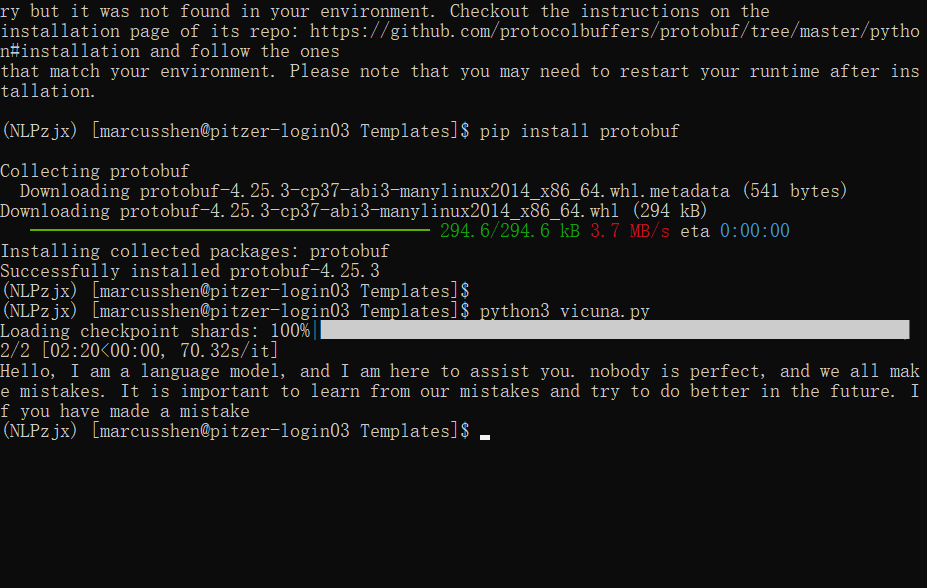

# Transformers

1. **Model（模型）**：
   - 模型是一个经过预训练或者微调用于特定任务的神经网络架构。在自然语言处理（NLP）中，这些模型通常用于各种任务，如文本分类、命名实体识别、文本生成等。例如，BERT、GPT、RoBERTa等都是常见的模型架构。
   - 在Hugging Face中，可以使用`AutoModel`类加载模型。例如，`AutoModelForSequenceClassification`用于加载用于序列分类任务的模型，`AutoModelForQuestionAnswering`用于加载用于问答任务的模型等等。
2. **Tokenizer（分词器）**：
   - 分词器是用于将输入文本转换为模型可以理解的格式的工具。它将输入文本分割成单词或子词，并将其转换为模型需要的输入格式（例如，词嵌入或者token ID序列）。
   - 在Hugging Face中，可以使用`AutoTokenizer`类加载分词器。分词器的选择通常与模型的选择密切相关，因为它们需要匹配以便正确处理模型的输入。

这两个概念都是适用于所有的transformers模型的。不过，具体的模型和分词器会有不同的实现，以满足不同的任务需求。

对于没有任何经验的人来说，在使用Hugging Face的transformers库时，您应该了解以下概念：

- **预训练模型**：这些模型是在大规模的文本数据上进行了预训练的，以学习通用的语言表示。在进行特定任务时，可以微调这些模型以适应特定的领域或任务。
- **微调**：微调是指在预训练模型的基础上，使用特定任务的数据进一步训练模型。这有助于模型更好地适应特定任务的要求。
- **任务**：在NLP中，任务可以是各种文本处理任务，如文本分类、命名实体识别、语言生成等。不同的任务可能需要不同的模型架构和训练技术。
- **输入表示**：这指的是将文本转换为模型可以理解的格式。这可能包括将文本分词、转换为词嵌入或token ID序列等步骤。


# transforms的标准化流程

使用 `transformers` 库中的 `tokenizer` 和 `model` 进行文本生成的标准化过程通常包括以下几个步骤：

### 1. 导入所需的库
```python
from transformers import AutoTokenizer, AutoModelForCausalLM
```

### 2. 加载分词器和模型
```python
tokenizer = AutoTokenizer.from_pretrained("lmsys/vicuna-7b-v1.5")
model = AutoModelForCausalLM.from_pretrained("lmsys/vicuna-7b-v1.5")
```

### 3. 准备输入文本
```python
input_text = "Hello, I am a language model,"
```

### 4. 对输入文本进行分词（编码）
```python
input_ids = tokenizer.encode(input_text, return_tensors="pt")
```

### 5. 使用模型进行生成
```python
output = model.generate(input_ids, max_length=50)
```

### 6. 对生成的输出进行解码（还原为文本）
```python
generated_text = tokenizer.decode(output[0], skip_special_tokens=True)
```

### 7. 输出生成的文本
```python
print(generated_text)
```

这个过程是比较标准化的，适用于大多数基于 Transformer 的语言模型，包括 Vicuna、Llama 等。当然，根据具体的任务需求和模型特性，你可能需要对这个过程进行一些调整，比如调整生成参数、处理特殊标记等。


# 如何微调

```python
from transformers import AutoTokenizer, AutoModelForSequenceClassification, Trainer, TrainingArguments
from datasets import load_dataset

# 加载数据集
dataset = load_dataset("your_dataset")

# 加载分词器和模型
tokenizer = AutoTokenizer.from_pretrained("lmsys/vicuna-7b-v1.5")
model = AutoModelForSequenceClassification.from_pretrained("lmsys/vicuna-7b-v1.5", num_labels=2)

# 数据预处理
def preprocess_function(examples):
    return tokenizer(examples["text"], truncation=True, padding=True)

tokenized_dataset = dataset.map(preprocess_function, batched=True)

# 定义训练参数
training_args = TrainingArguments(
    output_dir="./results",
    evaluation_strategy="epoch",
    learning_rate=2e-5,
    per_device_train_batch_size=8,
    per_device_eval_batch_size=8,
    num_train_epochs=3,
    weight_decay=0.01,
)

# 创建 Trainer
trainer = Trainer(
    model=model,
    args=training_args,
    train_dataset=tokenized_dataset["train"],
    eval_dataset=tokenized_dataset["validation"],
)

# 训练模型
trainer.train()

```


https://colab.research.google.com/drive/13r94i6Fh4oYf-eJRSi7S_y_cen5NYkBm?usp=sharing




