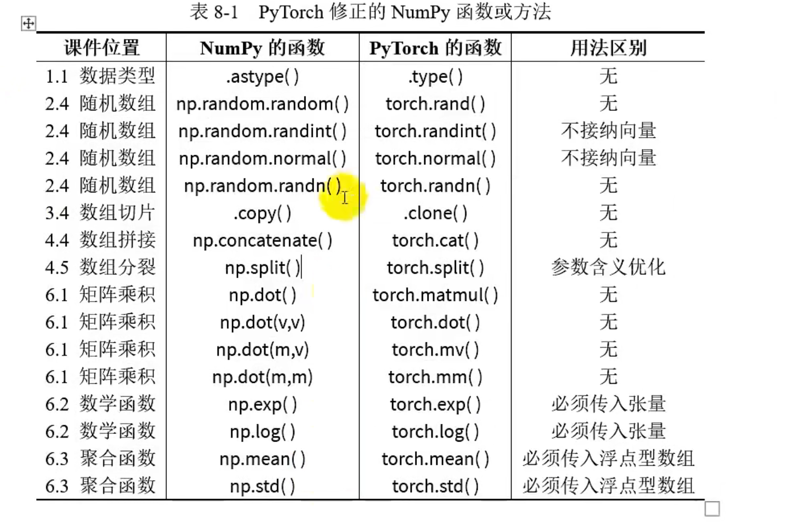

pycharm快速向下复制一行 ctrl+d

删除一行 ctrl+y

# 数组基础

## 1.1数据类型

### 1.1.1整数型数组与浮点型数组

numpy一种数组只能存放一种数据类型，用于节省内存

```python
import numpy as np
arr1 = np.array([1,2,3])
print (arr1)
>>> [1 2 3]  //numpy数组没有逗号
```

```python
import numpy as np
arr1 = np.array([1.1,2,3])
print (arr1)
>>>[1.1 2.  3. ] 
```


### 1.1.2 同化定理

往整数型数组添加浮点数，浮点数会截断

往浮点型数组添加整数，整数会升级为浮点

```python
import numpy as np
arr1 = np.array([1.1,2,3])
arr1[0]=100
print (arr1)
>>>[100.   2.   3.]
```

```python
import numpy as np
arr1 = np.array([1,2,3])
arr1[0]=100.1
print (arr1)
>>>[100   2   3]
```

​			

### 1.1.3 共同改变定理

整数型数组和浮点型数组相互转换 使用.astype()方法,返回转化后的数组，原数组不变
**np.后面是函数 对象后面是方法**

```python
import numpy as np
arr1 = np.array([1,2,3])
arr2 = arr1.astype(float)
print (arr2)
```

```python
import numpy as np
arr1 = np.array([1.1,2.2,3])
arr2 = arr1.astype(int)
print (arr2)
>>>[1 2 3]
```

除了上面的方法，还有不经意间升级

```python
//整数型数组和浮点数运算
import numpy as np
arr1 = np.array([1,2,3])
print (arr1*1.0)   //numpy中数组每个元素都乘以1
>>>[1. 2. 3.]
//整数型数组除法，即使除以整数也会变成浮点数数组
import numpy as np
arr1 = np.array([1,2,3])
print (arr1/1)
>>>[1. 2. 3.]
//整数型数组和浮点数数组运算
import numpy as np
arr1 = np.array([1,2,3])
arr2 = np.array([1.1,2.1,3.1])
print (arr1+arr2)
>>>print (arr1+arr2)
```


## 1.2数组维度

### 1.2.1 一维数组和二维数组

- 不同维度数组的本质区别

  几维数组几个中括号包裹

- 有些函数需要传入数组的形状参数，不用维度数组的形状参数为

  一维数组的形状参数：(x,)或x

  二维数组：(x,y)

  三维数组：(x,y,z)

- 同一序列举例

  当数组有一层中括号，如[1,2,3],形状参数3或者(3,) 代表三行

  [[1,2,3]]，二维数组，形状参数(1,3)一行三列

  [[[1,2,3]]]，三维数组(1,1,3)

这里用np.ones来讲解，因为这个函数要传入形状参数

```python
import numpy as np
arr1 = np.ones(3)
print(arr1)
>>>[1. 1. 1.]

import numpy as np
arr1 = np.ones((1,3))
print(arr1)
>>>[[1. 1. 1.]]

import numpy as np
arr1 = np.ones((1,1,3))
print(arr1)
>>>[[[1. 1. 1.]]]
```

也可以用.shape属性来查看形状

```python
import numpy as np
arr1 = np.ones((1,1,3))
print(arr1.shape)
>>>(1, 1, 3)
```

### 1.2.2不同维度数组之间的转换

数组方法.reshape()，需要传入重塑后的形状参数

```python
//一维转二维
import numpy as np
arr1 = np.arange(10)
arr2 = arr1.reshape((1,-1))
print(arr2)
>>>一维数组转成二位数组，固定行数之后，列数为-1，可以自动计算出列数，即1*10（原一维数组个数）/1（转换后行数）=列数

//多维转一维
import numpy as np
arr1 = np.arange(10).reshape((2,-1))
arr2 = arr1.reshape(-1)  //给个-1 就是转一维
print(arr2)
>>>[0 1 2 3 4 5 6 7 8 9]
```


**今后一维数组称为向量，二维数组称为矩阵**


# 数组的创建

## 2.1创建指定数组

明确知道每一个元素的具体值时，使用np.array()函数进行创建，将python列表转化成np数组

```python
arr1 = np.array([1,2,3])//创建向量
arr2 = np.array([[1,2,3]]) //创建行矩阵
arr3 = np.array([ [1],[2],[3] ]) //创建列矩阵  一共中括号里中有几个元素就是激烈，有几个中括号就是几行
arr4 = np.array([ [1,2,3],[4,5,6] ])


```

## 2.2创建递增数组

np.arange()

```python
arr1 = np.arange(10)
print(arr1)
>>>[0 1 2 3 4 5 6 7 8 9]

arr2 = np.arrange(10,20)
print(arr2)
>>>[10 11 12 13 14 15 16 17 18 19]

import numpy as np
arr1 = np.arange(10,20,2)  //步长是2
print(arr1)
>>>[10 12 14 16 18]  


浮点数
arr1 = np.arange(10,20,2)*1.0  or  任意参数变成浮点数


np.arrange(1,17).reshape(4,4)
```


## 2.3 创建同值数组

```python
//全0数组
arr1 = np.zeros(4)  形状为4的向量
print(arr1)
>>>[0. 0. 0. 0.]

arr1.ones((1,2))  //形状为（1，2）的全1矩阵
print(arr1)  
>>>[[1. 1.]]


arr1 = 3.14*np.ones((2,3))
print(arr1)
>>>[[3.14 3.14 3.14]
 [3.14 3.14 3.14]]
```


## 2.4创建随机数组

### 2.4.1浮点型随机数组

```python
arr1 =np.random.random(5)  //随机数范围[0,1)
print(arr1)
>>>[0.26688669 0.08056473 0.83595846 0.94521307 0.67801163]

创建一个60-100范围内均匀分布的3行3列随机数组
arr1 =(100-60)*np.random.random((3,3))+60 //先生成0-40再加60
print(arr1)
```


### 2.4.2 整数型随机数组

```python
arr1 =np.random.randint(10,100,(1,15))
print(arr1)
>>>[[64 90 19 94 87 59 70 84 37 23 24 67 45 48 40]]
```


### 2.4.3服从正态分布的随机数组、

```python
arr1 =np.random.normal(4,2,(2,5)) //均值，标准差，形状
print(arr1)
>>>[[2.41062    3.05075851 5.06797223 5.13336656 1.68124686]
 [2.72032718 5.42585309 1.35236911 3.27317787 1.88057483]]

//如果是标准正态分布(0,1)
arr1 =np.random.randn((2,5))
[[-0.2357357  -1.84865885  1.52610709 -0.79777238  0.44978987]
 [-2.12101013  0.24850036 -0.02268558 -1.02203212  0.91009054]]
```


# 数组的索引

## 3.1访问数组元素

### 3.1.1访问向量

```python
arr1 = np.arange(1,10) [1,9]
print(arr1[3]) //正着访问 >>>3
print(arr1[-1]) //到这访问 >>>9

//修改元素
arr1[3] = 999
print(arr1)
>>>[  1   2   3 999   5   6   7   8   9]
```


### 3.1.2访问矩阵

```python
arr1 = np.array([ [1,2,3],[4,5,6] ])
print(arr1)
print(arr1[0,2])  >>>3
print(arr1[1,-2]) >>>5

//修改元素
arr1[1,0] = 100.9
import numpy as np
arr1 = np.array([ [1,2,3],[4,5,6] ])
arr2 = arr1.astype(float)
arr2[1,0] = 100.9
print(arr2)
>>>[[  1.    2.    3. ]
 [100.9   5.    6. ]]
```


## 3.2花式索引

### 3.2.1 向量的花式索引

```python
arr1 = np.arange(0,90,10)
print(arr1[ [0,2] ])  //第一列第三列
>>>[ 0 20]
```

### 3.2.2矩阵的花式索引

取出来还是矩阵

```python
arr1 = np.arange(1,17).reshape(4,4)
print(arr1)
print(arr1[ [0,2],[0,1] ])  [行],[列]
>>[ 1 10]   1->(第0行第0列) 10->第2行第1列

//可以做到修改多个数组元素
arr1 = np.arange(1,17).reshape(4,4)
arr1[ [0,2],[0,1] ]=100
print(arr1)
>>>[[100   2   3   4]
 [  5   6   7   8]
 [  9 100  11  12]
 [ 13  14  15  16]]
```


## 3.3访问数组切片

### 3.3.1向量的切片

左开右闭

```python
arr1 = np.arange(10)
print(arr1[1:4]) >>[1 2 3] 
print(arr1[1:])  >>[1 2 3 4 5 6 7 8 9]
print(arr1[:4])  >>[0 1 2 3]

print(arr1[2:-2]) //[2 3 4 5 6 7]
print(arr1[:-2]) //[0 1 2 3 4 5 6 7]

```

```python
print(arr1)
print(arr1[::2])  //开头到结尾 每两个元素采样一次（隔一个）
print(arr1[::3])
print(arr1[1:-1:2])
>>>[0 1 2 3 4 5 6 7 8 9]
>>>[0 2 4 6 8]
>>>[0 3 6 9]
>>>[1 3 5 7]
```


### 3.3.2矩阵的切片

```
arr1 = np.arange(1,21).reshape(4,5)
print(arr1)
print(arr1[1:3,1:-1]) //行数1-2 列数1-倒数1
[[ 1  2  3  4  5]
 [ 6  7  8  9 10]
 [11 12 13 14 15]
 [16 17 18 19 20]]
[[ 7  8  9]
 [12 13 14]]
print(arr1[::3, ::2]) 每隔两行采样一次 每隔一列采样一次
>>>[[ 1  3  5]
 [16 18 20]]

```

### 3.3.3提取矩阵的行

```python
arr1 = np.arange(1,21).reshape(4,5)
print(arr1)
print(arr1[[2]])  //提取的还是矩阵 
print(arr1[2,:])  //提取出一行的向量 第2行
[[ 1  2  3  4  5]
 [ 6  7  8  9 10]
 [11 12 13 14 15]
 [16 17 18 19 20]]
[[11 12 13 14 15]]
[11 12 13 14 15]
```

提取行可以简写不写：

### 3.3.4提取矩阵的列

```python
arr1 = np.arange(1,21).reshape(4,5)
print(arr1)
print(arr1[:,1:3])  //提取1-2列
>>>[[ 2  3]
 [ 7  8]
 [12 13]
 [17 18]]
print(arr1[:,1]) //[ 2  7 12 17]这里是个向量了 目的是为了节省空间 
为了把这个向量转化为矩阵
可以
cut = arr1[:,1].reshape(1,-1) >>>[[2 7 12 17]]
print(cut.T) //转置 
[[ 2]
 [ 7]
 [12]
 [17]]

或者直接cut = arr1[:,1].reshape(-1，3)
```


## 3.4数组切片仅是视图

### 3.4.1 数组切片仅是视图

就是浅拷贝的意思

```python
arr1 = np.arange(10)
cut = arr1[:3]
cut[0] = 100
print(arr1)
>>>[100   1   2   3   4   5   6   7   8   9]
```

想为切片产生新的内存空间，就是用.copy()方法


## 3.5数组赋值仅是绑定

```
arr1 = np.arange(10)
arr2 = arr1
arr2[0] = 100
print(arr1)>>>[100   1   2   3   4   5   6   7   8   9]
```

也是使用.copy 创建新的变量


# 数组的变形

## 4.1数组的转置

### 4.1.1向量的转置

向量转置需要先转化成矩阵

```python
arr1 = np.arange(1,4)
arr2 = arr1.reshape(1,-1)
print(arr2.T)
[[1]
 [2]
 [3]]
```


## 4.2 数组的翻转

数组的翻转方法有两种，一种是上下翻转的np.flipud(),表示up-down;一种是左右翻转的np.fliplr(),表示left-right.

向量只能用flipud因为数学中，向量不是横着排的，而是竖着排的

### 4.2.1 向量的翻转

```python
arr1 = np.arange(10)
print(arr1)
arr_ud = np.flipud(arr1)
print(arr_ud)
>>>[0 1 2 3 4 5 6 7 8 9]
>>>[9 8 7 6 5 4 3 2 1 0]
```

### 4.2.2矩阵的翻转

```python
//fliplr左右翻转
arr1 = np.arange(1,21).reshape(4,5)
print(arr1)
arr_lr = np.fliplr(arr1)
print(arr_lr)
[[ 1  2  3  4  5]
 [ 6  7  8  9 10]
 [11 12 13 14 15]
 [16 17 18 19 20]]
[[ 5  4  3  2  1]
 [10  9  8  7  6]
 [15 14 13 12 11]
 [20 19 18 17 16]]

//flipud上下翻转
arr1 = np.arange(1,21).reshape(4,5)
print(arr1)
arr_ud = np.flipud(arr1)
print(arr_ud)
[[ 1  2  3  4  5]
 [ 6  7  8  9 10]
 [11 12 13 14 15]
 [16 17 18 19 20]]
[[16 17 18 19 20]
 [11 12 13 14 15]
 [ 6  7  8  9 10]
 [ 1  2  3  4  5]]
```


## 4.3数组的拼接

### 4.3.1向量的拼接

两个向量拼接，将得到一个新的加长版向量

```
arr1 = np.array([1,2,3])
arr2 = np.array([3,4,5])
arr3 = np.concatenate([arr1,arr2])
print(arr3)
>>>[1 2 3 3 4 5]
```

### 4.3.2矩阵的拼接

```python
arr1 = np.array([[1,2,3],[4,5,6]])
arr2 = np.array([[7,8,9],[10,11,12]])
arr3 = np.concatenate([arr1,arr2])  //默认参数axis = 0 //以行进行拼接
print(arr3)
//[[ 1  2  3]
 [ 4  5  6]
 [ 7  8  9]
 [10 11 12]]

arr1 = np.array([[1,2,3],[4,5,6]])
arr2 = np.array([[7,8,9],[10,11,12]])
arr3 = np.concatenate([arr1,arr2],axis=1)  //以列进行拼接
print(arr3)
>>> [[ 1  2  3  7  8  9]
 [ 4  5  6 10 11 12]]
```


## 4.4 数组的分裂

### 4.4.1向量的分裂

```python
arr = np.arange(10,100,10)
print(arr)
arr1,arr2,arr3 = np.split(arr,[2,8])  //分割点2,8
print(arr1)
print(arr2)
print(arr3)
[10 20 30 40 50 60 70 80 90]
[10 20]
[30 40 50 60 70 80]
[90]
```


### 4.4.2矩阵的分裂

可以按照不同维度进行

```python
arr = np.arange(1,9).reshape(2,4)
print(arr)
arr1,arr2 = np.split(arr,[1])
print(arr1)
print(arr2)

[[1 2 3 4]
 [5 6 7 8]]
[[1 2 3 4]]
[[5 6 7 8]]


arr = np.arange(1,9).reshape(2,4)
print(arr)
arr1,arr2,arr3 = np.split(arr,[1,3],axis=1)  //按照列分割
print(arr1)
print(arr2)
print(arr3)
[[1 2 3 4]
 [5 6 7 8]]
[[1]
 [5]]
[[2 3]
 [6 7]]
[[4]
 [8]]
```


# 数组的运算

## 5.1矩阵与系数之间的运算

逐元素运算

```python
arr = np.arange(1,9).reshape(2,4)
print(arr)
print(arr+10)
print(arr-10)
print(arr*10)
print(arr/10)
print(arr**10)
print(arr//10)
print(arr%10)      


[[1 2 3 4]
 [5 6 7 8]]
[[11 12 13 14]
 [15 16 17 18]]
[[-9 -8 -7 -6]
 [-5 -4 -3 -2]]
[[10 20 30 40]
 [50 60 70 80]]
[[0.1 0.2 0.3 0.4]
 [0.5 0.6 0.7 0.8]]
[[         1       1024      59049    1048576]
 [   9765625   60466176  282475249 1073741824]]
[[0 0 0 0]
 [0 0 0 0]]
[[1 2 3 4]
 [5 6 7 8]]
```


## 5.2矩阵与矩阵之间的运算

对应元素运算

```python
arr1 = np.arange(-1,-9,-1).reshape(2,4)
print(arr1)
arr2 = -arr1
print(arr2)
print(arr1+arr2)

[[-1 -2 -3 -4]
 [-5 -6 -7 -8]]
[[1 2 3 4]
 [5 6 7 8]]
[[0 0 0 0]
 [0 0 0 0]]

```


## 5.3广播

5.2是同形状矩阵之间的运算，本节是不同形状的矩阵之间的运算

- 如果向量与矩阵运算，向量自动升级为行矩阵
- 如果某矩阵是行矩阵或者列矩阵，则其被**广播**，以适配另一个矩阵的形状

### 5.3.1 行矩阵被广播

行矩阵和运算的矩阵的列必须相同

```python
arr1 = np.array([-100,0,100])
print(arr1)
arr2 = np.random.random((10,3))
print(arr2)
print(arr1*arr2)

[-100    0  100] 先转化为[[-100 0 100]] 然后10行填满
[[0.26654323 0.15162457 0.18696251]
 [0.96038808 0.76698635 0.86268687]
 [0.41261181 0.78398013 0.07613499]
 [0.38526269 0.54734527 0.37134394]
 [0.87853653 0.83091266 0.84896799]
 [0.93750777 0.52983294 0.16120221]
 [0.20448344 0.42207944 0.75287838]
 [0.33809641 0.90163894 0.13263468]
 [0.39971943 0.47789501 0.69613301]
 [0.27103737 0.62158938 0.21314881]]
[[-26.65432265   0.          18.69625091]
 [-96.038808     0.          86.26868711]
 [-41.26118097   0.           7.61349866]
 [-38.52626853   0.          37.13439427]
 [-87.85365269   0.          84.89679915]
 [-93.75077739   0.          16.12022076]
 [-20.44834401   0.          75.2878382 ]
 [-33.80964073   0.          13.26346813]
 [-39.97194264   0.          69.61330131]
 [-27.10373746   0.          21.31488094]]
```


### 5.3.2 列矩阵被广播

列矩阵必须和运算的矩阵行相同

```python
arr1 = np.array([-100,0,100]).reshape(3,-1)
print(arr1)
arr2 = np.random.random((3,5))
print(arr2)
print(arr1*arr2)

[[-100]
 [   0]
 [ 100]]
[[0.94403314 0.40241204 0.23475203 0.02801286 0.93295023]
 [0.52054739 0.8938742  0.80239438 0.62139179 0.17827798]
 [0.79791339 0.99810831 0.63815188 0.40495685 0.07321734]]
[[-94.40331431 -40.24120448 -23.47520302  -2.80128599 -93.29502261]
 [  0.           0.           0.           0.           0.        ]
 [ 79.79133905  99.81083141  63.81518753  40.49568505   7.32173362]]
```


# 矩阵的函数

## 6.1 矩阵乘积

当向量和矩阵相乘的时候，**根据需求可以充当行矩阵和列一阵**，但混有向量时输出结果必是向量

[向量点乘（内积）和叉乘（外积、向量积）概念及几何意义解读-CSDN博客](https://blog.csdn.net/dcrmg/article/details/52416832)

### 6.1.1向量点乘向量

```python
arr1 = np.arange(5)
arr2 = np.arange(5)
print(arr1)
print(arr2)
print(np.dot(arr1,arr2)
//向量乘积是一个标量  
[0 1 2 3 4]
[0 1 2 3 4]
30
```

### 6.1.2向量点乘矩阵

```
arr1 = np.arange(5)
arr2 = np.arange(15).reshape(5,3)
print(arr1)
print(arr2)
print(np.dot(arr1,arr2))
[0 1 2 3 4]
[[ 0  1  2]
 [ 3  4  5]
 [ 6  7  8]
 [ 9 10 11]
 [12 13 14]]
[ 90 100 110]  结果是个向量
```

### 6.1.3矩阵点乘向量

```python
arr1 = np.arange(5)
arr2 = np.arange(15).reshape(3,5)
print(arr1)
print(arr2)
print(np.dot(arr2,arr1))


[0 1 2 3 4]  //这里把这个向量当成列矩阵
[[ 0  1  2  3  4]
 [ 5  6  7  8  9]
 [10 11 12 13 14]]
[ 30  80 130]
```

### 6.1.4矩阵点乘矩阵

```python
arr1 = np.arange(10).reshape(5,2)
arr2 = np.arange(16).reshape(2,8)
print(arr1)
print(arr2)
print(np.dot(arr1,arr2))

[[0 1]
 [2 3]
 [4 5]
 [6 7]
 [8 9]]
[[ 0  1  2  3  4  5  6  7]
 [ 8  9 10 11 12 13 14 15]]
[[  8   9  10  11  12  13  14  15]
 [ 24  29  34  39  44  49  54  59]
 [ 40  49  58  67  76  85  94 103]
 [ 56  69  82  95 108 121 134 147]
 [ 72  89 106 123 140 157 174 191]]


```


## 6.2 数学函数

```python
//绝对值函数
arr1 = np.array([-100,0,100])
print(arr1)
print(np.abs(arr1))
```

```python
//三角函数
arr1 = np.arange(3)*np.pi/2
sin_v = np.sin(arr1)
cos_v = np.cos(arr1)
tan_v = np.tan(arr1)
print("原数组",arr1)
print("sin",sin_v)
print("cos",cos_v)
print("tan",tan_v)

原数组 [0.         1.57079633 3.14159265]
sin [0.0000000e+00 1.0000000e+00 1.2246468e-16]
cos [ 1.000000e+00  6.123234e-17 -1.000000e+00]
tan [ 0.00000000e+00  1.63312394e+16 -1.22464680e-16]
```

```python
//对数
x = np.array([1,10,100,1000])
print('x = ',x)
print('ln(x) = ',np.log(x))
print('log2(x) = ',np.log2(x))
print('log10(x) = ',np.log10(x))
x =  [   1   10  100 1000]
ln(x) =  [0.         2.30258509 4.60517019 6.90775528]
ln(x) =  [0.         3.32192809 6.64385619 9.96578428]
ln(x) =  [0. 1. 2. 3.]

```


## 6.3聚合函数

### 6.3.1 算最大值

```python
arr1 =np.random.randint(10,100,(2,3))
print(arr1)
print("算出每列最大值",np.max(arr1,axis=0))
print("算出每行最大值",np.max(arr1,axis=1))
print("算出整体",np.max(arr1))
```

### 6.3.2 求和求积

.prod() 求积

```python
arr1 =np.random.randint(10,100,(2,3))
print(arr1)
print("按照维度一求和",np.sum(arr1,axis=0))
print("按照维度二求和",np.sum(arr1,axis=1))
print("算出整体",np.sum(arr1))
[[18 26 27]
 [82 13 58]]
按照维度一求和 [100  39  85]
按照维度二求和 [ 71 153]
算出整体 439
```

### 6.3.2 求标准差和均值

np.mean() 均值

np.std()标准差

```python
arr1 =np.random.randint(10,100,(2,3))
print(arr1)
print("按照维度一求平均",np.mean(arr1,axis=0))
print("按照维度二求平均",np.mean(arr1,axis=1))
print("算出整体",np.mean(arr1))
[[18 71 13]
 [47 10 15]]
按照维度一求平均 [32.5 40.5 14. ]
按照维度二求平均 [34. 24.]
算出整体 29.0

```

考虑大型数组难免有缺失值，忽略缺失值，使用np.nansum() 前面加个nan


# 布尔型数组

## 7.1创建布尔型数组

```python
arr1 =np.arange(1,7).reshape(2,3)
arr2 = np.flipud(arr1)
print(arr1)
print(arr2)
print(arr1>arr2)

[[1 2 3]
 [4 5 6]]
[[4 5 6]
 [1 2 3]]
[[False False False]
 [ True  True  True]]

//比较多个条件  & | ~ 与或非
arr1 =np.arange(1,7).reshape(2,3)
print(arr1)
print((arr1<4)|(arr1>6))
[[1 2 3]
 [4 5 6]]
[[ True  True  True]
 [False False False]]
```


## 7.2 布尔型数组中True的数量

```python
//绝对值小于1的元素个数
arr1 =np.random.normal(0,1,10000)  
num = np.sum(np.abs(arr1)<1)
print(num)
6950
```


```python
//np.any() 有一个以上的True就返回true
arr1 =np.arange(1,10)
arr2 = np.flipud(arr1)
print(arr1)
print(arr2)
print(np.any(arr1==arr2))
[1 2 3 4 5 6 7 8 9]
[9 8 7 6 5 4 3 2 1]
True
```

```python
//np.all() //全是True才是true
arr1 =np.random.normal(500,70,10000)
print(np.all(arr1>250))
```


## 7.3布尔数组作为掩码

筛选出数组中大于小于等于某个数字的元素

```
arr1 =np.arange(1,13).reshape(3,4)
print(arr1>4)
print(arr1[arr1>4])

[[False False False False]
 [ True  True  True  True]
 [ True  True  True  True]]
[ 5  6  7  8  9 10 11 12]
//矩阵进行掩码操作 退化成了向量


arr1 =np.arange(1,9)
arr2 = np.flipud(arr1)
print(arr1[arr1>arr2])
print(arr2[arr1>arr2])
[5 6 7 8]
[4 3 2 1]
```


## 7.4找到满足条件的元素所在位置

np.where()输出一个元素

```python
arr1 =np.random.normal(500,70,1000)
print(np.where(arr1>650))
(array([ 39, 119, 162, 324, 481, 487, 581, 616, 626, 631, 635, 677, 711,
       723, 884, 915, 967, 988], dtype=int64),)

arr1 =np.random.normal(500,70,1000)
print(np.where(arr1>650)[0])
[ 83 103 138 201 239 288 442 447 463 658 721 736 747 894 958 964]

print(np.where(arr1==np.max(arr1))) //arr1==np.max(arr1) 只有一个true的数组，where找到true的位置
(array([517], dtype=int64),)
```


# 数组到张量

## 8.1数组与张量

numpy和pytorch的基础语法几乎一致

1. np对应torch
2. 数组array对应张量tensor
3. numpy的n为数组对应着pytorch的n阶张量

数组和张量可以相互转换

1. arr转为张量ts：ts = torch.tensor(arr)ts
2. tsz转arr arr = np.array(ts)


## 8.2语法不同点

np改为torch，array改为tensor

