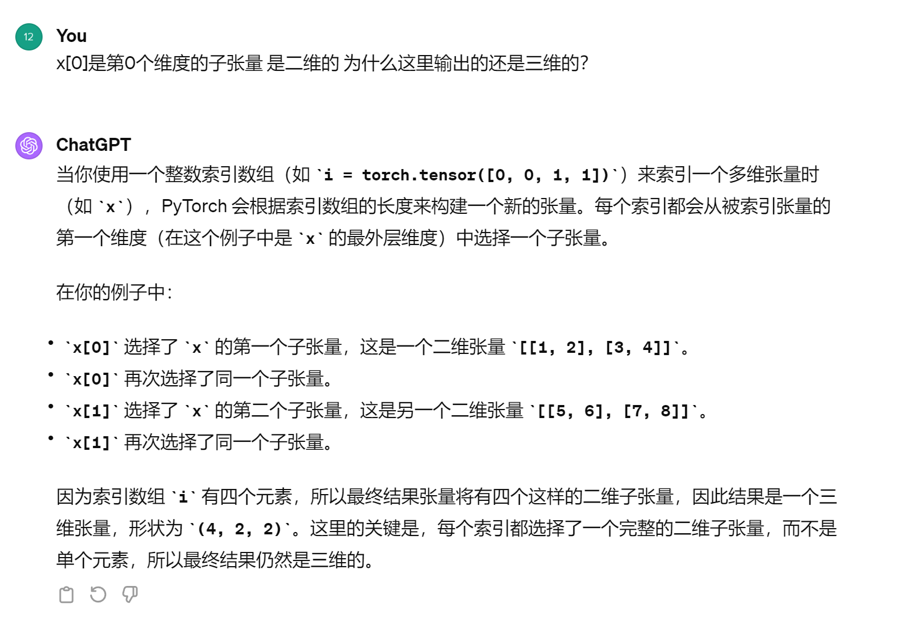

https://colab.research.google.com/drive/1Z6K6nwbb69XfuInMx7igAp-NNVj_2xc3?usp=sharing#scrollTo=lsjIW9I_ztiO


# tensor和array的区别

Tensor和Array（通常指的是多维数组，比如NumPy中的ndarray）是数据结构，它们用于在计算机中存储数据。虽然这两个词在某些上下文中可以互换使用，但在深度学习框架（如PyTorch和TensorFlow）中，它们具有一些特定的差异：

1. **Tensor**:
   - 在深度学习框架中，Tensor通常是一个多维数组，它不仅可以存储数据，还可以在GPU或其他专门的硬件上进行运算。
   - Tensor通常有自动微分的能力，意味着它们可以自动跟踪它们在计算图中的操作，从而在进行反向传播时自动计算梯度。
   - Tensors被优化用于大规模**并行处理**，这对于深度学习中的大量矩阵运算非常重要。
2. **Array**:
   - Array通常指在普通编程语言（如Python中的NumPy库）中的多维数组数据结构。
   - 它们可能不支持GPU加速和自动微分等功能，或者这些功能不像深度学习框架中的Tensor那么易于使用。
   - 数组主要用于数据处理、数值计算，以及通用的多维数据存储。

总之，Tensor和Array在本质上都是多维数据的集合。但是，"Tensor"这个术语在深度学习上下文中通常与硬件加速和自动微分功能联系在一起，而“Array”则更多用于指代普通编程环境中的多维数据结构。


# torch基础

## 创建torch

### from a numpy array

```python
# Initialize a tensor from a Python List
data = [
        [0, 1], 
        [2, 3],
        [4, 5]
       ]
x_python = torch.tensor(data)

# Print the tensor
x_python

>>>
tensor([[0, 1],
        [2, 3],
        [4, 5]])
```

```python
npArray = np.array(data)
x_tensor = torch.from_numpy(npArray)
```

### from a tensor

We can also initialize a tensor from another tensor, using the following methods:

- `torch.ones_like(old_tensor)`: Initializes a tensor of `1s`.
- `torch.zeros_like(old_tensor)`: Initializes a tensor of `0s`.
- `torch.rand_like(old_tensor)`: Initializes a tensor where all the elements are sampled from a uniform distribution between `0` and `1`.
- `torch.randn_like(old_tensor)`: Initializes a tensor where all the elements are sampled from a normal distribution.

```python
x = torch.tensor([[1.,2],[3,4]])
>>tensor([[1., 2.],
        [3., 4.]])
```

```python
x_zeros = torch.zeros_like(x)
>>
x_zeros
tensor([[0., 0.],
        [0., 0.]])
```

```python
x_ones = torch_ones_like(x)
>>
tensor([[1., 1.],
        [1., 1.]])
```

```pyhton
# between 0 and 1
x_rand = torch.rand_like(x)
x_rand
tensor([[0.8979, 0.7173],
        [0.3067, 0.1246]])
```

```python
##服从标准正态分布
# Initialize a tensor where each element is sampled from a normal distribution
x_randn = torch.randn_like(x)
x_randn
tensor([[-0.6749, -0.8590],
        [ 0.6666,  1.1185]])
```


## tensor 矩阵之间运算

确实，`@` 运算符、`*` 运算符和 `dot` 函数在 Python 和其科学计算库中有特定的用途。

1. **`@` 运算符**:
   - 在 Python 中，`@` 是矩阵乘法运算符，它用于执行两个二维数组（或更高维）之间的矩阵乘法。这意味着它会进行行与列的点积运算，与线性代数中的矩阵乘法相同。
   - 例如，`numpy`、`scipy` 和深度学习库如 `PyTorch` 和 `TensorFlow` 都支持使用 `@` 进行矩阵乘法。
   - 如果矩阵 A 的维度是 (m, n) 而矩阵 B 的维度是 (n, p)，则 A @ B 的结果将是一个 (m, p) 维的矩阵。

2. **`*` 运算符**:
   - 在 Python 的 `numpy` 和 `array` 类型中，`*` 表示元素间乘法（也称作**哈达玛**积或元素积），它将两个数组的对应元素相乘，并返回一个数组。
   - **这意味着两个数组必须有相同的大小或者满足广播规则。**

3. **外积**:
   - 外积（也称为外积或向量积）通常指两个向量的笛卡尔积，其结果是一个矩阵。
   - 在 `numpy` 中，你可以使用 `numpy.outer()` 函数来计算向量的外积。

4. **`numpy.dot()` 函数**:
   - 在 `numpy` 中，`dot()` 既可以执行两个向量的点积，也可以执行两个矩阵的矩阵乘法。当对两个向量使用时，它计算的是点积，结果是一个标量。当对两个矩阵使用时，它执行的是矩阵乘法，结果是一个矩阵。
   - **对于二维数组（即矩阵），`numpy.dot()` 和 `@` 运算符的效果是相同的。**

简而言之，`@` 运算符用于矩阵乘法，`*` 运算符用于数组的元素积，外积是一个特殊的向量运算，而 `numpy.dot()` 根据输入的维度（一维或二维）可以计算点积或矩阵乘法。

### @ 矩阵乘法

```python
# Create a 4x3 tensor of 6s
a = torch.ones((4,3)) * 6
>>>a
tensor([[6., 6., 6.],
        [6., 6., 6.],
        [6., 6., 6.],
        [6., 6., 6.]])

# Create a 1D tensor of 2s
b = torch.ones(3) * 2
>>>b
tensor([2., 2., 2.])


a / b
>>>
tensor([[3., 3., 3.],
        [3., 3., 3.],
        [3., 3., 3.],
        [3., 3., 3.]])


# Alternative to a.matmul(b)
# a @ b.T returns the same result since b is 1D tensor and the 2nd dimension
# is inferred
a  @ b
>>>
tensor([36., 36., 36., 36.])
```


## tensor‘s shape

打印shape是调试的好方法

```python
pp.pprint(a.shape)
pp.pprint(a.T.shape)
>>>
torch.Size([4, 3])
torch.Size([3, 4])
```


### 重塑tensor的方法 view

```python
x = torch.arange(1,7)
x_view = x.view(2,3)
x_view = x.view(2,-1)  //自动计算
>>>
tensor([[1, 2, 3],
        [4, 5, 6]])
```


## tensor内部运算

### sum

```python
x = torch.arange(1,7)
x_view = x.view(2,3)
pprint.pprint(x_view)
pprint.pprint(x_view.sum(dim=0))  //按列求和
pprint.pprint(x_view.sum(dim=1))  //按行求和
>>>
tensor([[1, 2, 3],
        [4, 5, 6]])
tensor([5, 7, 9])
tensor([ 6, 15])

```

### std 标准差

```python
pprint.pprint(x_view.std(dim=0))  
pprint.pprint(x_view.std(dim=1))  

>>>
tensor([2.1213, 2.1213, 2.1213])
tensor([1., 1.])
```


### mean 均值

```python
# Create an example tensor
m = torch.tensor(
    [
     [1., 1.],
     [2., 2.],
     [3., 3.],
     [4., 4.]
    ]
)

pp.pprint("Mean: {}".format(m.mean()))
pp.pprint("Mean in the 0th dimension: {}".format(m.mean(0)))
pp.pprint("Mean in the 1st dimension: {}".format(m.mean(1)))
>>>
'Mean: 2.5'
'Mean in the 0th dimension: tensor([2.5000, 2.5000])'
'Mean in the 1st dimension: tensor([1., 2., 3., 4.])'
```


## tensor  矩阵的拼接 cat

```python
x = torch.arange(1,7)
a = x.view(2,3)*1.0
a_cat0 = torch.cat([a,a,a],0)
a_cat1 = torch.cat([a,a,a],1)
pprint.pprint(a)
pprint.pprint(a_cat0)
pprint.pprint(a_cat1)
>>>
tensor([[1., 2., 3.],
        [4., 5., 6.]])
tensor([[1., 2., 3.],
        [4., 5., 6.],
        [1., 2., 3.],
        [4., 5., 6.],
        [1., 2., 3.],
        [4., 5., 6.]])
tensor([[1., 2., 3., 1., 2., 3., 1., 2., 3.],
        [4., 5., 6., 4., 5., 6., 4., 5., 6.]])
```


## 索引indexing

```python
# Initialize an example tensor
x = torch.Tensor([
                  [[1, 2], [3, 4]],
                  [[5, 6], [7, 8]], 
                  [[9, 10], [11, 12]] 
                 ])
>>>x
tensor([[[ 1.,  2.],
         [ 3.,  4.]],

        [[ 5.,  6.],
         [ 7.,  8.]],

        [[ 9., 10.],
         [11., 12.]]])
```

```python
x.shape
>>>
torch.Size([3, 2, 2])
```

```python
x[0] ##第0个维度的子张量
>>>
tensor([[1., 2.],
        [3., 4.]])
```

```python
x[:, 0, 0]  ##所有维度的子张量的第0行第0列
>>>
tensor([1., 5., 9.])
```

```python
i = torch.tensor([0, 0, 1, 1])
x[i]##i作为索引 belike:  x[0] x[0] x[1] x[1]
>>>
tensor([[[1., 2.],
         [3., 4.]],

        [[1., 2.],
         [3., 4.]],

        [[5., 6.],
         [7., 8.]],

        [[5., 6.],
         [7., 8.]]])

```



## 获得标量 item

```python
x[0, 0, 0]
>>>tensor(1.)
```

```python
x[0, 0, 0].item()
>>>1.0
```


# autograd 自动梯度计算

PyTorch 和其他机器学习库以其自动微分功能而闻名。也就是说，只要我们定义了需要执行的操作集合，框架本身就可以计算出如何计算梯度。我们可以调用 backward() 方法来请求 PyTorch 计算梯度，这些梯度随后存储在 grad 属性中。

```python
# Create an example tensor
# requires_grad parameter tells PyTorch to store gradients
x = torch.tensor([2.], requires_grad=True)##默认情况下

# Print the gradient if it is calculated
# Currently None since x is a scalar  因为只有一个元素被认为是标量
pp.pprint(x.grad)
>>>none
```

```python
# Calculating the gradient of y with respect to x
y = x * x * 3 # 3x^2
y.backward()
pp.pprint(x.grad) # d(y)/d(x) = d(3x^2)/d(x) = 6x = 12
```

