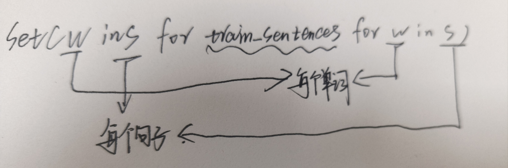

https://colab.research.google.com/drive/1Z6K6nwbb69XfuInMx7igAp-NNVj_2xc3?usp=sharing#scrollTo=lsjIW9I_ztiO


# tensor和array的区别

Tensor和Array（通常指的是多维数组，比如NumPy中的ndarray）是数据结构，它们用于在计算机中存储数据。虽然这两个词在某些上下文中可以互换使用，但在深度学习框架（如PyTorch和TensorFlow）中，它们具有一些特定的差异：

1. **Tensor**:
   - 在深度学习框架中，Tensor通常是一个多维数组，它不仅可以存储数据，还可以在GPU或其他专门的硬件上进行运算。
   - Tensor通常有自动微分的能力，意味着它们可以自动跟踪它们在计算图中的操作，从而在进行反向传播时自动计算梯度。
   - Tensors被优化用于大规模**并行处理**，这对于深度学习中的大量矩阵运算非常重要。
2. **Array**:
   - Array通常指在普通编程语言（如Python中的NumPy库）中的多维数组数据结构。
   - 它们可能不支持GPU加速和自动微分等功能，或者这些功能不像深度学习框架中的Tensor那么易于使用。
   - 数组主要用于数据处理、数值计算，以及通用的多维数据存储。

总之，Tensor和Array在本质上都是多维数据的集合。但是，"Tensor"这个术语在深度学习上下文中通常与硬件加速和自动微分功能联系在一起，而“Array”则更多用于指代普通编程环境中的多维数据结构。


# torch基础

## 创建torch

### from a numpy array

```python
# Initialize a tensor from a Python List
data = [
        [0, 1], 
        [2, 3],
        [4, 5]
       ]
x_python = torch.tensor(data)

# Print the tensor
x_python

>>>
tensor([[0, 1],
        [2, 3],
        [4, 5]])
```

```python
npArray = np.array(data)
x_tensor = torch.from_numpy(npArray)
```

### from a tensor

We can also initialize a tensor from another tensor, using the following methods:

- `torch.ones_like(old_tensor)`: Initializes a tensor of `1s`.
- `torch.zeros_like(old_tensor)`: Initializes a tensor of `0s`.
- `torch.rand_like(old_tensor)`: Initializes a tensor where all the elements are sampled from a uniform distribution between `0` and `1`.
- `torch.randn_like(old_tensor)`: Initializes a tensor where all the elements are sampled from a normal distribution.

```python
x = torch.tensor([[1.,2],[3,4]])
>>tensor([[1., 2.],
        [3., 4.]])
```

```python
x_zeros = torch.zeros_like(x)
>>
x_zeros
tensor([[0., 0.],
        [0., 0.]])
```

```python
x_ones = torch_ones_like(x)
>>
tensor([[1., 1.],
        [1., 1.]])
```

```pyhton
# between 0 and 1
x_rand = torch.rand_like(x)
x_rand
tensor([[0.8979, 0.7173],
        [0.3067, 0.1246]])
```

```python
##服从标准正态分布
# Initialize a tensor where each element is sampled from a normal distribution
x_randn = torch.randn_like(x)
x_randn
tensor([[-0.6749, -0.8590],
        [ 0.6666,  1.1185]])
```


## tensor 矩阵之间运算

确实，`@` 运算符、`*` 运算符和 `dot` 函数在 Python 和其科学计算库中有特定的用途。

1. **`@` 运算符**:
   - 在 Python 中，`@` 是矩阵乘法运算符，它用于执行两个二维数组（或更高维）之间的矩阵乘法。这意味着它会进行行与列的点积运算，与线性代数中的矩阵乘法相同。
   - 例如，`numpy`、`scipy` 和深度学习库如 `PyTorch` 和 `TensorFlow` 都支持使用 `@` 进行矩阵乘法。
   - 如果矩阵 A 的维度是 (m, n) 而矩阵 B 的维度是 (n, p)，则 A @ B 的结果将是一个 (m, p) 维的矩阵。

2. **`*` 运算符**:
   - 在 Python 的 `numpy` 和 `array` 类型中，`*` 表示元素间乘法（也称作**哈达玛**积或元素积），它将两个数组的对应元素相乘，并返回一个数组。
   - **这意味着两个数组必须有相同的大小或者满足广播规则。**

3. **外积**:
   - 外积（也称为外积或向量积）通常指两个向量的笛卡尔积，其结果是一个矩阵。
   - 在 `numpy` 中，你可以使用 `numpy.outer()` 函数来计算向量的外积。

4. **`numpy.dot()` 函数**:
   - 在 `numpy` 中，`dot()` 既可以执行两个向量的点积，也可以执行两个矩阵的矩阵乘法。当对两个向量使用时，它计算的是点积，结果是一个标量。当对两个矩阵使用时，它执行的是矩阵乘法，结果是一个矩阵。
   - **对于二维数组（即矩阵），`numpy.dot()` 和 `@` 运算符的效果是相同的。**

简而言之，`@` 运算符用于矩阵乘法，`*` 运算符用于数组的元素积，外积是一个特殊的向量运算，而 `numpy.dot()` 根据输入的维度（一维或二维）可以计算点积或矩阵乘法。

### @ 矩阵乘法

```python
# Create a 4x3 tensor of 6s
a = torch.ones((4,3)) * 6
>>>a
tensor([[6., 6., 6.],
        [6., 6., 6.],
        [6., 6., 6.],
        [6., 6., 6.]])

# Create a 1D tensor of 2s
b = torch.ones(3) * 2
>>>b
tensor([2., 2., 2.])


a / b
>>>
tensor([[3., 3., 3.],
        [3., 3., 3.],
        [3., 3., 3.],
        [3., 3., 3.]])


# Alternative to a.matmul(b)
# a @ b.T returns the same result since b is 1D tensor and the 2nd dimension
# is inferred
a  @ b
>>>
tensor([36., 36., 36., 36.])
```


## tensor‘s shape

打印shape是调试的好方法

```python
pp.pprint(a.shape)
pp.pprint(a.T.shape)
>>>
torch.Size([4, 3])
torch.Size([3, 4])
```


### 重塑tensor的方法 view

```python
x = torch.arange(1,7)
x_view = x.view(2,3)
x_view = x.view(2,-1)  //自动计算
>>>
tensor([[1, 2, 3],
        [4, 5, 6]])
```


## tensor内部运算

### sum

```python
x = torch.arange(1,7)
x_view = x.view(2,3)
pprint.pprint(x_view)
pprint.pprint(x_view.sum(dim=0))  //按列求和
pprint.pprint(x_view.sum(dim=1))  //按行求和
>>>
tensor([[1, 2, 3],
        [4, 5, 6]])
tensor([5, 7, 9])
tensor([ 6, 15])

```

### std 标准差

```python
pprint.pprint(x_view.std(dim=0))  
pprint.pprint(x_view.std(dim=1))  

>>>
tensor([2.1213, 2.1213, 2.1213])
tensor([1., 1.])
```


### mean 均值

```python
# Create an example tensor
m = torch.tensor(
    [
     [1., 1.],
     [2., 2.],
     [3., 3.],
     [4., 4.]
    ]
)

pp.pprint("Mean: {}".format(m.mean()))
pp.pprint("Mean in the 0th dimension: {}".format(m.mean(0)))
pp.pprint("Mean in the 1st dimension: {}".format(m.mean(1)))
>>>
'Mean: 2.5'
'Mean in the 0th dimension: tensor([2.5000, 2.5000])'
'Mean in the 1st dimension: tensor([1., 2., 3., 4.])'
```


## tensor  矩阵的拼接 cat

```python
x = torch.arange(1,7)
a = x.view(2,3)*1.0
a_cat0 = torch.cat([a,a,a],0)
a_cat1 = torch.cat([a,a,a],1)
pprint.pprint(a)
pprint.pprint(a_cat0)
pprint.pprint(a_cat1)
>>>
tensor([[1., 2., 3.],
        [4., 5., 6.]])
tensor([[1., 2., 3.],
        [4., 5., 6.],
        [1., 2., 3.],
        [4., 5., 6.],
        [1., 2., 3.],
        [4., 5., 6.]])
tensor([[1., 2., 3., 1., 2., 3., 1., 2., 3.],
        [4., 5., 6., 4., 5., 6., 4., 5., 6.]])
```


## 索引indexing

```python
# Initialize an example tensor
x = torch.Tensor([
                  [[1, 2], [3, 4]],
                  [[5, 6], [7, 8]], 
                  [[9, 10], [11, 12]] 
                 ])
>>>x
tensor([[[ 1.,  2.],
         [ 3.,  4.]],

        [[ 5.,  6.],
         [ 7.,  8.]],

        [[ 9., 10.],
         [11., 12.]]])
```

```python
x.shape
>>>
torch.Size([3, 2, 2])
```

```python
x[0] ##第0个维度的子张量
>>>
tensor([[1., 2.],
        [3., 4.]])
```

```python
x[:, 0, 0]  ##所有维度的子张量的第0行第0列
>>>
tensor([1., 5., 9.])
```

```python
i = torch.tensor([0, 0, 1, 1])
x[i]##i作为索引 belike:  x[0] x[0] x[1] x[1]
>>>
tensor([[[1., 2.],
         [3., 4.]],

        [[1., 2.],
         [3., 4.]],

        [[5., 6.],
         [7., 8.]],

        [[5., 6.],
         [7., 8.]]])

```


## 获得标量 item

```python
x[0, 0, 0]
>>>tensor(1.)
```

```python
x[0, 0, 0].item()
>>>1.0
```


# autograd 自动梯度计算

PyTorch 和其他机器学习库以其自动微分功能而闻名。也就是说，只要我们定义了需要执行的操作集合，框架本身就可以计算出如何计算梯度。我们可以调用 backward() 方法来请求 PyTorch 计算梯度，这些梯度随后存储在 grad 属性中。

**在你的例子中，`x` 不是模型的参数，而是一个张量，它被用来计算另一个张量 `y` 的值。在这个特定的情况下，`x` 被用作一个自变量，用来演示如何计算 `y` 相对于 `x` 的梯度。正常情况下我们都是求模型参数的grad**

```python
# Create an example tensor
# requires_grad parameter tells PyTorch to store gradients
x = torch.tensor([2.], requires_grad=True)##默认情况下关闭，开启之后会进行记录，消耗算力，因为我们只有在训练更新的时候才需要梯度，当我们真正去预测的时候是不需要梯度去额外小号算力的

# Print the gradient if it is calculated
# Currently None since x is a scalar  因为只有一个元素被认为是标量
pp.pprint(x.grad)
>>>none
```

```python
# Calculating the gradient of y with respect to x
y = x * x * 3 # 3x^2
y.backward() #simply，y是cost function
pp.pprint(x.grad) # d(y)/d(x) = d(3x^2)/d(x) = 6x = 12
>>>tensor([12.])
```

```python
z = x * x * 3 # 3x^2
z.backward()
pp.pprint(x.grad)
>>>tensor([48.])  
```

我们可以看到，**x.grad 被更新为到目前为止计算的梯度之和**。当我们在神经网络中运行反向传播时，**我们会在进行更新之前对某个神经元的所有梯度求和**。这正是此处发生的情况！这也是为什么我们需要在每次训练迭代中运行 zero_grad() 的原因（稍后会详细介绍）。否则，我们的梯度会从一个训练迭代累积到另一个训练迭代，这将导致我们的更新出错。

**如果 `y` 不是标量而是一个向量或矩阵**，我们需要传递一个与 `y` 形状相同的张量作为 `backward()` 方法的参数，以指定对 `y` 中每个元素的梯度权重。例如：

```python
# 创建一个二维张量
x = torch.tensor([[1., 2.], [3., 4.]], requires_grad=True)

# 定义一个操作
y = x ** 2  # y = x^2

# 创建一个与 y 形状相同的张量，表示对 y 中每个元素的梯度权重
grad_tensor = torch.tensor([[1., 1.], [1., 1.]])

# 对 y 进行反向传播，计算 x 的梯度
y.backward(grad_tensor)

# 打印 x 的梯度
print(x.grad)  # 输出 [[2., 4.], [6., 8.]]
```

**上游梯度、本地梯度、下游梯度是针对某个神经元的**

**但是我们所谓的梯度这个概念，其实是针对所有神经网络的参数**


# Nerual Network Module

但是接下来，我们将使用 PyTorch 中的 torch.nn 模块中的预定义模块。然后我们将把这些模块组合起来创建复杂的网络。

```
import torch.nn as nn 
```


## Liner layer

我们首先要理解几个概念

### 样本 特征向量 特征

在深度学习中，数据通常以张量的形式组织和处理。在这个例子中，输入张量 `input` 的形状为 `(2, 3, 4)`，可以从以下三个角度理解：

1. **样本（Sample）**：
   - 样本是指单个数据点或观察值。在这个例子中，张量的第一个维度大小为 2，意味着有 2 个样本。在深度学习中，一个样本通常对应于一个训练实例，如一张图片、一个文本句子或一个数据记录。
2. **特征向量（Feature Vector）**：
   - 特征向量是指描述样本的一组数值。在这个例子中，每个样本有 3 个特征向量，即张量的第二个维度大小为 3。这可以理解为每个样本由 3 个不同的特征向量组成，每个特征向量代表样本的不同方面或特性。
3. **特征（Feature）**：
   - 特征是特征向量中的单个数值。在这个例子中，每个特征向量有 4 个特征，即张量的第三个维度大小为 4。这意味着每个特征向量由 4 个数值组成，每个数值代表一个特定的特征或属性。

总的来说，这个张量可以被看作是包含 2 个样本的批次，每个样本有 3 个特征向量，每个特征向量有 4 个特征。这种组织数据的方式在深度学习中很常见，因为它允许模型批量处理多个样本，从而提高计算效率。


我们可以使用 **nn.Linear(H_in, H_out)** 来创建一个线性层。**这将接收一个维度为 (N, *, H_in) 的矩阵，并输出一个维度为 (N, *, H_out) 的矩阵**。星号 (*) 表示中间可以有任意数量的维度。线性层执行 Ax+b 操作，其中 A 和 b 被随机初始化。如果我们不希望线性层学习偏置参数，我们可以使用 bias=False 来初始化我们的层。

```python
input = torch.ones(2,3,4)
pp.print(input)
>>>
tensor([[[1., 1., 1., 1.],
         [1., 1., 1., 1.],
         [1., 1., 1., 1.]],

        [[1., 1., 1., 1.],
         [1., 1., 1., 1.],
         [1., 1., 1., 1.]]])


# Make a linear layers transforming N,*,H_in dimensinal inputs to N,*,H_out
# dimensional outputs
linear = nn.Linear(4, 2)##创建/实例化线性层##输入N_in,N_out 对应特征值4，2输入特征值为4的张量，输出特征值为2的张量
linear_output = linear(input)  
linear_output
>>>
tensor([[[ 0.1582, -0.4119],
         [ 0.1582, -0.4119],
         [ 0.1582, -0.4119]],

        [[ 0.1582, -0.4119],
         [ 0.1582, -0.4119],
         [ 0.1582, -0.4119]]], grad_fn=<ViewBackward0>)
##从shape 2,3,4->2,3,2
```

### grad_fn

***在 PyTorch 中，`grad_fn` 属性表示创建给定张量的函数，它是计算图中的一个节点。`grad_fn` 跟踪了张量是如何被计算出来的，这对于自动梯度计算（自动微分）是必要的。在反向传播过程中，PyTorch 会使用这些 `grad_fn` 来计算梯度。***

***例如，如果一个张量是通过一个操作生成的，如 `view` 操作（用于改变张量的形状），那么它的 `grad_fn` 将被标记为 `<ViewBackward>`，表示这个张量是通过 `view` 操作得到的。`<ViewBackward0>` 只是表示这是 `ViewBackward` 类的一个实例***

***在 PyTorch 中，知道一个张量是通过 `view` 操作（或类似的操作，如 `reshape`、`transpose` 等）得到的对计算梯度是有帮助的，因为这些操作会改变张量的形状而不改变其数据内容。当你对一个经过这些操作的张量进行反向传播时，PyTorch 需要确保梯度正确地传递回原始张量，即使它们的形状不同。***

list(linear.parameters())   linear.parameters()返回一个生成器 list将他转换为列表

```python
list(linear.parameters()) # Ax + b ##其实是A.T
>>> 输出两个张量 第一个是权重矩阵 第二个是偏置矩阵
[Parameter containing:
 tensor([[-0.0675,  0.0311, -0.0579,  0.4879],
         [-0.1701, -0.4245, -0.3129,  0.0659]], requires_grad=True),
 Parameter containing:
 tensor([-0.2354,  0.4296], requires_grad=True)]
```

我们通过输入特征值为4转化成特征值为2，过程为：

对于第一个样本，特征向量[1,1,1,1]xA.T+B=[y[0],y[1]]  

特征向量1x4，A.T形状4x2->生成1x2的矩阵特征值为2，实现liner层

```PYTHON
y[0] = (-0.0675 * 1) + (0.0311 * 1) + (-0.0579 * 1) + (0.4879 * 1) + (-0.2354)
      = -0.0675 + 0.0311 - 0.0579 + 0.4879 - 0.2354
      = 0.1582

y[1] = (-0.1701 * 1) + (-0.4245 * 1) + (-0.3129 * 1) + (0.0659 * 1) + (0.4296)
      = -0.1701 - 0.4245 - 0.3129 + 0.0659 + 0.4296
      = -0.4119
```


## activation function layer

我们还可以使用 nn 模块将激活函数应用于我们的张量。激活函数用于为我们的网络添加非线性。一些激活函数的示例包括 nn.ReLU()、nn.Sigmoid() 和 nn.LeakyReLU()。激活函数分别对每个元素进行操作，因此我们作为输出得到的张量的形状与我们传入的张量的形状相同


### Sigmoid(*x*)=1+*e*−*x*1

对于给定的线性输出 `liner_output`，Sigmoid 函数逐元素地应用这个公式，得到输出张量 `output`。

```pyhton
sigmnod = nn.Sigmoid()
output = sigmnod(liner_output)
>>>
tensor([[[0.7679, 0.4755],
         [0.7679, 0.4755],
         [0.7679, 0.4755]],

        [[0.7679, 0.4755],
         [0.7679, 0.4755],
         [0.7679, 0.4755]]], grad_fn=<SigmoidBackward0>)
```

### 

## putting the layers together

到目前为止，我们已经看到我们可以创建层并将一个层的输出作为下一个层的输入。我们可以使用 nn.Sequential 来代替创建中间张量并传递它们，它正是为此而设计的。


```python
block = nn.Sequential(
		nn.Linear(4,2),
		nn.Sigmoid()
)
input = torch.ones(2,3,4)
output = block(input)
>>>
tensor([[[0.6865, 0.3374],
         [0.6865, 0.3374],
         [0.6865, 0.3374]],

        [[0.6865, 0.3374],
         [0.6865, 0.3374],
         [0.6865, 0.3374]]], grad_fn=<SigmoidBackward0>)
```


## Custom Modules 自定义模块

### define模型

#### `nn.Module` 类

在 PyTorch 中，所有的神经网络模型都应该继承自 `nn.Module` 类。`nn.Module` 是 PyTorch 中所有神经网络模块的基类，它提供了一些基本的功能，如参数管理、模型训练和评估等。

当你创建一个自定义的神经网络模型时，你需要定义一个类来表示这个模型，并让这个类继承自 `nn.Module`。在这个类中，你需要实现两个主要的方法：`__init__` 和 `forward`。

#### `__init__` 方法

`__init__` 方法是类的构造函数，用于初始化模型的层和参数。在这个方法中，你通常会**调用超类 `nn.Module` 的构造函数**，这是通过 `super(MultilayerPerceptron, self).__init__()` 这行代码实现的。调用超类的构造函数是必要的，**因为它会初始化一些在 `nn.Module` 中定义的内部变量和结构，这对于后续的参数管理和模型训练是必要的。**

在 `__init__` 方法中，除了调用超类的构造函数外，**你还会定义模型中的各个层**。在你的例子中，这是通过创建一个 `nn.Sequential` 容器并添加线性层和激活函数来实现的。

总的来说，`__init__` 方法的作用是初始化模型的结构和参数，而调用超类 `nn.Module` 的构造函数是为了确保这些初始化工作符合 PyTorch 的要求

```python
class MultilayerPerceptron(nn.Module):

  def __init__(self, input_size, hidden_size):
    # Call to the __init__ function of the super class
    super(MultilayerPerceptron, self).__init__()

    # Bookkeeping: Saving the initialization parameters
    self.input_size = input_size 
    self.hidden_size = hidden_size 

    # Defining of our model
    # There isn't anything specific about the naming of `self.model`. It could
    # be something arbitrary.
    self.model = nn.Sequential(
        nn.Linear(self.input_size, self.hidden_size),
        nn.ReLU(),
        nn.Linear(self.hidden_size, self.input_size),
        nn.Sigmoid()
    )
    
  def forward(self, x):
    output = self.model(x)
    return output
```

在 PyTorch 中，当你定义了一个模型继承自 `nn.Module` 并实现了 `forward` 方法后，你可以直接将模型实例当作一个函数来调用。当你这样做时，实际上是在调用模型的 `forward` 方法。也就是说，**`model(input)` 实际上是在后台调用 `model.forward(input)`。**

在你的例子中，`model = MultilayerPerceptron(5, 3)` 创建了一个 `MultilayerPerceptron` 的实例，其中输入层大小为 5，隐藏层大小为 3。当你执行 `model(input)` 时，它会将输入数据 `input` 通过模型的前向传播函数 `forward` 进行处理，并返回输出结果。这就是为什么你不需要直接调用 `forward` 方法；PyTorch 为你处理了这一部分。

####  `__call__` 方法

在 PyTorch 中，这种直接调用模型实例以进行前向传播的方式是通过 `nn.Module` 类的特殊方法 `__call__` 实现的。当你创建一个继承自 `nn.Module` 的类（如你的 `MultilayerPerceptron` 类）并实例化它时，你得到的对象是一个可调用对象。这意味着你可以像调用函数一样调用这个对象。

这是如何工作的：

1. **`__call__` 方法**：在 `nn.Module` 类中定义了一个 `__call__` 方法。这个方法使得任何继承自 `nn.Module` 的类的实例都可以像函数一样被调用。
2. **调用 `forward`**：当你调用模型实例时（例如，`model(input)`），实际上是在调用 `nn.Module` 中的 `__call__` 方法。这个 `__call__` 方法会做一些准备工作（如设置模型为训练模式或评估模式，应用钩子函数等），然后调用你在子类中定义的 `forward` 方法，并将输入参数传递给它。
3. **返回输出**：`forward` 方法处理输入并返回输出。这个输出就是 `model(input)` 的结果。

这种设计使得模型的使用更加直观和简洁。你不需要显式地调用 `forward` 方法；你只需要像调用普通函数一样调用模型实例即可。这也使得模型的使用与普通的 Python 函数调用保持一致，降低了学习门槛。多层感知机（Multilayer Perceptron, MLP）是一种前馈神经网络，它由一个输入层、一个或多个隐藏层和一个输出层组成。每一层都包含若干个神经元，相邻层之间的神经元通过权重连接。MLP 使用非线性激活函数来引入非线性特征，使得网络能够学习复杂的函数映射。

#### MLP 的主要作用包括：

1. **分类**：MLP 可以用于二分类或多分类问题。在输出层使用适当的激活函数（如 softmax）和损失函数（如交叉熵损失），MLP 可以学习将输入特征映射到不同的类别标签上。
2. **回归**：MLP 也可以用于回归问题，即预测连续值。通过在输出层使用线性激活函数（或不使用激活函数），MLP 可以学习输入特征与连续目标值之间的关系。
3. **特征提取**：隐藏层可以学习输入数据的高级特征表示，这些特征可以用于其他机器学习任务，如聚类或降维。
4. **近似任意函数**：理论上，具有至少一个隐藏层且足够多神经元的 MLP 能够近似任意连续函数，这使得它们在许多应用中非常灵活和强大。

```python
list(model.named_parameters())
>>> 两个线性层的参数
('model.0.weight',
  Parameter containing:
  tensor([[ 0.1085,  0.4337,  0.0553, -0.2615,  0.4020],
          [-0.0603,  0.3529,  0.4155, -0.0905,  0.0606],
          [ 0.4449,  0.0792, -0.1505, -0.4393,  0.2296]], requires_grad=True)),
 ('model.0.bias',
  Parameter containing:
  tensor([-0.4108, -0.2566,  0.1668], requires_grad=True)),
 ('model.2.weight',
  Parameter containing:
  tensor([[-0.0014,  0.5237,  0.2961],
          [-0.3127, -0.3627, -0.2712],
          [-0.4654, -0.3234,  0.0029],
          [ 0.1980, -0.3169,  0.3647],
          [-0.0985, -0.4923, -0.4869]], requires_grad=True)),
 ('model.2.bias',
  Parameter containing:
  tensor([ 0.3559,  0.2877,  0.0828,  0.0669, -0.5682], requires_grad=True))]
```


### optimization 优化

我们已经展示了如何使用 backward() 函数计算梯度。仅有梯度对于我们的模型来说是不够的，我们还需要知道如何更新模型的参数。这就是优化器发挥作用的地方。torch.optim 模块包含了几个我们可以使用的优化器。一些流行的例子包括 optim.SGD 和 optim.Adam。在初始化优化器时，我们传递我们的模型参数，可以通过 model.parameters() 访问，告诉优化器它将优化哪些值。**优化器还有一个学习率（lr）参数，决定了每一步将进行多大的更新。不同的优化器还有不同的超参数**。

```python
import torch.optim as optim
```


构建神经网络模型时，定义优化目标（即损失函数）的重要性。优化函数用于根据损失函数计算得到的梯度更新模型的参数，以减少损失并提高模型的性能。

1. **定义损失函数**：损失函数衡量模型预测与真实值之间的差异。你可以根据具体的任务自定义损失函数，或者使用 PyTorch 提供的预定义损失函数，例如 `nn.BCELoss()`（二元交叉熵损失），这在二分类问题中很常用。
2. **创建虚拟数据**：在实际应用模型之前，通常会使用一些虚拟数据来测试模型的结构和优化过程是否正确。这些虚拟数据应该与实际数据具有相同的格式和维度。
3. **综合运用**：一旦定义了优化函数和损失函数，并准备了数据，就可以将这些元素结合起来进行模型训练。这通常涉及到在训练循环中反复计算损失，使用优化器根据损失的梯度更新模型参数，并监控训练过程中的性能指标

#### 定义data

```python
# Create the y data
y = torch.ones(10, 5)

# Add some noise to our goal y to generate our x
# We want out model to predict our original data, albeit the noise
x = y + torch.randn_like(y)
x
>>>
tensor([[ 0.8380,  2.5777,  1.1166,  0.9116, -0.4451],
        [ 0.8303,  2.1061,  2.2382,  2.3162,  0.9996],
        [-0.5046,  1.1863,  1.2903,  1.5943,  1.0434],
        [-0.7874,  0.7638,  0.2501, -1.4281,  0.2135],
        [-0.5343,  0.9503,  2.0201,  0.5922,  0.8805],
        [ 2.8209,  1.2848, -0.6981,  1.0437, -0.1171],
        [ 2.2282,  0.9780,  2.1590, -0.5419,  2.4298],
        [ 1.6055, -0.1102,  0.5263,  1.8585,  1.9228],
        [-1.1403,  0.6889,  0.5987,  1.4502,  2.5326],
        [ 1.3639,  2.1660,  2.7522,  0.4086,  0.7330]])
```

#### 定义optimizer优化和损失函数

```python
# Instantiate the model
model = MultilayerPerceptron(5, 3)

# Define the optimizer
adam = optim.Adam(model.parameters(), lr=1e-1)

# Define loss using a predefined loss function
loss_function = nn.BCELoss()

# Calculate how our model is doing now
y_pred = model(x)
loss_function(y_pred, y).item()
>>>  一开始我疑问为什么lossfunction的结果是个张量标量，后来我意识到，之前说的应该是偏导和输入的矩阵格式相同，lossfunction代表的就是预测值和真实值的差异，所以应该就是一个数字
0.7544203996658325
```

#### train

```python
# Set the number of epoch, which determines the number of training iterations
n_epoch = 10 

for epoch in range(n_epoch):
  # Set the gradients to 0
  adam.zero_grad()  //每次更新之后都要清空梯度，我们不需要累加梯度

  # Get the model predictions
  y_pred = model(x)  //对模型进行预测

  # Get the loss
  loss = loss_function(y_pred, y)  //算出损失函数

  # Print stats
  print(f"Epoch {epoch}: traing loss: {loss}")

  # Compute the gradients
  loss.backward()  #求偏导数 计算梯度

  # Take a step to optimize the weights
  adam.step()  #更新模型参数
```

```python
Epoch 0: traing loss: 0.5756269693374634
Epoch 1: traing loss: 0.5173695683479309
Epoch 2: traing loss: 0.44215404987335205
Epoch 3: traing loss: 0.34650230407714844
Epoch 4: traing loss: 0.25023093819618225
Epoch 5: traing loss: 0.17002996802330017
Epoch 6: traing loss: 0.1046878844499588
Epoch 7: traing loss: 0.05941229313611984
Epoch 8: traing loss: 0.03189791366457939
Epoch 9: traing loss: 0.016544118523597717
```

可以看到经过十次模型参数的优化，损失之越来越小，真实值和预测值的偏差也越来越小

查看模型参数梯度

```python
# Print the gradients
for name, param in model.named_parameters():
    print(f"Gradient of {name}: {param.grad}")
>>>
Gradient of model.0.weight: tensor([[ 0.0000,  0.0000,  0.0000,  0.0000,  0.0000],
        [ 0.0000,  0.0000,  0.0000,  0.0000,  0.0000],
        [-0.0271, -0.0100,  0.0015, -0.0144, -0.0061]])
Gradient of model.0.bias: tensor([ 0.0000,  0.0000, -0.0138])
Gradient of model.2.weight: tensor([[ 0.0000,  0.0000, -0.0108],
        [ 0.0000,  0.0000, -0.0108],
        [ 0.0000,  0.0000, -0.0139],
        [ 0.0000,  0.0000, -0.0041],
        [ 0.0000,  0.0000, -0.0050]])
Gradient of model.2.bias: tensor([-0.0038, -0.0038, -0.0048, -0.0018, -0.0021])
```


#### 用训练数据查看模型表现

因为模型使用了sigmoid，在这个例子中，`y_pred` 中的大多数值都非常接近 1，这可能表明模型在训练数据上的表现不错，因为它倾向于对样本做出强烈的正类预测。

```python
# See how our model performs on the training data
y_pred = model(x)
y_pred
>>>
tensor([[0.9987, 0.9998, 0.9983, 0.9993, 0.9993],
        [0.9993, 0.9999, 0.9990, 0.9996, 0.9997],
        [1.0000, 1.0000, 1.0000, 1.0000, 1.0000],
        [0.9946, 0.9988, 0.9932, 0.9959, 0.9964],
        [0.9963, 0.9993, 0.9953, 0.9974, 0.9977],
        [0.9987, 0.9998, 0.9983, 0.9993, 0.9993],
        [0.9999, 1.0000, 0.9998, 1.0000, 1.0000],
        [0.9997, 1.0000, 0.9996, 0.9999, 0.9999],
        [0.9982, 0.9997, 0.9977, 0.9989, 0.9990],
        [0.9997, 1.0000, 0.9996, 0.9999, 0.9999]], grad_fn=<SigmoidBackward>)
```


# Demo：Word Window Classification

1. Data: Creating a Dataset of Batched Tensors
2. Modeling
3. Training
4. Prediction

在本节中，我们的目标是训练一个模型，该模型将找到句子中与位置相对应的单词，这些位置始终是跨度1。我们的任务之所以称为**单词窗口分类**，是有原因的。我们不想让我们的模型在每次前向传播时只看一个单词，而是希望它能够考虑到问题单词的上下文。也就是说，对于每个单词，我们希望我们的模型能够意识到周围的单词。


## Data

在任何机器学习项目中的第一个任务是设置我们的训练集。通常，我们将使用一个训练语料库。在NLP任务中，语料库通常是一个.txt或.csv文件，其中每行对应一个句子或一个表格数据点。在我们的demo中，我们将假设我们已经将数据和相应的标签读入了一个Python列表。

### Preprocessing 预处理

为了使我们的模型更容易学习，我们通常会对数据进行一些预处理步骤。这在处理文本数据时尤其重要。以下是一些文本**预处理**的示例：

- 分词：将句子分解为单词。
- 小写化：将所有字母改为小写。
- 去噪：去除特殊字符（如标点符号）。
- 停用词去除：去除常用词。

哪些预处理步骤是必要的取决于手头的任务。例如，尽管在某些任务中去除特殊字符是有用的，但在其他任务中它们可能很重要（例如，如果我们处理多种语言）。对于我们的任务，**我们将对单词进行小写化和分词**。

```python
def preprocess_sentence(sentence):
  return sentence.lower().split()

# Create our training set
train_sentences = [preprocess_sentence(sent) for sent in corpus]  #Python 的列表推导式
>>>
[['we', 'always', 'come', 'to', 'paris'],
 ['the', 'professor', 'is', 'from', 'australia'],
 ['i', 'live', 'in', 'stanford'],
 ['he', 'comes', 'from', 'taiwan'],
 ['the', 'capital', 'of', 'turkey', 'is', 'ankara']]
```

对于我们每一个训练样例，我们也应该有一个相应的标签。回想一下我们模型的目标是确定哪些词对应于地点（LOCATION）。也就是说，我们希望我们的模型对所有不是地点的词输出0，对所有是地点的词输出1。

这个标签用于在训练过程中指导模型学习。在机器学习中，模型通过比较其**预测输出和实际标签**来学习并调整其参数，以减少预测错误。

```python
# Set of locations that appear in our corpus
locations = set(["australia", "ankara", "paris", "stanford", "taiwan", "turkey"])

# Our train labels
train_labels = [[1 if word in locations else 0 for word in sent] for sent in train_sentences]  #[]相当于取数组内部元素

>>>
[[0, 0, 0, 0, 1],
 [0, 0, 0, 0, 1],
 [0, 0, 0, 1],
 [0, 0, 0, 1],
 [0, 0, 0, 1, 0, 1]]
```

### Converting words to Embeddings

我们正在讨论如何将训练数据中的单词转换为数字，以便机器学习模型可以处理它们。这是通过使用**嵌入（embeddings）**来实现的。

嵌入是一种将单词转换为固定长度的实数向量的技术。这些向量捕获了单词之间的语义关系，使得语义相似的单词具有相似的嵌入表示。

想象我们有一个嵌入查找表 E，其中每一行对应一个嵌入。也就是说，我们词汇表中的每个单词都有一个对应的嵌入行 i。每当我们想要找到一个单词的嵌入时，我们将遵循以下步骤：

1. 找到单词在嵌入表中对应的索引 i：word->index。
2. 索引到嵌入表并获取嵌入：index->embedding。

第一步是将我们词汇表中的所有单词分配给一个对应的索引。我们可以按照以下方式进行：

1. 找到我们语料库中所有唯一的单词。
2. 为每个单词分配一个索引。

这样，每个单词都有一个唯一的数字标识符，我们可以使用这个标识符在嵌入表中查找相应的嵌入向量。这是将文本数据转换为机器学习模型可以处理的数值数据的关键步骤。

#### 生成词汇表 vocabulary

```python
# Find all the unique words in our corpus 
vocabulary = set(w in s for train_sentences for w in s)
#in s for train_sentences for w in s
>>>
{'always',
 'ankara',
 'australia',
 'capital',
 'come',
 'comes',
 'from',
 'he',
 'i',
 'in',
 'is',
 'live',
 'of',
 'paris',
 'professor',
 'stanford',
 'taiwan',
 'the',
 'to',
 'turkey',
 'we'}
```



#### 处理未知单词

在这段文字中，提到了在测试时可能会遇到不在我们词汇表中的单词。为了让模型能够处理这些未知的单词，我们引入了一个特殊的标记 `<unk>`，代表“未知”。这样，即使在测试时遇到了词汇表之外的单词，模型仍然可以根据周围的单词来推理这个未知单词是否是一个地点（LOCATION）。

我们需要确保这个特殊标记是唯一的，只用于表示未知的单词。同时，我们也会将这个特殊标记添加到我们的词汇表中。这样做的目的是让模型能够识别并处理那些在训练数据中没有出现过的单词。

```python
# Add the unknown token to our vocabulary
vocabulary.add("<unk>")
```

#### 填充窗口

在前面的内容中，我们提到我们的任务被称为“单词窗口分类”，因为我们的模型在做出预测时不仅要考虑给定的单词，还要考虑周围的单词。

例如，让我们来看这个句子：“We always come to Paris”。这个句子对应的训练标签是 0, 0, 0, 0, 1，因为只有最后一个单词 Paris 是一个地点（LOCATION）。在一次传递（即一次调用 `forward()`）中，我们的模型将尝试为一个单词生成正确的标签。假设我们的模型正试图为 Paris 生成正确的标签 1。**如果我们只允许我们的模型看到 Paris，但没有其他的话，我们将错过一个重要的信息，即单词 to 经常出现在地点的前面**。

单词窗口允许我们的模型在做出预测时考虑每个单词周围的 +N 或 -N 个单词。在我们之前的例子中，对于 Paris，如果我们有一个窗口大小为 1，这意味着我们的模型将查看紧挨着 Paris 的前后单词，即 to 和，空，这就引出了另一个问题。**Paris 在句子的末尾，所以它后面没有其他单词**。记住，当我们初始化我们的 PyTorch 模型时，我们定义了输入维度。如果我们将窗口大小设置为 1，这意味着我们的模型将在每次传递中接受 3 个单词。我们不能让我们的模型时不时地期待 2 个单词。

解决方案是引入一个特殊的标记，比如 `<pad>`，它将被添加到我们的句子中，以确保每个单词周围都有一个有效的窗口。类似于 `<unk>` 标记，如果我们想的话，我们可以为我们的填充标记选择另一个字符串，只要我们确保它用于唯一的目的。

```python
# Add the <pad> token to our vocabulary
vocabulary.add("<pad>")

# Function that pads the given sentence
# We are introducing this function here as an example
# We will be utilizing it later in the tutorial
def pad_window(sentence, window_size, pad_token="<pad>"):
  window = [pad_token] * window_size
  return window + sentence + window

# Show padding example
window_size = 2
pad_window(train_sentences[0], window_size=window_size)
```

#### 生成word索引表

现在我们要生成每个words的索引

```python
# We are just converting our vocabularly to a list to be able to index into it
# Sorting is not necessary, we sort to show an ordered word_to_ind dictionary
# That being said, we will see that having the index for the padding token
# be 0 is convenient as some PyTorch functions use it as a default value
# such as nn.utils.rnn.pad_sequence, which we will cover in a bit
ix_to_word = sorted(list(vocabulary))

# Creating a dictionary to find the index of a given word
word_to_ix = {word:ind for ind,word in enumerate(ix_to_word)}
```

接下来我们根据word_to_ix将句子转换为对应的index索引

```python
#sentence是输入的句子，word_to_ix是我们已经有的单词-index索引表
def convert_token_to_indices(sentence,word_to_ix):
    indices = []
    index = 0
    for token in sentence:
        if token in word_to_ix： #查找字典中的key对应的是word
			index = word_to_ix[token]
        else:
            index = word_to_ix['<unk>']
        indices.append(index)
     return indices

#更加紧凑的写法
def convert_token_to_indices(sentence,word_to_ix):
    return [word_to_ix.get(token,word_to_ix['<unk>'])for token in sentence]


# Show an example
example_sentence = ["we", "always", "come", "to", "kuwait"]
example_indices = _convert_token_to_indices(example_sentence, word_to_ix)
restored_example = [ix_to_word[ind] for ind in example_indices]

print(f"Original sentence is: {example_sentence}")
print(f"Going from words to indices: {example_indices}")
print(f"Going from indices to words: {restored_example}")

>>>
Original sentence is: ['we', 'always', 'come', 'to', 'kuwait']
Going from words to indices: [22, 2, 6, 20, 1]
Going from indices to words: ['we', 'always', 'come', 'to', '<unk>']
```

#### 将我们训练数据转化为索引

```python
example_padded_indices = [_convert_token_to_indices(sentence,word_to_ix)for sentence in train_sentences]
>>>
[[22, 2, 6, 20, 15],
 [19, 16, 12, 8, 4],
 [10, 13, 11, 17],
 [9, 7, 8, 18],
 [19, 5, 14, 21, 12, 3]]
```


#### 生成嵌入层 embedding layer

在我们的词汇表中为每个单词分配了索引后，我们可以使用 PyTorch 中的 `nn.Embedding` 类来创建一个嵌入表。它的调用方式如下：`nn.Embedding(num_words, embedding_dimension)`，其中 `num_words` 是词汇表中单词的数量，`embedding_dimension` 是我们希望拥有的嵌入的维度。

`nn.Embedding` 并没有什么特别之处：它只是一个围绕一个可训练的 NxE 维张量的包装类，**其中 N 是词汇表中单词的数量，E 是嵌入维度的数量**。这个表最初是随机的，但它会随着时间的推移而改变。当我们训练我们的网络时，梯度会被反向传播到嵌入层，因此我们的单词嵌入会被更新。

word->indx->embeddinglayer中的行向量

```python
embedding_dim = 5 
embeds = nn.Embedding(len(vocabulary),embedding_dim)

list(embeds.parameters())#随机生成的初始化embedding层
>>>
[Parameter containing:
 tensor([[-0.5421,  0.6919,  0.8236, -1.3510,  1.4048],
         [ 1.2983,  1.4740,  0.1002, -0.5475,  1.0871],
         [ 1.4604, -1.4934, -0.4363, -0.3231, -1.9746],
         [ 0.8021,  1.5121,  0.8239,  0.9865, -1.3801],
         [ 0.3502, -0.5920,  0.9295,  0.6062, -0.6258],
         [ 0.5038, -1.0187,  0.2860,  0.3231, -1.2828],
         [ 1.5232, -0.5983, -0.4971, -0.5137,  1.4319],
         [ 0.3826,  0.6501, -0.3948,  1.3998, -0.5133],
         [-0.1728, -0.7658,  0.2873, -2.1812,  0.9506],
         [-0.5617,  0.4552,  0.0618, -1.7503,  0.2192],
         [-0.5405,  0.7887, -0.9843, -0.6110,  0.6391],
         [ 0.6581, -0.7067,  1.3208,  1.3860, -1.5113],
         [ 1.1594,  0.4977, -1.9175,  0.0916,  0.0085],
         [ 0.3317,  1.8169,  0.0802, -0.1456, -0.7304],
         [ 0.4997, -1.4895,  0.1237, -0.4121,  0.8909],
         [ 0.6732,  0.4117, -0.5378,  0.6632, -2.7096],
         [-0.4580, -0.9436, -1.6345,  0.1284, -1.6147],
         [-0.3537,  1.9635,  1.0702, -0.1894, -0.8822],
         [-0.4057, -1.2033, -0.7083,  0.4087, -1.1708],
         [-0.6373,  0.5272,  1.8711, -0.5865, -0.7643],
         [ 0.4714, -2.5822,  0.4338,  0.1537, -0.7650],
         [-2.1828,  1.3178,  1.3833,  0.5018, -1.7209],
         [-0.5354,  0.2153, -0.1482,  0.3903,  0.0900]], requires_grad=True)]
```


#### 生成嵌入层的查找张量 lookup tensor

为了获取我们词汇表中某个单词的词嵌入，我们需要创建一个**查找张量（lookup tensor）**。查找张量只是一个包含我们想要查找的索引的张量。`nn.Embedding` 类期望一个索引张量，**这个张量应该是长整型张量（Long Tensor）**，因此我们应该相应地创建我们的张量。

emample:

```python
index = word_to_ix['paris']
index_ankara = word_to_ix['ankara']
indices_tensor = torch.tensor([index,index_ankara],dtype=torch.long)
embeddings = embeds(indices_tensor)
>>>
tensor([[ 0.6732,  0.4117, -0.5378,  0.6632, -2.7096],
        [ 0.8021,  1.5121,  0.8239,  0.9865, -1.3801]],
       grad_fn=<EmbeddingBackward>)
```


### Batching sentences

在进行更新之前等待整个训练语料库被处理是代价高昂的。另一方面，每个训练样本后更新参数会导致更新之间的损失不够稳定。为了解决这些问题，**我们改为在训练一批数据后更新参数。**这样我们可以更好地估计全局损失的梯度。

1. **批处理（Batching）**：为了平衡训练速度和损失稳定性，我们通常不会等待整个训练语料库被处理后再更新模型参数，也不会在每个训练样本后立即更新参数。相反，我们在处理一批数据后更新参数。这样可以更好地估计全局损失的梯度。
2. **使用 `DataLoader`**：`DataLoader` 类用于创建批次。它的调用方式为 `DataLoader(data, batch_size=batch_size, shuffle=True, collate_fn=collate_fn)`。其中，`batch_size` 参数确定每个批次中的样本数量。通过迭代 `DataLoader`，我们可以在每个epoch中处理所有批次。通过将 `shuffle` 参数设置为 `True`，我们可以确保批次的顺序是随机的，这有助于避免多次遇到不良批次。
3. **自定义 `collate_fn`**：如果提供了 `collate_fn`，`DataLoader` 会将它准备的批次传递给这个函数。我们可以编写一个自定义函数来执行额外的处理，**例如打印批次的统计信息、窗口填充训练句子、将训练样本中的单词转换为索引、以及填充训练样本和标签使它们具有相同的长度。**在计算损失时，我们需要知道给定样本中实际的单词数量，因此我们也会在传递给 `collate_fn` 参数的函数中跟踪这个数量。
4. **使用 `partial` 函数**：由于我们的 `collate_fn` 函数需要访问 `word_to_ix` 字典（以便将单词转换为索引），我们将使用 Python 中的 `partial` 函数，它允许我们将给定的参数传递给我们传递给它的函数。

通过这种方式，我们可以有效地将数据组织成批次，并在训练过程中对模型进行更新。

#### 处理数据

```python
from torch.utils.data import DataLoader
from functools import partial
from torch.utils.data import DataLoader
from functools import partial

def custom_collate_fn(batch, window_size, word_to_ix):
  # 它用于将 batch 中的训练样本 (x) 和标签 (y) 分开
  x, y = zip(*batch)
  #补充窗口大小
  def pad_window(sentence, window_size, pad_token="<pad>"):
    window = [pad_token] * window_size
    return window + sentence + window

  # 给训练样例补充窗口大小
  x = [pad_window(s, window_size=window_size) for s in x]

  #定义word的索引表
  def convert_tokens_to_indices(sentence, word_to_ix):
    return [word_to_ix.get(token, word_to_ix["<unk>"]) for token in sentence]

  # 将训练数据word转化为索引表
  x = [convert_tokens_to_indices(s, word_to_ix) for s in x]

  #记录pad的索引
  pad_token_ix = word_to_ix["<pad>"]

  # 生成x的张量矩阵 每一个元素是对应单词索引 每一行是对应句子的索引 有多行
  x = [torch.LongTensor(x_i) for x_i in x]
  #batch_first=True: 这个参数指定了输出张量的维度顺序。当设置为 True 时，输出张量的第一个维度是批次大小（即序列的数量），第二个维度是序列的最大长度。如果设置为 False（默认值），则第一个维度是序列的最大长度，第二个维度是批次大小。
  #这里代表用pad的索引填充x，列长度为x中最长的元素长度，行长度为x行数
  x_padded = nn.utils.rnn.pad_sequence(x, batch_first=True, padding_value=pad_token_ix)

  #将每个句子标签长度记录成张量
  lengths = [len(label) for label in y]
  lenghts = torch.LongTensor(lengths)
  #标签记录为张量并用0填充
  y = [torch.LongTensor(y_i) for y_i in y]
  y_padded = nn.utils.rnn.pad_sequence(y, batch_first=True, padding_value=0)

 #返回处理后的训练样本、标签和每个样本中单词的实际数量。
  return x_padded, y_padded, lenghts 
```

#### 使用Dataloader

```python
data = list(zip(train_sentences,train_labels))
batch_size = 2
shuffle = True
window_size = 2
#第二个第三个参数也是custom_collate_fn的第二个第三个参数
collate_fn = 
partial(custom_collate_fn,window_size=window_size,word_to_ix=word_to_ix)
#第一个参数是custom_collate_fn的第一个参数
#loader把collate_fn返回的样本按照两个进行分割
loader = DataLoader(data,batch_size=batch_size, shuffle=shuffle, collate_fn=collate_fn)

counter = 0
for batched_x, batched_y, batched_lengths in loader:
  print(f"Iteration {counter}")
  print("Batched Input:")
  print(batched_x)
  print("Batched Labels:")
  print(batched_y)
  print("Batched Lengths:")
  print(batched_lengths)
  print("")
  counter += 1

>>>
0 秒
# Go through one loop
counter = 0
for batched_x, batched_y, batched_lengths in loader:
  print(f"Iteration {counter}")
  print("Batched Input:")
  print(batched_x)
  print("Batched Labels:")
  print(batched_y)
  print("Batched Lengths:")
  print(batched_lengths)
  print("")
  counter += 1
Iteration 0
Batched Input:
tensor([[ 0,  0, 19,  5, 14, 21, 12,  3,  0,  0],
        [ 0,  0, 10, 13, 11, 17,  0,  0,  0,  0]])
Batched Labels:
tensor([[0, 0, 0, 1, 0, 1],
        [0, 0, 0, 1, 0, 0]])
Batched Lengths:
tensor([6, 4])

Iteration 1
Batched Input:
tensor([[ 0,  0, 19, 16, 12,  8,  4,  0,  0],
        [ 0,  0, 22,  2,  6, 20, 15,  0,  0]])
Batched Labels:
tensor([[0, 0, 0, 0, 1],
        [0, 0, 0, 0, 1]])
Batched Lengths:
tensor([5, 5])

Iteration 2
Batched Input:
tensor([[ 0,  0,  9,  7,  8, 18,  0,  0]])
Batched Labels:
tensor([[0, 0, 0, 1]])
Batched Lengths:
tensor([4])
```

#### 窗口分类器

1. **窗口分类器（Window Classifier）**：模型将对每个单词及其周围的单词（即窗口内的单词）进行分类，以判断中心单词是否是一个地点（LOCATION）。在这个例子中，模型需要为每个窗口做出预测，并将这些预测组合起来返回。
2. **输入张量的格式**：目前，输入张量的格式是将一个句子中的所有单词放在一个数据点中。当这个输入传递给模型时，模型需要为每个单词创建一个窗口，并对每个窗口进行分类。
3. **预先格式化数据**：为了避免模型需要在内部创建窗口的问题，我们可以事先将数据格式化为窗口。但在这个例子中，选择让模型来处理这个格式化过程。
4. **窗口大小（window_size）**：给定窗口大小为 N，**我们希望模型在每 2N+1 个标记上做出预测**。例如，如果输入有 9 个标记，窗口大小为 2，则模型应该返回 5 个预测。这是因为在填充了每侧 2 个标记之前，输入也包含了 5 个标记。
5. **创建窗口**：可以使用 for 循环来创建窗口，但 PyTorch 提供了一个更快的替代方法，即 `unfold(dimension, size, step)` 方法。可以使用这个方法按如下方式创建所需的窗口：

```python
# Print the original tensor
print(f"Original Tensor: ")
print(batched_x)
print("")

# Create the 2 * 2 + 1 chunks
chunk = batched_x.unfold(1, window_size*2 + 1, 1)
print(f"Windows: ")
print(chunk)
>>>
Original Tensor: 
tensor([[ 0,  0,  9,  7,  8, 18,  0,  0]])

Windows: 
tensor([[[ 0,  0,  9,  7,  8],
         [ 0,  9,  7,  8, 18],
         [ 9,  7,  8, 18,  0],
         [ 7,  8, 18,  0,  0]]])
```


## Model

### 自定义模型

```python
class WordWindowClassifier(nn.module)
	#创建时输入超参数，词汇表大小，embedd默认值
	def __init__(self,hyperparameters,vocab_size,pad_ix=0)
    	 """ 初始化参数 """
    self.window_size = hyperparameters["window_size"]
    self.embed_dim = hyperparameters["embed_dim"]
    self.hidden_dim = hyperparameters["hidden_dim"]
    self.freeze_embeddings = hyperparameters["freeze_embeddings"]
    
    """ Embedding Layer 
    Takes in a tensor containing embedding indices, and returns the 
    corresponding embeddings. The output is of dim 
    (number_of_indices * embedding_dim).

    freeze_embeddings 如果是true代表不能更改嵌入层，有时候很有用，比如当我们只希望改变除了嵌入参数以外的其他参数时
    """##索引大于等于 vocab_size 的单词，将会引发索引越界错误。这就是 vocab_size 在嵌入层中的作用。embed_dim就是将一个元素变成长度为embed_dim的向量
    self.embeds = nn.Embedding(vocab_size, self.embed_dim, padding_idx=pad_ix)
    if self.freeze_embeddings:
      self.embed_layer.weight.requires_grad = False#禁止更新梯度
    
    #隐藏层  函数处理
    #定义预测窗口大小 2N+1
    full_window_size = 2*window_size+1
    self.hidden_layer = nn.Sequential(
    	nn.Liner(full_window_size*self.embed_dim,self.hidden_dim)
        #full_window_size * self.embed_dim。例如，如果窗口大小为 2（即考虑中心词的前后各两个单词），嵌入维度为 5，那么输入向量的维度就是 (2*2 + 1) * 5 = 25。
        nn.Tanh()
    )
    
    """ Output Layer
    """
    self.output_layer = nn.Linear(self.hidden_dim, 1)

    """ Probabilities 
    """
    self.probabilities = nn.Sigmoid()
    
    def forward(self,inputs):
        #B：批次大小（batch size）。
		#L：窗口填充后的句子长度（window-padded sentence length）。
		#D：嵌入维度（embedding dimension）。
		#S：窗口大小（window size）。
		#H：隐藏层维度（hidden dimension）
        B,L = inputs.size() #input是个索引矩阵 每个元素是word索引
        #1.拿到我们文字窗口 1代表维度 以第二个维度展开也就是列方向，1代表是每次移动窗口位置 ji
        token_windows = inputs.unfold(1,2*self.window_size+1,1)
        #三位数组，第一个参数代表第几个句子，第二个参数代表第几个窗口，第三个参数代表word具体元素
        _,adjusted_length,_=token_windows.size() #拿到对应句子分成几个窗口，其实句子长度相同因为都填充过
        
        # Good idea to do internal tensor-size sanity checks, at the least in comments!
    	assert token_windows.size() == (B, adjusted_length, 2 * self.window_size + 1)
       
    ##Takes in a torch.LongTensor of size (B, L~, S) 
    ##Outputs a (B, L~, S, D) FloatTensor.
    embedded_windows = self.embeds(token_windows)
    
    """
    Reshaping.
   接下来，embedded_windows 被重塑（reshaped）为一个三维张量，形状为 (B, L~, S*D)。这是通过 .view() 方法实现的，它允许我们改变张量的形状而不改变其数据。
S*D 是新的第三维度，它是窗口大小和嵌入维度的乘积。这意味着每个窗口中的所有嵌入向量被展平（flattened）成一个长向量。
    """
    embedded_windows = embedded_windows.view(B, adjusted_length, -1)
      """
    Layer 1.
    Takes in a (B, L~, S*D) FloatTensor.
    Resizes it into a (B, L~, H) FloatTensor
    """
    layer_1 = self.hidden_layer(embedded_windows)

    """
    Layer 2
    Takes in a (B, L~, H) FloatTensor.
    Resizes it into a (B, L~, 1) FloatTensor.
    """
    output = self.output_layer(layer_1)

    """
    Softmax.
    Takes in a (B, L~, 1) FloatTensor of unnormalized class scores.
    Outputs a (B, L~, 1) FloatTensor of (log-)normalized class scores.
    """
    output = self.probabilities(output)
    output = output.view(B, -1)

    return output
        
```

```python
举个例子，如果批次大小 B = 2，调整后的句子长度 L~ = 3，则输出张量可能如下所示：
[[0.1, 0.8, 0.3],  # 第一个句子中每个窗口中心单词是地点的预测概率
 [0.2, 0.9, 0.4]]  # 第二个句子中每个窗口中心单词是地点的预测概率
```


## Training

```python
# Prepare the data
data = list(zip(train_sentences, train_labels))
batch_size = 2
shuffle = True
window_size = 2
collate_fn = partial(custom_collate_fn, window_size=window_size, word_to_ix=word_to_ix)

# Instantiate a DataLoader
loader = DataLoader(data, batch_size=batch_size, shuffle=shuffle, collate_fn=collate_fn)

# Initialize a model
# It is useful to put all the model hyperparameters in a dictionary
model_hyperparameters = {
    "batch_size": 4,
    "window_size": 2,
    "embed_dim": 25,
    "hidden_dim": 25,
    "freeze_embeddings": False,
}

vocab_size = len(word_to_ix)
model = WordWindowClassifier(model_hyperparameters, vocab_size)

# Define an optimizer
learning_rate = 0.01
optimizer = torch.optim.SGD(model.parameters(), lr=learning_rate)

# Define a loss function, which computes to binary cross entropy loss
def loss_function(batch_outputs, batch_labels, batch_lengths):   
    # Calculate the loss for the whole batch
    bceloss = nn.BCELoss()
    loss = bceloss(batch_outputs, batch_labels.float())

    # Rescale the loss. Remember that we have used lengths to store the 
    # number of words in each training example
    loss = loss / batch_lengths.sum().float()  #由于我们的损失是在一个批次的所有输出上计算的，我们需要对损失进行缩放，以考虑实际的单词数量，而不是包括填充的总长度。为此，我们使用 batch_lengths.sum().float() 计算批次中所有句子的实际单词总数，并将损失除以这个数值。

    return loss
```

```python
# Function that will be called in every epoch
def train_epoch(loss_function, optimizer, model, loader):
  
  # Keep track of the total loss for the batch
  total_loss = 0
  for batch_inputs, batch_labels, batch_lengths in loader:
    # Clear the gradients
    optimizer.zero_grad()
    # Run a forward pass
    outputs = model.forward(batch_inputs)
    # Compute the batch loss
    loss = loss_function(outputs, batch_labels, batch_lengths)
    # Calculate the gradients
    loss.backward()
    # Update the parameteres
    optimizer.step()
    total_loss += loss.item()  ##分批次的和

  return total_loss


# Function containing our main training loop
def train(loss_function, optimizer, model, loader, num_epochs=10000):

  # Iterate through each epoch and call our train_epoch function
  for epoch in range(num_epochs):
    epoch_loss = train_epoch(loss_function, optimizer, model, loader)
    if epoch % 100 == 0: print(epoch_loss)
```


## 预测

```python
# Create test sentences
test_corpus = ["She comes from Paris"]
test_sentences = [s.lower().split() for s in test_corpus]
test_labels = [[0, 0, 0, 1]]

# Create a test loader
test_data = list(zip(test_sentences, test_labels))
batch_size = 1
shuffle = False
window_size = 2
collate_fn = partial(custom_collate_fn, window_size=2, word_to_ix=word_to_ix)
test_loader = torch.utils.data.DataLoader(test_data, 
                                           batch_size=1, 
                                           shuffle=False, 
                                           collate_fn=collate_fn)
```

```python
for test_instance, labels, _ in test_loader:
  outputs = model.forward(test_instance)
  print(labels)
  print(outputs)
>>>
tensor([[0, 0, 0, 1]])
tensor([[0.0218, 0.5462, 0.1497, 0.9696]], grad_fn=<ViewBackward0>)

```

